R Notebook for Age Length Key Analysis
================

-   [*Main Objectives of this script*](#main-objectives-of-this-script)
-   [*Start Here*](#start-here)
-   [1. Load data and do some wrangling](#load-data-and-do-some-wrangling)
-   [2. Basic data summarization](#basic-data-summarization)
-   [3. Statistical analyses](#statistical-analyses)
-   [4. Make age-length keys (ALKs)](#make-age-length-keys-alks)
-   [5. Visualize the data](#visualize-the-data)
-   [6. Among group statistical comparisons of ALKs](#among-group-statistical-comparisons-of-alks)

### *Main Objectives of this script*

1.  Imports otolith data. Summarizes data, mean age, mean length, sd and se and total sample number.
2.  Makes bay-specific observed ALK, calculates some summary statistics.
3.  Makes bay specific smoothed (modeled) ALK with multinomial modeling methods in Ogle (87-).
4.  Likelihood ratio testing to do among group statistical comparisons - Ogle (102-103)
5.  Plots observed and smoothed ALK for each bay.
6.  Calculates proportional age distribution
7.  Determines mean length -at-age (otolith database) and produces plots
8.  One way anova to determine if the mean lengths (and mean ages) of males and females are significantly different among estuaries
9.  T test to determine whether there is a significant difference between male and female age for each estuary
10. T test to determine whether there is a significant difference in male and female length for each estuary. 11.Calculates proportional age distribution for ADULTS to be used in Delta\_Method script (different from \#6)
11. Calculates weight at age for ADULTS to be used in Delta\_Method script

### *Start Here*

Load packages and set my working directory.

``` r
library(FSA)
library(magrittr)
library(nnet)
library(plotrix)
library(haven)
library(ggplot2)
library(scales)
library(fishmethods) #masking select from dplyr 
library(dplyr)
library(gridExtra)
```

### 1. Load data and do some wrangling

1.  load the csv file
2.  subset by which bay I want
3.  subset the FIM program
4.  make sure I have just the "aged sample"
5.  turn mm to cm
6.  select just a few variables to make it more manageable
7.  then drop the remaining bay levels still sticking around (droplevels)
8.  turn tl from mm to cm
9.  create length categories with FSA package

*Note: Because each dataset has its peculiarities I did this for each dataset and not within a loop or function*

``` r
setwd("U:/PhD_projectfiles/Raw_Data/Age_Length_Data")
Agelength_TB<- droplevels(subset(as.data.frame(read.csv("ALK_Bay_and_weight.csv", header=T)), bay=="TB" & tl>14 & final_age >0 & program== 'FIM', select=c(sex,SpecimenNumber, bay, tl,sl, final_age, wt_total, date, program))) %>% mutate(tl=tl/10, sl=sl/10, lcat2 =lencat(tl, w=2)) %>% filter(sex %in% c("m", "M", "F")) #, as.fact=TRUE))- can include this when determing ALK below but the smoothed ALK needs to be the nonfactored version of the length categorization variable. 
Agelength_TB$sex[which(Agelength_TB$sex == "m")] = "M"
Agelength_TB$sex <- droplevels(Agelength_TB$sex)
```

Change date format into a factor so that I can do summary statistics by year later on

``` r
Agelength_TB$date=as.character(Agelength_TB$date)
Agelength_TB$DateNew = as.POSIXct(strptime(Agelength_TB$date, format="%d-%B-%y", tz=""))  #B is the selection for when month is spelled out
Agelength_TB = mutate(Agelength_TB, year = strftime(DateNew, format="%Y")) %>% dplyr::select(c(-date, -DateNew))
Agelength_TB$year = as.factor(Agelength_TB$year)
```

Now do the same thing for other estuaries. R code will not be displayed because it was fairly similar.

### 2. Basic data summarization

``` r
#total sample number of FIM data
All= rbind(Agelength_AP, Agelength_CK, Agelength_TB, Agelength_CH, Agelength_JX, Agelength_IR) #omits na
All <- na.omit(All)
```

    ## [1] 10.6

    ## [1] 75.7

``` r
#summarize the entire set and group by sex and then bay
Combined_sum <- dplyr::summarize(group_by(All, sex,bay), mean_tl=mean(tl), sd_tl=sd(tl), se_tl= sd_tl/(sqrt(length(final_age))),min_tl=min(tl), max_tl=max(tl), mean_age=mean(final_age), median_age=median(final_age),sd_age= sd(final_age), se_age=sd_age/sqrt(length(final_age)), min_age= min(final_age), max_age=max(final_age))

Combined_sum
```

    ## # A tibble: 12 x 13
    ## # Groups:   sex [?]
    ##    sex   bay   mean_tl sd_tl se_tl min_tl max_tl mean_age median_age
    ##    <fct> <fct>   <dbl> <dbl> <dbl>  <dbl>  <dbl>    <dbl>      <dbl>
    ##  1 F     AP       41.6  9.16 0.328   15.7   71.0     2.58       2.00
    ##  2 F     CK       39.0  7.80 0.302   16.4   64.5     2.04       2.00
    ##  3 F     TB       40.0  7.85 0.232   16.3   70.4     2.58       2.00
    ##  4 F     CH       40.5  7.08 0.276   20.8   64.7     2.59       2.00
    ##  5 F     JX       35.7  7.64 0.343   15.2   69.8     1.83       2.00
    ##  6 F     IR       39.7 10.6  0.236   10.6   75.7     2.50       2.00
    ##  7 M     AP       35.1  5.26 0.324   15.2   50.5     2.66       2.00
    ##  8 M     CK       34.4  5.55 0.397   20.5   52.4     2.07       2.00
    ##  9 M     TB       35.8  5.25 0.201   16.0   61.9     2.86       3.00
    ## 10 M     CH       35.3  5.09 0.255   22.1   62.9     2.66       3.00
    ## 11 M     JX       32.6  4.61 0.239   18.0   51.9     2.01       2.00
    ## 12 M     IR       34.1  7.50 0.290   15.1   60.3     2.86       3.00
    ## # ... with 4 more variables: sd_age <dbl>, se_age <dbl>, min_age <dbl>,
    ## #   max_age <dbl>

Summarize each to get sex ratios etc.

``` r
#an example with Tampa Bay data
TB_sum <- summarise(Agelength_TB %>% filter(sex %in% c("M", "F")),mean_age=mean(final_age), median_age=median(final_age),sd_age= sd(final_age), se_age=sd_age/sqrt(length(final_age)), mean_tl = mean(tl), median_tl = median(tl), min_tl=min(tl), max_tl=max(tl), sd_tl= sd(tl), se_tl= sd_tl/(sqrt(length(final_age))), prop_F=nrow(subset(Agelength_TB, sex=="F"))/length(final_age),prop_M=nrow(subset(Agelength_TB, sex=="M"))/length(final_age), N_F=nrow(subset(Agelength_TB, sex=="F")), N_M=nrow(subset(Agelength_TB, sex=="M")), totN =N_F+N_M)
```

Now for all other estuaries but code not displayed.

Add them together and make sure rownames are added

``` r
All_sum <- rbind(AP_sum, CK_sum, TB_sum, CH_sum, JX_sum, IR_sum) 
rownames(All_sum) <- c("AP", "CK", "TB", "CH", "JX", "IR")
```

### 3. Statistical analyses

Two way Anovas: To test for differences in age and length by bay and sex.

``` r
All_MF <- droplevels(subset(All, sex %in% c("M", "F")))

#differences in final age and length by estuary and sex
aov <- aov(final_age ~ sex + bay, data= All_MF)
summary(aov)
```

    ##               Df Sum Sq Mean Sq F value   Pr(>F)    
    ## sex            1     70   69.72   42.54 7.32e-11 ***
    ## bay            5    602  120.38   73.46  < 2e-16 ***
    ## Residuals   8325  13642    1.64                     
    ## ---
    ## Signif. codes:  0 '***' 0.001 '**' 0.01 '*' 0.05 '.' 0.1 ' ' 1

``` r
#Tukey's test for pairwise comparison
TukeyHSD(aov)
```

    ##   Tukey multiple comparisons of means
    ##     95% family-wise confidence level
    ## 
    ## Fit: aov(formula = final_age ~ sex + bay, data = All_MF)
    ## 
    ## $sex
    ##        diff       lwr       upr p adj
    ## M-F 0.19776 0.1383262 0.2571938     0
    ## 
    ## $bay
    ##                diff         lwr          upr     p adj
    ## CK-AP -0.5491323628 -0.71694930 -0.381315428 0.0000000
    ## TB-AP  0.0626960378 -0.07875504  0.204147118 0.8049849
    ## CH-AP -0.0095706787 -0.16882131  0.149679951 0.9999797
    ## JX-AP -0.7274866204 -0.89509184 -0.559881396 0.0000000
    ## IR-AP -0.0087666919 -0.14199094  0.124457557 0.9999681
    ## TB-CK  0.6118284006  0.46127858  0.762378226 0.0000000
    ## CH-CK  0.5395616841  0.37217708  0.706946286 0.0000000
    ## JX-CK -0.1783542576 -0.35370634 -0.003002175 0.0435139
    ## IR-CK  0.5403656709  0.39751770  0.683213640 0.0000000
    ## CH-TB -0.0722667165 -0.21320461  0.068671176 0.6889091
    ## JX-TB -0.7901826582 -0.94049646 -0.639868861 0.0000000
    ## IR-TB -0.0714627297 -0.18214889  0.039223434 0.4397216
    ## JX-CH -0.7179159417 -0.88508829 -0.550743598 0.0000000
    ## IR-CH  0.0008039868 -0.13187526  0.133483231 1.0000000
    ## IR-JX  0.7187199285  0.57612074  0.861319122 0.0000000

``` r
aov2 <- aov(tl ~ bay + sex, data= All_MF)
summary(aov2)
```

    ##               Df Sum Sq Mean Sq F value Pr(>F)    
    ## bay            5  16439    3288   49.74 <2e-16 ***
    ## sex            1  41446   41446  627.04 <2e-16 ***
    ## Residuals   8325 550266      66                   
    ## ---
    ## Signif. codes:  0 '***' 0.001 '**' 0.01 '*' 0.05 '.' 0.1 ' ' 1

``` r
TukeyHSD(aov2)
```

    ##   Tukey multiple comparisons of means
    ##     95% family-wise confidence level
    ## 
    ## Fit: aov(formula = tl ~ bay + sex, data = All_MF)
    ## 
    ## $bay
    ##             diff        lwr        upr     p adj
    ## CK-AP -2.0057352 -3.0715401 -0.9399302 0.0000012
    ## TB-AP -1.5358818 -2.4342373 -0.6375263 0.0000165
    ## CH-AP -1.4232857 -2.4346860 -0.4118853 0.0008630
    ## JX-AP -5.6318568 -6.6963172 -4.5673965 0.0000000
    ## IR-AP -1.7030310 -2.5491379 -0.8569241 0.0000001
    ## TB-CK  0.4698534 -0.4862882  1.4259949 0.7266964
    ## CH-CK  0.5824495 -0.4806097  1.6455087 0.6239606
    ## JX-CK -3.6261217 -4.7397823 -2.5124610 0.0000000
    ## IR-CK  0.3027042 -0.6045229  1.2099313 0.9330243
    ## CH-TB  0.1125961 -0.7825001  1.0076923 0.9992268
    ## JX-TB -4.0959750 -5.0506176 -3.1413325 0.0000000
    ## IR-TB -0.1671492 -0.8701167  0.5358184 0.9844179
    ## JX-CH -4.2085712 -5.2702823 -3.1468600 0.0000000
    ## IR-CH -0.2797453 -1.1223909  0.5629002 0.9343789
    ## IR-JX  3.9288258  3.0231787  4.8344730 0.0000000
    ## 
    ## $sex
    ##          diff       lwr       upr p adj
    ## M-F -4.763083 -5.140547 -4.385619     0

``` r
#differences in final age and length by sex within each estuary
summary(aov(final_age ~  sex, data= AL_TB))
```

    ##               Df Sum Sq Mean Sq F value   Pr(>F)    
    ## sex            1     32   32.15   16.62 4.75e-05 ***
    ## Residuals   1858   3593    1.93                     
    ## ---
    ## Signif. codes:  0 '***' 0.001 '**' 0.01 '*' 0.05 '.' 0.1 ' ' 1

``` r
summary(aov(final_age ~  sex, data= AL_AP))
```

    ##               Df Sum Sq Mean Sq F value Pr(>F)  
    ## sex            1      5   5.037   2.835 0.0925 .
    ## Residuals   1245   2212   1.777                 
    ## ---
    ## Signif. codes:  0 '***' 0.001 '**' 0.01 '*' 0.05 '.' 0.1 ' ' 1

``` r
summary(aov(final_age ~  sex, data= AL_CK))
```

    ##              Df Sum Sq Mean Sq F value Pr(>F)
    ## sex           1    0.1  0.1025   0.081  0.777
    ## Residuals   818 1040.9  1.2725

``` r
summary(aov(final_age ~  sex, data= AL_CH))
```

    ##               Df Sum Sq Mean Sq F value Pr(>F)
    ## sex            1    0.7  0.7301   0.479  0.489
    ## Residuals   1144 1744.4  1.5248

``` r
summary(aov(final_age ~  sex, data= AL_JX))
```

    ##              Df Sum Sq Mean Sq F value  Pr(>F)   
    ## sex           1    7.9   7.878   7.952 0.00492 **
    ## Residuals   819  811.5   0.991                   
    ## ---
    ## Signif. codes:  0 '***' 0.001 '**' 0.01 '*' 0.05 '.' 0.1 ' ' 1

``` r
summary(aov(final_age ~  sex, data= AL_IR))
```

    ##               Df Sum Sq Mean Sq F value  Pr(>F)    
    ## sex            1     95   95.27   58.78 2.5e-14 ***
    ## Residuals   2494   4042    1.62                    
    ## ---
    ## Signif. codes:  0 '***' 0.001 '**' 0.01 '*' 0.05 '.' 0.1 ' ' 1

``` r
summary(aov(tl ~  sex, data= AL_TB))
```

    ##               Df Sum Sq Mean Sq F value Pr(>F)    
    ## sex            1   7986    7986   168.3 <2e-16 ***
    ## Residuals   1858  88159      47                   
    ## ---
    ## Signif. codes:  0 '***' 0.001 '**' 0.01 '*' 0.05 '.' 0.1 ' ' 1

``` r
summary(aov(tl  ~  sex, data= AL_AP))
```

    ##               Df Sum Sq Mean Sq F value Pr(>F)    
    ## sex            1   9085    9085   153.5 <2e-16 ***
    ## Residuals   1245  73669      59                   
    ## ---
    ## Signif. codes:  0 '***' 0.001 '**' 0.01 '*' 0.05 '.' 0.1 ' ' 1

``` r
summary(aov(tl  ~  sex, data= AL_CK))
```

    ##              Df Sum Sq Mean Sq F value Pr(>F)    
    ## sex           1   3114  3114.1   72.98 <2e-16 ***
    ## Residuals   818  34905    42.7                   
    ## ---
    ## Signif. codes:  0 '***' 0.001 '**' 0.01 '*' 0.05 '.' 0.1 ' ' 1

``` r
summary(aov(tl  ~  sex, data= AL_CH))
```

    ##               Df Sum Sq Mean Sq F value Pr(>F)    
    ## sex            1   8584    8584   213.7 <2e-16 ***
    ## Residuals   1144  45954      40                   
    ## ---
    ## Signif. codes:  0 '***' 0.001 '**' 0.01 '*' 0.05 '.' 0.1 ' ' 1

``` r
summary(aov(tl  ~  sex, data= AL_JX))
```

    ##              Df Sum Sq Mean Sq F value   Pr(>F)    
    ## sex           1   2235  2234.6   64.41 3.49e-15 ***
    ## Residuals   819  28413    34.7                     
    ## ---
    ## Signif. codes:  0 '***' 0.001 '**' 0.01 '*' 0.05 '.' 0.1 ' ' 1

``` r
summary(aov(tl  ~  sex, data= AL_IR))
```

    ##               Df Sum Sq Mean Sq F value Pr(>F)    
    ## sex            1  12253   12253     153 <2e-16 ***
    ## Residuals   2494 199671      80                   
    ## ---
    ## Signif. codes:  0 '***' 0.001 '**' 0.01 '*' 0.05 '.' 0.1 ' ' 1

#### Chi sqaured tests: To test differencs in age distribution between bays

non-parameteric like anova is below so it doesnt assume normality of the age distribution
can do a test of variance to determine whether can use anova
anova assumes homogenous variances
test for variances
H0= ratio of variances is equal to 1
Ha = ratio of variances is not equal to 1

``` r
var.test(Agelength_TB$final_age, Agelength_AP$final_age) #equal variances
```

    ## 
    ##  F test to compare two variances
    ## 
    ## data:  Agelength_TB$final_age and Agelength_AP$final_age
    ## F = 1.0974, num df = 1873, denom df = 1254, p-value = 0.07313
    ## alternative hypothesis: true ratio of variances is not equal to 1
    ## 95 percent confidence interval:
    ##  0.991309 1.213639
    ## sample estimates:
    ## ratio of variances 
    ##           1.097419

``` r
var.test(Agelength_TB$final_age, Agelength_CK$final_age)
```

    ## 
    ##  F test to compare two variances
    ## 
    ## data:  Agelength_TB$final_age and Agelength_CK$final_age
    ## F = 1.5524, num df = 1873, denom df = 863, p-value = 2.34e-13
    ## alternative hypothesis: true ratio of variances is not equal to 1
    ## 95 percent confidence interval:
    ##  1.383334 1.737926
    ## sample estimates:
    ## ratio of variances 
    ##           1.552416

``` r
var.test(Agelength_TB$final_age, Agelength_CH$final_age)
```

    ## 
    ##  F test to compare two variances
    ## 
    ## data:  Agelength_TB$final_age and Agelength_CH$final_age
    ## F = 1.2721, num df = 1873, denom df = 1168, p-value = 6.399e-06
    ## alternative hypothesis: true ratio of variances is not equal to 1
    ## 95 percent confidence interval:
    ##  1.146447 1.409787
    ## sample estimates:
    ## ratio of variances 
    ##           1.272115

``` r
var.test(Agelength_TB$final_age, Agelength_IR$final_age) 
```

    ## 
    ##  F test to compare two variances
    ## 
    ## data:  Agelength_TB$final_age and Agelength_IR$final_age
    ## F = 1.1415, num df = 1873, denom df = 2765, p-value = 0.001685
    ## alternative hypothesis: true ratio of variances is not equal to 1
    ## 95 percent confidence interval:
    ##  1.050929 1.240627
    ## sample estimates:
    ## ratio of variances 
    ##           1.141462

``` r
var.test(Agelength_TB$final_age, Agelength_JX$final_age)
```

    ## 
    ##  F test to compare two variances
    ## 
    ## data:  Agelength_TB$final_age and Agelength_JX$final_age
    ## F = 1.9811, num df = 1873, denom df = 867, p-value < 2.2e-16
    ## alternative hypothesis: true ratio of variances is not equal to 1
    ## 95 percent confidence interval:
    ##  1.765692 2.217492
    ## sample estimates:
    ## ratio of variances 
    ##           1.981129

``` r
var.test(Agelength_AP$final_age, Agelength_CK$final_age)
```

    ## 
    ##  F test to compare two variances
    ## 
    ## data:  Agelength_AP$final_age and Agelength_CK$final_age
    ## F = 1.4146, num df = 1254, denom df = 863, p-value = 4.533e-08
    ## alternative hypothesis: true ratio of variances is not equal to 1
    ## 95 percent confidence interval:
    ##  1.250425 1.598094
    ## sample estimates:
    ## ratio of variances 
    ##           1.414607

``` r
var.test(Agelength_AP$final_age, Agelength_CH$final_age) 
```

    ## 
    ##  F test to compare two variances
    ## 
    ## data:  Agelength_AP$final_age and Agelength_CH$final_age
    ## F = 1.1592, num df = 1254, denom df = 1168, p-value = 0.01035
    ## alternative hypothesis: true ratio of variances is not equal to 1
    ## 95 percent confidence interval:
    ##  1.035452 1.297415
    ## sample estimates:
    ## ratio of variances 
    ##           1.159189

``` r
var.test(Agelength_AP$final_age, Agelength_IR$final_age)
```

    ## 
    ##  F test to compare two variances
    ## 
    ## data:  Agelength_AP$final_age and Agelength_IR$final_age
    ## F = 1.0401, num df = 1254, denom df = 2765, p-value = 0.4093
    ## alternative hypothesis: true ratio of variances is not equal to 1
    ## 95 percent confidence interval:
    ##  0.9472387 1.1440803
    ## sample estimates:
    ## ratio of variances 
    ##           1.040134

``` r
var.test(Agelength_AP$final_age, Agelength_JX$final_age) #equal variances
```

    ## 
    ##  F test to compare two variances
    ## 
    ## data:  Agelength_AP$final_age and Agelength_JX$final_age
    ## F = 1.8053, num df = 1254, denom df = 867, p-value < 2.2e-16
    ## alternative hypothesis: true ratio of variances is not equal to 1
    ## 95 percent confidence interval:
    ##  1.596025 2.039100
    ## sample estimates:
    ## ratio of variances 
    ##           1.805263

``` r
var.test(Agelength_CK$final_age, Agelength_CH$final_age)
```

    ## 
    ##  F test to compare two variances
    ## 
    ## data:  Agelength_CK$final_age and Agelength_CH$final_age
    ## F = 0.81944, num df = 863, denom df = 1168, p-value = 0.00184
    ## alternative hypothesis: true ratio of variances is not equal to 1
    ## 95 percent confidence interval:
    ##  0.7239490 0.9286267
    ## sample estimates:
    ## ratio of variances 
    ##          0.8194424

``` r
var.test(Agelength_CK$final_age, Agelength_IR$final_age)
```

    ## 
    ##  F test to compare two variances
    ## 
    ## data:  Agelength_CK$final_age and Agelength_IR$final_age
    ## F = 0.73528, num df = 863, denom df = 2765, p-value = 6.204e-08
    ## alternative hypothesis: true ratio of variances is not equal to 1
    ## 95 percent confidence interval:
    ##  0.6609450 0.8205232
    ## sample estimates:
    ## ratio of variances 
    ##          0.7352814

``` r
var.test(Agelength_CK$final_age, Agelength_JX$final_age)
```

    ## 
    ##  F test to compare two variances
    ## 
    ## data:  Agelength_CK$final_age and Agelength_JX$final_age
    ## F = 1.2762, num df = 863, denom df = 867, p-value = 0.0003424
    ## alternative hypothesis: true ratio of variances is not equal to 1
    ## 95 percent confidence interval:
    ##  1.116831 1.458247
    ## sample estimates:
    ## ratio of variances 
    ##           1.276159

``` r
var.test(Agelength_CH$final_age, Agelength_IR$final_age)
```

    ## 
    ##  F test to compare two variances
    ## 
    ## data:  Agelength_CH$final_age and Agelength_IR$final_age
    ## F = 0.89729, num df = 1168, denom df = 2765, p-value = 0.02982
    ## alternative hypothesis: true ratio of variances is not equal to 1
    ## 95 percent confidence interval:
    ##  0.8153206 0.9894154
    ## sample estimates:
    ## ratio of variances 
    ##          0.8972947

``` r
var.test(Agelength_CH$final_age, Agelength_JX$final_age)
```

    ## 
    ##  F test to compare two variances
    ## 
    ## data:  Agelength_CH$final_age and Agelength_JX$final_age
    ## F = 1.5574, num df = 1168, denom df = 867, p-value = 5.956e-12
    ## alternative hypothesis: true ratio of variances is not equal to 1
    ## 95 percent confidence interval:
    ##  1.374485 1.762501
    ## sample estimates:
    ## ratio of variances 
    ##            1.55735

``` r
var.test(Agelength_IR$final_age, Agelength_JX$final_age)
```

    ## 
    ##  F test to compare two variances
    ## 
    ## data:  Agelength_IR$final_age and Agelength_JX$final_age
    ## F = 1.7356, num df = 2765, denom df = 867, p-value < 2.2e-16
    ## alternative hypothesis: true ratio of variances is not equal to 1
    ## 95 percent confidence interval:
    ##  1.555611 1.930462
    ## sample estimates:
    ## ratio of variances 
    ##           1.735606

``` r
#mostly all variances are unequal so use a chi squared test

#truncate to less than 8 to satisfy requirements of the test
ALL_to7 <- All %>% subset(final_age<8)
(age_freq <- xtabs(~bay+final_age, data=ALL_to7))
```

    ##     final_age
    ## bay    1   2   3   4   5   6   7
    ##   AP 243 327 225 157  58  19  12
    ##   CK 347 264 154  71  23   3   2
    ##   TB 389 540 473 235 119  51  23
    ##   CH 207 329 282 163  55  16   4
    ##   JX 338 360 113  37  12   6   1
    ##   IR 629 737 702 388 136  52  16

``` r
chisq.test(age_freq[1:2,]) 
```

    ## 
    ##  Pearson's Chi-squared test
    ## 
    ## data:  age_freq[1:2, ]
    ## X-squared = 89.013, df = 6, p-value < 2.2e-16

``` r
chisq.test(age_freq[1:3,]) 
```

    ## 
    ##  Pearson's Chi-squared test
    ## 
    ## data:  age_freq[1:3, ]
    ## X-squared = 162.27, df = 12, p-value < 2.2e-16

``` r
chisq.test(age_freq[1:4,]) 
```

    ## 
    ##  Pearson's Chi-squared test
    ## 
    ## data:  age_freq[1:4, ]
    ## X-squared = 198.05, df = 18, p-value < 2.2e-16

``` r
chisq.test(age_freq[1:5,]) 
```

    ## 
    ##  Pearson's Chi-squared test
    ## 
    ## data:  age_freq[1:5, ]
    ## X-squared = 404.56, df = 24, p-value < 2.2e-16

``` r
chisq.test(age_freq[1:6,]) 
```

    ## 
    ##  Pearson's Chi-squared test
    ## 
    ## data:  age_freq[1:6, ]
    ## X-squared = 449.2, df = 30, p-value < 2.2e-16

``` r
chisq.test(age_freq[2:3,]) 
```

    ## 
    ##  Pearson's Chi-squared test
    ## 
    ## data:  age_freq[2:3, ]
    ## X-squared = 144.78, df = 6, p-value < 2.2e-16

``` r
chisq.test(age_freq[2:4,]) 
```

    ## 
    ##  Pearson's Chi-squared test
    ## 
    ## data:  age_freq[2:4, ]
    ## X-squared = 188.52, df = 12, p-value < 2.2e-16

``` r
chisq.test(age_freq[2:5,]) 
```

    ## 
    ##  Pearson's Chi-squared test
    ## 
    ## data:  age_freq[2:5, ]
    ## X-squared = 384.93, df = 18, p-value < 2.2e-16

``` r
chisq.test(age_freq[2:6,]) 
```

    ## 
    ##  Pearson's Chi-squared test
    ## 
    ## data:  age_freq[2:6, ]
    ## X-squared = 435.87, df = 24, p-value < 2.2e-16

``` r
chisq.test(age_freq[3:4,])
```

    ## 
    ##  Pearson's Chi-squared test
    ## 
    ## data:  age_freq[3:4, ]
    ## X-squared = 16.99, df = 6, p-value = 0.00932

``` r
chisq.test(age_freq[3:5,]) 
```

    ## 
    ##  Pearson's Chi-squared test
    ## 
    ## data:  age_freq[3:5, ]
    ## X-squared = 282.68, df = 12, p-value < 2.2e-16

``` r
chisq.test(age_freq[3:6,]) 
```

    ## 
    ##  Pearson's Chi-squared test
    ## 
    ## data:  age_freq[3:6, ]
    ## X-squared = 311.04, df = 18, p-value < 2.2e-16

``` r
chisq.test(age_freq[4:5,]) 
```

    ## 
    ##  Pearson's Chi-squared test
    ## 
    ## data:  age_freq[4:5, ]
    ## X-squared = 201.89, df = 6, p-value < 2.2e-16

``` r
chisq.test(age_freq[4:6,]) 
```

    ## 
    ##  Pearson's Chi-squared test
    ## 
    ## data:  age_freq[4:6, ]
    ## X-squared = 266.71, df = 12, p-value < 2.2e-16

``` r
chisq.test(age_freq[5:6,]) 
```

    ## 
    ##  Pearson's Chi-squared test
    ## 
    ## data:  age_freq[5:6, ]
    ## X-squared = 235.72, df = 6, p-value < 2.2e-16

``` r
#Adjusting p-values for the multople comparisons
ps_age<- c(chisq.test(age_freq[1:2,])$p.value,
           chisq.test(age_freq[1:3,])$p.value,
           chisq.test(age_freq[1:4,])$p.value,
           chisq.test(age_freq[1:5,])$p.value,
           chisq.test(age_freq[1:6,])$p.value,
           chisq.test(age_freq[2:3,])$p.value,
           chisq.test(age_freq[2:4,])$p.value,
           chisq.test(age_freq[2:5,])$p.value,
           chisq.test(age_freq[2:6,])$p.value,
           chisq.test(age_freq[3:4,])$p.value,
           chisq.test(age_freq[3:5,])$p.value,
           chisq.test(age_freq[3:6,])$p.value,
           chisq.test(age_freq[4:5,])$p.value,
           chisq.test(age_freq[4:6,])$p.value,
           chisq.test(age_freq[5:6,])$p.value)

pdf <- as.data.frame(p.adjust(ps_age))

#all significantly different excpet for TB to AP and CH and IR
```

#### Chi squared tests: to test for diferences in length distribution among areas

test for equal variances

``` r
var.test(Agelength_TB$tl, Agelength_AP$tl)
```

    ## 
    ##  F test to compare two variances
    ## 
    ## data:  Agelength_TB$tl and Agelength_AP$tl
    ## F = 0.77476, num df = 1873, denom df = 1254, p-value = 6.243e-07
    ## alternative hypothesis: true ratio of variances is not equal to 1
    ## 95 percent confidence interval:
    ##  0.6998504 0.8568126
    ## sample estimates:
    ## ratio of variances 
    ##          0.7747624

``` r
var.test(Agelength_TB$tl, Agelength_CK$tl)
```

    ## 
    ##  F test to compare two variances
    ## 
    ## data:  Agelength_TB$tl and Agelength_CK$tl
    ## F = 0.93581, num df = 1873, denom df = 863, p-value = 0.2494
    ## alternative hypothesis: true ratio of variances is not equal to 1
    ## 95 percent confidence interval:
    ##  0.8338865 1.0476374
    ## sample estimates:
    ## ratio of variances 
    ##          0.9358103

``` r
var.test(Agelength_TB$tl, Agelength_CH$tl)
```

    ## 
    ##  F test to compare two variances
    ## 
    ## data:  Agelength_TB$tl and Agelength_CH$tl
    ## F = 1.07, num df = 1873, denom df = 1168, p-value = 0.2023
    ## alternative hypothesis: true ratio of variances is not equal to 1
    ## 95 percent confidence interval:
    ##  0.9642759 1.1857711
    ## sample estimates:
    ## ratio of variances 
    ##           1.069975

``` r
var.test(Agelength_TB$tl, Agelength_IR$tl) #equal variances
```

    ## 
    ##  F test to compare two variances
    ## 
    ## data:  Agelength_TB$tl and Agelength_IR$tl
    ## F = 0.52453, num df = 1873, denom df = 2765, p-value < 2.2e-16
    ## alternative hypothesis: true ratio of variances is not equal to 1
    ## 95 percent confidence interval:
    ##  0.4829248 0.5700948
    ## sample estimates:
    ## ratio of variances 
    ##          0.5245267

``` r
var.test(Agelength_TB$tl, Agelength_JX$tl)
```

    ## 
    ##  F test to compare two variances
    ## 
    ## data:  Agelength_TB$tl and Agelength_JX$tl
    ## F = 1.2036, num df = 1873, denom df = 867, p-value = 0.001665
    ## alternative hypothesis: true ratio of variances is not equal to 1
    ## 95 percent confidence interval:
    ##  1.072683 1.347158
    ## sample estimates:
    ## ratio of variances 
    ##           1.203564

``` r
var.test(Agelength_AP$tl, Agelength_CK$tl)
```

    ## 
    ##  F test to compare two variances
    ## 
    ## data:  Agelength_AP$tl and Agelength_CK$tl
    ## F = 1.2079, num df = 1254, denom df = 863, p-value = 0.002743
    ## alternative hypothesis: true ratio of variances is not equal to 1
    ## 95 percent confidence interval:
    ##  1.067680 1.364538
    ## sample estimates:
    ## ratio of variances 
    ##           1.207867

``` r
var.test(Agelength_AP$tl, Agelength_CH$tl) #equal variances
```

    ## 
    ##  F test to compare two variances
    ## 
    ## data:  Agelength_AP$tl and Agelength_CH$tl
    ## F = 1.381, num df = 1254, denom df = 1168, p-value = 2.282e-08
    ## alternative hypothesis: true ratio of variances is not equal to 1
    ## 95 percent confidence interval:
    ##  1.233619 1.545717
    ## sample estimates:
    ## ratio of variances 
    ##           1.381037

``` r
var.test(Agelength_AP$tl, Agelength_IR$tl)
```

    ## 
    ##  F test to compare two variances
    ## 
    ## data:  Agelength_AP$tl and Agelength_IR$tl
    ## F = 0.67702, num df = 1254, denom df = 2765, p-value = 3.248e-15
    ## alternative hypothesis: true ratio of variances is not equal to 1
    ## 95 percent confidence interval:
    ##  0.6165513 0.7446742
    ## sample estimates:
    ## ratio of variances 
    ##          0.6770162

``` r
var.test(Agelength_AP$tl, Agelength_JX$tl)
```

    ## 
    ##  F test to compare two variances
    ## 
    ## data:  Agelength_AP$tl and Agelength_JX$tl
    ## F = 1.5535, num df = 1254, denom df = 867, p-value = 4.289e-12
    ## alternative hypothesis: true ratio of variances is not equal to 1
    ## 95 percent confidence interval:
    ##  1.373410 1.754684
    ## sample estimates:
    ## ratio of variances 
    ##           1.553463

``` r
var.test(Agelength_CK$tl, Agelength_CH$tl)
```

    ## 
    ##  F test to compare two variances
    ## 
    ## data:  Agelength_CK$tl and Agelength_CH$tl
    ## F = 1.1434, num df = 863, denom df = 1168, p-value = 0.03405
    ## alternative hypothesis: true ratio of variances is not equal to 1
    ## 95 percent confidence interval:
    ##  1.010126 1.295713
    ## sample estimates:
    ## ratio of variances 
    ##           1.143368

``` r
var.test(Agelength_CK$tl, Agelength_IR$tl)
```

    ## 
    ##  F test to compare two variances
    ## 
    ## data:  Agelength_CK$tl and Agelength_IR$tl
    ## F = 0.56051, num df = 863, denom df = 2765, p-value < 2.2e-16
    ## alternative hypothesis: true ratio of variances is not equal to 1
    ## 95 percent confidence interval:
    ##  0.5038387 0.6254853
    ## sample estimates:
    ## ratio of variances 
    ##          0.5605054

``` r
var.test(Agelength_CK$tl, Agelength_JX$tl)
```

    ## 
    ##  F test to compare two variances
    ## 
    ## data:  Agelength_CK$tl and Agelength_JX$tl
    ## F = 1.2861, num df = 863, denom df = 867, p-value = 0.0002201
    ## alternative hypothesis: true ratio of variances is not equal to 1
    ## 95 percent confidence interval:
    ##  1.125549 1.469629
    ## sample estimates:
    ## ratio of variances 
    ##            1.28612

``` r
var.test(Agelength_CH$tl, Agelength_IR$tl)
```

    ## 
    ##  F test to compare two variances
    ## 
    ## data:  Agelength_CH$tl and Agelength_IR$tl
    ## F = 0.49022, num df = 1168, denom df = 2765, p-value < 2.2e-16
    ## alternative hypothesis: true ratio of variances is not equal to 1
    ## 95 percent confidence interval:
    ##  0.4454378 0.5405518
    ## sample estimates:
    ## ratio of variances 
    ##          0.4902231

``` r
var.test(Agelength_CH$tl, Agelength_JX$tl)
```

    ## 
    ##  F test to compare two variances
    ## 
    ## data:  Agelength_CH$tl and Agelength_JX$tl
    ## F = 1.1249, num df = 1168, denom df = 867, p-value = 0.06484
    ## alternative hypothesis: true ratio of variances is not equal to 1
    ## 95 percent confidence interval:
    ##  0.9927713 1.2730302
    ## sample estimates:
    ## ratio of variances 
    ##           1.124852

``` r
var.test(Agelength_IR$tl, Agelength_JX$tl)
```

    ## 
    ##  F test to compare two variances
    ## 
    ## data:  Agelength_IR$tl and Agelength_JX$tl
    ## F = 2.2946, num df = 2765, denom df = 867, p-value < 2.2e-16
    ## alternative hypothesis: true ratio of variances is not equal to 1
    ## 95 percent confidence interval:
    ##  2.056609 2.552183
    ## sample estimates:
    ## ratio of variances 
    ##           2.294572

``` r
#unequal variances so will use chi.squared again

#truncate lengths to satisfy requirements
All_len_freq_30to58 <- All %>% subset(lcat2>=32 & lcat2<= 58)
(len_freq <- xtabs(~bay+lcat2, data=All_len_freq_30to58))
```

    ##     lcat2
    ## bay   32  34  36  38  40  42  44  46  48  50  52  54  56  58
    ##   AP  99 111 120  84  95  75  62  44  37  34  22  36  16  12
    ##   CK  84  94 122  95  75  59  44  33  31  22  15   7   4   4
    ##   TB 241 279 242 157 138 142 103  61  55  35  24  24  18  16
    ##   CH 111 137 172 118  85  63  59  41  41  27  16  11   9   6
    ##   JX 144 142  79  58  28  27  21  12   8   6   7   3   3   4
    ##   IR 201 215 265 245 198 129 117  91  82  80  65  46  48  47

``` r
chisq.test(len_freq[1:2,]) 
```

    ## 
    ##  Pearson's Chi-squared test
    ## 
    ## data:  len_freq[1:2, ]
    ## X-squared = 31.487, df = 13, p-value = 0.00286

``` r
chisq.test(len_freq[1:3,]) 
```

    ## 
    ##  Pearson's Chi-squared test
    ## 
    ## data:  len_freq[1:3, ]
    ## X-squared = 76.934, df = 26, p-value = 6.171e-07

``` r
chisq.test(len_freq[1:4,]) 
```

    ## 
    ##  Pearson's Chi-squared test
    ## 
    ## data:  len_freq[1:4, ]
    ## X-squared = 97.572, df = 39, p-value = 6.343e-07

``` r
chisq.test(len_freq[1:5,]) 
```

    ## 
    ##  Pearson's Chi-squared test
    ## 
    ## data:  len_freq[1:5, ]
    ## X-squared = 241.7, df = 52, p-value < 2.2e-16

``` r
chisq.test(len_freq[1:6,]) 
```

    ## 
    ##  Pearson's Chi-squared test
    ## 
    ## data:  len_freq[1:6, ]
    ## X-squared = 366.66, df = 65, p-value < 2.2e-16

``` r
chisq.test(len_freq[2:3,]) 
```

    ## 
    ##  Pearson's Chi-squared test
    ## 
    ## data:  len_freq[2:3, ]
    ## X-squared = 26.538, df = 13, p-value = 0.01438

``` r
chisq.test(len_freq[2:4,]) 
```

    ## 
    ##  Pearson's Chi-squared test
    ## 
    ## data:  len_freq[2:4, ]
    ## X-squared = 39.529, df = 26, p-value = 0.04337

``` r
chisq.test(len_freq[2:5,]) 
```

    ## 
    ##  Pearson's Chi-squared test
    ## 
    ## data:  len_freq[2:5, ]
    ## X-squared = 158.14, df = 39, p-value = 2.781e-16

``` r
chisq.test(len_freq[2:6,]) 
```

    ## 
    ##  Pearson's Chi-squared test
    ## 
    ## data:  len_freq[2:6, ]
    ## X-squared = 322.9, df = 52, p-value < 2.2e-16

``` r
chisq.test(len_freq[3:4,]) 
```

    ## 
    ##  Pearson's Chi-squared test
    ## 
    ## data:  len_freq[3:4, ]
    ## X-squared = 23.467, df = 13, p-value = 0.0364

``` r
chisq.test(len_freq[3:5,]) 
```

    ## 
    ##  Pearson's Chi-squared test
    ## 
    ## data:  len_freq[3:5, ]
    ## X-squared = 125.33, df = 26, p-value = 5.735e-15

``` r
chisq.test(len_freq[3:6,]) 
```

    ## 
    ##  Pearson's Chi-squared test
    ## 
    ## data:  len_freq[3:6, ]
    ## X-squared = 296.02, df = 39, p-value < 2.2e-16

``` r
chisq.test(len_freq[4:5,]) 
```

    ## 
    ##  Pearson's Chi-squared test
    ## 
    ## data:  len_freq[4:5, ]
    ## X-squared = 102.49, df = 13, p-value = 5.455e-16

``` r
chisq.test(len_freq[4:6,]) 
```

    ## 
    ##  Pearson's Chi-squared test
    ## 
    ## data:  len_freq[4:6, ]
    ## X-squared = 251, df = 26, p-value < 2.2e-16

``` r
chisq.test(len_freq[5:6,]) 
```

    ## 
    ##  Pearson's Chi-squared test
    ## 
    ## data:  len_freq[5:6, ]
    ## X-squared = 210.68, df = 13, p-value < 2.2e-16

``` r
ps_length <- c(chisq.test(len_freq[1:2,])$p.value, 
chisq.test(len_freq[1:3,])$p.value, 
chisq.test(len_freq[1:4,])$p.value, 
chisq.test(len_freq[1:5,])$p.value, 
chisq.test(len_freq[1:6,])$p.value, 
chisq.test(len_freq[2:3,])$p.value, 
chisq.test(len_freq[2:4,])$p.value, 
chisq.test(len_freq[2:5,])$p.value, 
chisq.test(len_freq[2:6,])$p.value, 
chisq.test(len_freq[3:4,])$p.value, 
chisq.test(len_freq[3:5,])$p.value, 
chisq.test(len_freq[3:6,])$p.value, 
chisq.test(len_freq[4:5,])$p.value, 
chisq.test(len_freq[4:6,])$p.value, 
chisq.test(len_freq[5:6,])$p.value) 

plength <- as.data.frame(p.adjust(ps_length))
```

### 4. Make age-length keys (ALKs)

Make table with observed total numbers at length by age to be used for statistical analysis

``` r
(rawfreq_TB <- xtabs(~lcat2+final_age, data=Agelength_TB)) 
```

    ##      final_age
    ## lcat2   1   2   3   4   5   6   7   8   9
    ##    14   1   0   0   0   0   0   0   0   0
    ##    16   4   0   0   0   0   0   0   0   0
    ##    18   1   0   0   0   0   0   0   0   0
    ##    20   2   0   0   0   0   0   0   0   0
    ##    22   6   0   0   0   0   0   0   0   0
    ##    24  12   1   0   0   0   0   0   0   0
    ##    26  17   1   1   0   0   0   0   0   0
    ##    28  41  21   9   0   0   0   0   0   0
    ##    30  62  67  33   4   1   0   0   0   0
    ##    32  80  78  63  18   2   0   0   0   0
    ##    34  76 105  72  29   3   1   0   0   0
    ##    36  61  83  68  23   7   2   1   0   0
    ##    38  18  61  51  22  11   2   0   0   0
    ##    40   6  38  46  33   9   5   3   0   0
    ##    42   4  47  48  31  10   2   1   1   0
    ##    44   1  23  33  25  13   9   1   0   0
    ##    46   0  16  22  12   8   3   1   1   0
    ##    48   0   4  15  16  15   4   1   0   0
    ##    50   1   0  11   9  10   7   0   0   0
    ##    52   0   1   5   7   7   2   2   0   0
    ##    54   0   0   5   8   8   1   2   0   0
    ##    56   0   0   2   2   6   4   4   0   0
    ##    58   0   0   2   4   7   3   0   1   0
    ##    60   0   0   0   0   2   6   3   0   0
    ##    62   0   0   0   2   3   1   2   1   0
    ##    66   0   0   0   0   0   1   1   0   1
    ##    68   0   0   0   0   1   0   0   0   0
    ##    70   0   0   0   0   0   0   1   0   0

``` r
#rawfreq_TB_test_df <- as.data.frame(as.matrix(xtabs(~lcat2+final_age, data=TB_test)))
# there appears to be a fish that was assigned an age of 3 but is in the 0-2 length category. Going to remove this because its probably a typo. Specified in above subsetting step as tl>20mm =(2cm).   
colSums(rawfreq_TB) #number of lengths obs per age
```

    ##   1   2   3   4   5   6   7   8   9 
    ## 393 546 486 245 123  53  23   4   1

``` r
rowSums(rawfreq_TB) #number age obs per length
```

    ##  14  16  18  20  22  24  26  28  30  32  34  36  38  40  42  44  46  48 
    ##   1   4   1   2   6  13  19  71 167 241 286 245 165 140 144 105  63  55 
    ##  50  52  54  56  58  60  62  66  68  70 
    ##  38  24  24  18  17  11   9   3   1   1

Now do for other estuaries

#### Make observed ALKs from tables produced above

The method to do so: The conditional proportions that form the ALK are calculated by dividing ecah cell of the frequency table by the sum of the corresponding row. These row proportions are constructed by submitting the xtabs() object to prop.table() and including margin=1 to indicate that the proportions are computed by row (page 92).

The alkPlot command used for plotting the observed ALK is unable to extend the x axis to the bounds of c(0,80) because xlim is not working. Therefore, in order to produce a plot with an x axis that can span from 0-80 (like what is happening with the length frequency and the smoothed ALK) I need to add in "observed" proportions for length categories that were not sampled. I could have added them to the original data frame but I was concerned that in the process of proportion calculations the extra entries would affect the proportions or result in proportions that I didn't want. The smoothing process can estimate proportions outside of the range but I wanted to keep the observed plot with just the proportions from the observed data. Therefore, I added in the zero proportion data by writing and editing a csv file which I then read below.

``` r
as.data.frame.matrix((prop.table(rawfreq_TB, margin=1))) %>% write.csv("U:/PhD_projectfiles/Exported_R_Datafiles/alk_TB.csv")
alk_TB <- read.csv("U:/PhD_projectfiles/Exported_R_Datafiles/alk_TB_edit.csv", row.names=1)
names(alk_TB) <- c(1,2,3,4,5,6,7,8,9)
round(alk_TB,3)
```

    ##        1     2     3     4     5     6     7     8     9
    ## 0  0.000 0.000 0.000 0.000 0.000 0.000 0.000 0.000 0.000
    ## 2  0.000 0.000 0.000 0.000 0.000 0.000 0.000 0.000 0.000
    ## 4  0.000 0.000 0.000 0.000 0.000 0.000 0.000 0.000 0.000
    ## 6  0.000 0.000 0.000 0.000 0.000 0.000 0.000 0.000 0.000
    ## 8  0.000 0.000 0.000 0.000 0.000 0.000 0.000 0.000 0.000
    ## 10 0.000 0.000 0.000 0.000 0.000 0.000 0.000 0.000 0.000
    ## 12 0.000 0.000 0.000 0.000 0.000 0.000 0.000 0.000 0.000
    ## 14 0.500 0.500 0.000 0.000 0.000 0.000 0.000 0.000 0.000
    ## 16 1.000 0.000 0.000 0.000 0.000 0.000 0.000 0.000 0.000
    ## 18 0.500 0.500 0.000 0.000 0.000 0.000 0.000 0.000 0.000
    ## 20 1.000 0.000 0.000 0.000 0.000 0.000 0.000 0.000 0.000
    ## 22 1.000 0.000 0.000 0.000 0.000 0.000 0.000 0.000 0.000
    ## 24 0.923 0.077 0.000 0.000 0.000 0.000 0.000 0.000 0.000
    ## 26 0.900 0.050 0.050 0.000 0.000 0.000 0.000 0.000 0.000
    ## 28 0.569 0.306 0.125 0.000 0.000 0.000 0.000 0.000 0.000
    ## 30 0.371 0.401 0.198 0.024 0.006 0.000 0.000 0.000 0.000
    ## 32 0.332 0.324 0.261 0.075 0.008 0.000 0.000 0.000 0.000
    ## 34 0.267 0.368 0.250 0.101 0.010 0.003 0.000 0.000 0.000
    ## 36 0.249 0.339 0.278 0.094 0.029 0.008 0.004 0.000 0.000
    ## 38 0.109 0.370 0.309 0.133 0.067 0.012 0.000 0.000 0.000
    ## 40 0.050 0.270 0.326 0.234 0.064 0.035 0.021 0.000 0.000
    ## 42 0.028 0.324 0.331 0.221 0.069 0.014 0.007 0.007 0.000
    ## 44 0.010 0.219 0.314 0.238 0.124 0.086 0.010 0.000 0.000
    ## 46 0.000 0.254 0.349 0.190 0.127 0.048 0.016 0.016 0.000
    ## 48 0.000 0.073 0.273 0.291 0.273 0.073 0.018 0.000 0.000
    ## 50 0.026 0.000 0.289 0.237 0.263 0.184 0.000 0.000 0.000
    ## 52 0.000 0.042 0.208 0.292 0.292 0.083 0.083 0.000 0.000
    ## 54 0.000 0.000 0.200 0.360 0.320 0.040 0.080 0.000 0.000
    ## 56 0.000 0.000 0.111 0.111 0.333 0.222 0.222 0.000 0.000
    ## 58 0.000 0.000 0.118 0.235 0.412 0.176 0.000 0.059 0.000
    ## 60 0.000 0.000 0.000 0.000 0.182 0.545 0.273 0.000 0.000
    ## 62 0.000 0.000 0.000 0.222 0.333 0.111 0.222 0.111 0.000
    ## 64 0.000 0.000 0.000 0.000 0.000 0.000 0.000 0.000 0.000
    ## 66 0.000 0.000 0.000 0.000 0.000 0.333 0.333 0.000 0.333
    ## 68 0.000 0.000 0.000 0.000 1.000 0.000 0.000 0.000 0.000
    ## 70 0.000 0.000 0.000 0.000 0.000 0.000 1.000 0.000 0.000
    ## 72 0.000 0.000 0.000 0.000 0.000 0.000 0.000 0.000 0.000
    ## 74 0.000 0.000 0.000 0.000 0.000 0.000 0.000 0.000 0.000
    ## 76 0.000 0.000 0.000 0.000 0.000 0.000 0.000 0.000 0.000
    ## 78 0.000 0.000 0.000 0.000 0.000 0.000 0.000 0.000 0.000
    ## 80 0.000 0.000 0.000 0.000 0.000 0.000 0.000 0.000 0.000

Now do the same with all of the others

    ##        1     2     3     4     5     6     7
    ## 0  0.000 0.000 0.000 0.000 0.000 0.000 0.000
    ## 2  0.000 0.000 0.000 0.000 0.000 0.000 0.000
    ## 4  0.000 0.000 0.000 0.000 0.000 0.000 0.000
    ## 6  0.000 0.000 0.000 0.000 0.000 0.000 0.000
    ## 8  0.000 0.000 0.000 0.000 0.000 0.000 0.000
    ## 10 1.000 0.000 0.000 0.000 0.000 0.000 0.000
    ## 12 0.000 0.000 0.000 0.000 0.000 0.000 0.000
    ## 14 1.000 0.000 0.000 0.000 0.000 0.000 0.000
    ## 16 0.000 0.000 1.000 0.000 0.000 0.000 0.000
    ## 18 1.000 0.000 0.000 0.000 0.000 0.000 0.000
    ## 20 0.750 0.250 0.000 0.000 0.000 0.000 0.000
    ## 22 1.000 0.000 0.000 0.000 0.000 0.000 0.000
    ## 24 0.933 0.067 0.000 0.000 0.000 0.000 0.000
    ## 26 0.879 0.121 0.000 0.000 0.000 0.000 0.000
    ## 28 0.562 0.359 0.078 0.000 0.000 0.000 0.000
    ## 30 0.404 0.404 0.141 0.051 0.000 0.000 0.000
    ## 32 0.381 0.271 0.280 0.051 0.008 0.008 0.000
    ## 34 0.255 0.379 0.255 0.090 0.014 0.000 0.007
    ## 36 0.240 0.363 0.291 0.095 0.011 0.000 0.000
    ## 38 0.074 0.347 0.331 0.207 0.041 0.000 0.000
    ## 40 0.054 0.370 0.326 0.196 0.054 0.000 0.000
    ## 42 0.045 0.348 0.364 0.152 0.076 0.000 0.015
    ## 44 0.015 0.106 0.409 0.348 0.106 0.015 0.000
    ## 46 0.000 0.227 0.295 0.318 0.068 0.068 0.023
    ## 48 0.023 0.116 0.302 0.372 0.140 0.047 0.000
    ## 50 0.000 0.111 0.333 0.370 0.111 0.074 0.000
    ## 52 0.000 0.059 0.176 0.412 0.176 0.176 0.000
    ## 54 0.000 0.000 0.091 0.182 0.636 0.091 0.000
    ## 56 0.000 0.000 0.100 0.500 0.300 0.100 0.000
    ## 58 0.000 0.000 0.000 0.429 0.429 0.000 0.143
    ## 60 0.000 0.000 0.000 0.400 0.400 0.200 0.000
    ## 62 0.000 0.000 0.000 0.000 1.000 0.000 0.000
    ## 64 0.000 0.000 0.000 0.000 0.000 1.000 0.000
    ## 66 0.000 0.000 0.000 0.000 0.000 0.000 0.000
    ## 68 0.000 0.000 0.000 0.000 0.000 0.000 0.000
    ## 70 0.000 0.000 0.000 0.000 0.000 0.000 0.000
    ## 72 0.000 0.000 0.000 0.000 0.000 0.000 0.000
    ## 74 0.000 0.000 0.000 0.000 0.000 0.000 0.000
    ## 76 0.000 0.000 0.000 0.000 0.000 0.000 0.000
    ## 78 0.000 0.000 0.000 0.000 0.000 0.000 0.000
    ## 80 0.000 0.000 0.000 0.000 0.000 0.000 0.000

    ##        1     2     3     4     5     6     7
    ## 0  0.000 0.000 0.000 0.000 0.000 0.000 0.000
    ## 2  0.000 0.000 0.000 0.000 0.000 0.000 0.000
    ## 4  0.000 0.000 0.000 0.000 0.000 0.000 0.000
    ## 6  0.000 0.000 0.000 0.000 0.000 0.000 0.000
    ## 8  0.000 0.000 0.000 0.000 0.000 0.000 0.000
    ## 10 0.000 0.000 0.000 0.000 0.000 0.000 0.000
    ## 12 0.000 0.000 0.000 0.000 0.000 0.000 0.000
    ## 14 1.000 0.000 0.000 0.000 0.000 0.000 0.000
    ## 16 0.900 0.000 0.100 0.000 0.000 0.000 0.000
    ## 18 1.000 0.000 0.000 0.000 0.000 0.000 0.000
    ## 20 0.875 0.125 0.000 0.000 0.000 0.000 0.000
    ## 22 1.000 0.000 0.000 0.000 0.000 0.000 0.000
    ## 24 0.938 0.062 0.000 0.000 0.000 0.000 0.000
    ## 26 0.917 0.083 0.000 0.000 0.000 0.000 0.000
    ## 28 0.838 0.162 0.000 0.000 0.000 0.000 0.000
    ## 30 0.753 0.233 0.014 0.000 0.000 0.000 0.000
    ## 32 0.667 0.274 0.060 0.000 0.000 0.000 0.000
    ## 34 0.543 0.330 0.128 0.000 0.000 0.000 0.000
    ## 36 0.418 0.434 0.123 0.016 0.008 0.000 0.000
    ## 38 0.295 0.442 0.211 0.053 0.000 0.000 0.000
    ## 40 0.184 0.500 0.237 0.079 0.000 0.000 0.000
    ## 42 0.119 0.407 0.271 0.186 0.017 0.000 0.000
    ## 44 0.045 0.227 0.500 0.205 0.023 0.000 0.000
    ## 46 0.000 0.182 0.545 0.152 0.091 0.000 0.030
    ## 48 0.000 0.194 0.387 0.290 0.129 0.000 0.000
    ## 50 0.000 0.182 0.409 0.227 0.091 0.045 0.045
    ## 52 0.000 0.000 0.133 0.533 0.333 0.000 0.000
    ## 54 0.000 0.143 0.429 0.286 0.143 0.000 0.000
    ## 56 0.000 0.000 0.000 0.750 0.250 0.000 0.000
    ## 58 0.000 0.000 0.000 0.500 0.250 0.250 0.000
    ## 60 0.000 0.000 0.167 0.500 0.333 0.000 0.000
    ## 62 0.000 0.000 0.000 0.500 0.500 0.000 0.000
    ## 64 0.000 0.000 0.000 0.000 0.000 1.000 0.000
    ## 66 0.000 0.000 0.000 0.000 0.000 0.000 0.000
    ## 68 0.000 0.000 0.000 0.000 0.000 0.000 0.000
    ## 70 0.000 0.000 0.000 0.000 0.000 0.000 0.000
    ## 72 0.000 0.000 0.000 0.000 0.000 0.000 0.000
    ## 74 0.000 0.000 0.000 0.000 0.000 0.000 0.000
    ## 76 0.000 0.000 0.000 0.000 0.000 0.000 0.000
    ## 78 0.000 0.000 0.000 0.000 0.000 0.000 0.000
    ## 80 0.000 0.000 0.000 0.000 0.000 0.000 0.000

    ##        1     2     3     4     5     6     7     8     9  10
    ## 0  0.000 0.000 0.000 0.000 0.000 0.000 0.000 0.000 0.000 0.0
    ## 2  0.000 0.000 0.000 0.000 0.000 0.000 0.000 0.000 0.000 0.0
    ## 4  0.000 0.000 0.000 0.000 0.000 0.000 0.000 0.000 0.000 0.0
    ## 6  1.000 0.000 0.000 0.000 0.000 0.000 0.000 0.000 0.000 0.0
    ## 8  0.000 0.000 0.000 0.000 0.000 0.000 0.000 0.000 0.000 0.0
    ## 10 0.000 0.000 0.000 0.000 0.000 0.000 0.000 0.000 0.000 0.0
    ## 12 0.000 0.000 0.000 0.000 0.000 0.000 0.000 0.000 0.000 0.0
    ## 14 1.000 0.000 0.000 0.000 0.000 0.000 0.000 0.000 0.000 0.0
    ## 16 1.000 0.000 0.000 0.000 0.000 0.000 0.000 0.000 0.000 0.0
    ## 18 1.000 0.000 0.000 0.000 0.000 0.000 0.000 0.000 0.000 0.0
    ## 20 1.000 0.000 0.000 0.000 0.000 0.000 0.000 0.000 0.000 0.0
    ## 22 1.000 0.000 0.000 0.000 0.000 0.000 0.000 0.000 0.000 0.0
    ## 24 1.000 0.000 0.000 0.000 0.000 0.000 0.000 0.000 0.000 0.0
    ## 26 0.867 0.000 0.000 0.067 0.000 0.067 0.000 0.000 0.000 0.0
    ## 28 0.759 0.185 0.037 0.019 0.000 0.000 0.000 0.000 0.000 0.0
    ## 30 0.627 0.320 0.053 0.000 0.000 0.000 0.000 0.000 0.000 0.0
    ## 32 0.450 0.410 0.100 0.030 0.010 0.000 0.000 0.000 0.000 0.0
    ## 34 0.261 0.461 0.226 0.043 0.000 0.009 0.000 0.000 0.000 0.0
    ## 36 0.257 0.459 0.209 0.061 0.014 0.000 0.000 0.000 0.000 0.0
    ## 38 0.168 0.534 0.214 0.061 0.023 0.000 0.000 0.000 0.000 0.0
    ## 40 0.038 0.523 0.235 0.136 0.053 0.008 0.000 0.000 0.008 0.0
    ## 42 0.026 0.465 0.316 0.132 0.061 0.000 0.000 0.000 0.000 0.0
    ## 44 0.013 0.400 0.373 0.200 0.013 0.000 0.000 0.000 0.000 0.0
    ## 46 0.000 0.236 0.364 0.273 0.073 0.055 0.000 0.000 0.000 0.0
    ## 48 0.000 0.188 0.396 0.354 0.062 0.000 0.000 0.000 0.000 0.0
    ## 50 0.000 0.116 0.326 0.326 0.163 0.047 0.023 0.000 0.000 0.0
    ## 52 0.000 0.000 0.333 0.407 0.185 0.000 0.074 0.000 0.000 0.0
    ## 54 0.000 0.000 0.263 0.395 0.211 0.132 0.000 0.000 0.000 0.0
    ## 56 0.000 0.056 0.167 0.444 0.278 0.056 0.000 0.000 0.000 0.0
    ## 58 0.000 0.000 0.000 0.357 0.143 0.286 0.071 0.143 0.000 0.0
    ## 60 0.000 0.000 0.000 0.267 0.333 0.200 0.200 0.000 0.000 0.0
    ## 62 0.000 0.000 0.000 0.600 0.200 0.200 0.000 0.000 0.000 0.0
    ## 64 0.000 0.000 0.000 0.250 0.125 0.125 0.500 0.000 0.000 0.0
    ## 66 0.000 0.000 0.000 0.000 0.000 0.000 1.000 0.000 0.000 0.0
    ## 68 0.000 0.000 0.000 0.000 0.000 0.000 0.000 0.000 0.000 0.0
    ## 70 0.000 0.000 0.000 0.000 0.000 0.000 0.500 0.000 0.000 0.5
    ## 72 0.000 0.000 0.000 0.000 0.000 0.000 0.000 0.000 0.000 0.0
    ## 73 0.000 0.000 0.000 0.000 0.000 0.000 0.000 0.000 0.000 0.0
    ## 76 0.000 0.000 0.000 0.000 0.000 0.000 0.000 0.000 0.000 0.0
    ## 78 0.000 0.000 0.000 0.000 0.000 0.000 0.000 0.000 0.000 0.0
    ## 80 0.000 0.000 0.000 0.000 0.000 0.000 0.000 0.000 0.000 0.0

    ##        1     2     3     4     5     6     7 8
    ## 0  0.000 0.000 0.000 0.000 0.000 0.000 0.000 0
    ## 2  0.000 0.000 0.000 0.000 0.000 0.000 0.000 0
    ## 4  0.000 0.000 0.000 0.000 0.000 0.000 0.000 0
    ## 6  0.000 0.000 0.000 0.000 0.000 0.000 0.000 0
    ## 8  0.000 0.000 0.000 0.000 0.000 0.000 0.000 0
    ## 10 0.000 0.000 0.000 0.000 0.000 0.000 0.000 0
    ## 12 0.000 0.000 0.000 0.000 0.000 0.000 0.000 0
    ## 14 1.000 0.000 0.000 0.000 0.000 0.000 0.000 0
    ## 16 1.000 0.000 0.000 0.000 0.000 0.000 0.000 0
    ## 18 1.000 0.000 0.000 0.000 0.000 0.000 0.000 0
    ## 20 1.000 0.000 0.000 0.000 0.000 0.000 0.000 0
    ## 22 0.900 0.100 0.000 0.000 0.000 0.000 0.000 0
    ## 24 0.867 0.133 0.000 0.000 0.000 0.000 0.000 0
    ## 26 0.806 0.194 0.000 0.000 0.000 0.000 0.000 0
    ## 28 0.592 0.408 0.000 0.000 0.000 0.000 0.000 0
    ## 30 0.500 0.432 0.061 0.007 0.000 0.000 0.000 0
    ## 32 0.368 0.535 0.083 0.014 0.000 0.000 0.000 0
    ## 34 0.310 0.479 0.176 0.028 0.007 0.000 0.000 0
    ## 36 0.241 0.557 0.165 0.025 0.013 0.000 0.000 0
    ## 38 0.207 0.448 0.293 0.034 0.017 0.000 0.000 0
    ## 40 0.250 0.393 0.214 0.107 0.036 0.000 0.000 0
    ## 42 0.074 0.259 0.370 0.222 0.074 0.000 0.000 0
    ## 44 0.048 0.429 0.286 0.143 0.048 0.048 0.000 0
    ## 46 0.000 0.250 0.500 0.167 0.000 0.000 0.083 0
    ## 48 0.000 0.375 0.250 0.375 0.000 0.000 0.000 0
    ## 50 0.000 0.000 0.333 0.500 0.000 0.167 0.000 0
    ## 52 0.000 0.000 0.429 0.286 0.286 0.000 0.000 0
    ## 54 0.000 0.000 0.333 0.667 0.000 0.000 0.000 0
    ## 56 0.000 0.000 0.000 0.333 0.333 0.333 0.000 0
    ## 58 0.000 0.000 0.250 0.250 0.250 0.250 0.000 0
    ## 60 0.000 0.000 0.000 0.000 0.000 0.000 0.000 0
    ## 62 0.000 0.000 0.000 0.000 0.000 1.000 0.000 0
    ## 64 0.000 0.000 0.000 0.000 1.000 0.000 0.000 0
    ## 66 0.000 0.000 0.000 0.000 0.000 0.000 0.000 1
    ## 68 0.000 0.000 0.000 0.000 0.000 1.000 0.000 0
    ## 70 0.000 0.000 0.000 0.000 0.000 0.000 0.000 0
    ## 72 0.000 0.000 0.000 0.000 0.000 0.000 0.000 0
    ## 74 0.000 0.000 0.000 0.000 0.000 0.000 0.000 0
    ## 76 0.000 0.000 0.000 0.000 0.000 0.000 0.000 0
    ## 78 0.000 0.000 0.000 0.000 0.000 0.000 0.000 0
    ## 80 0.000 0.000 0.000 0.000 0.000 0.000 0.000 0

    ##        1     2     3     4     5     6     7     8     9
    ## 0  0.000 0.000 0.000 0.000 0.000 0.000 0.000 0.000 0.000
    ## 2  0.000 0.000 0.000 0.000 0.000 0.000 0.000 0.000 0.000
    ## 4  0.000 0.000 0.000 0.000 0.000 0.000 0.000 0.000 0.000
    ## 6  0.000 0.000 0.000 0.000 0.000 0.000 0.000 0.000 0.000
    ## 8  1.000 0.000 0.000 0.000 0.000 0.000 0.000 0.000 0.000
    ## 10 1.000 0.000 0.000 0.000 0.000 0.000 0.000 0.000 0.000
    ## 12 1.000 0.000 0.000 0.000 0.000 0.000 0.000 0.000 0.000
    ## 14 1.000 0.000 0.000 0.000 0.000 0.000 0.000 0.000 0.000
    ## 16 0.938 0.062 0.000 0.000 0.000 0.000 0.000 0.000 0.000
    ## 18 0.846 0.154 0.000 0.000 0.000 0.000 0.000 0.000 0.000
    ## 20 0.739 0.217 0.043 0.000 0.000 0.000 0.000 0.000 0.000
    ## 22 0.703 0.266 0.031 0.000 0.000 0.000 0.000 0.000 0.000
    ## 24 0.766 0.190 0.036 0.007 0.000 0.000 0.000 0.000 0.000
    ## 26 0.576 0.265 0.132 0.026 0.000 0.000 0.000 0.000 0.000
    ## 28 0.497 0.322 0.154 0.020 0.000 0.000 0.007 0.000 0.000
    ## 30 0.390 0.345 0.220 0.040 0.005 0.000 0.000 0.000 0.000
    ## 32 0.284 0.373 0.270 0.069 0.005 0.000 0.000 0.000 0.000
    ## 34 0.174 0.375 0.344 0.094 0.009 0.004 0.000 0.000 0.000
    ## 36 0.152 0.390 0.316 0.124 0.014 0.004 0.000 0.000 0.000
    ## 38 0.109 0.354 0.350 0.156 0.027 0.004 0.000 0.000 0.000
    ## 40 0.077 0.346 0.308 0.188 0.067 0.005 0.010 0.000 0.000
    ## 42 0.082 0.291 0.321 0.216 0.052 0.030 0.007 0.000 0.000
    ## 44 0.008 0.289 0.405 0.190 0.099 0.008 0.000 0.000 0.000
    ## 46 0.021 0.189 0.453 0.274 0.042 0.021 0.000 0.000 0.000
    ## 48 0.012 0.212 0.353 0.306 0.082 0.035 0.000 0.000 0.000
    ## 50 0.012 0.153 0.282 0.353 0.106 0.059 0.024 0.000 0.012
    ## 52 0.000 0.099 0.352 0.296 0.183 0.028 0.042 0.000 0.000
    ## 54 0.000 0.000 0.383 0.319 0.213 0.085 0.000 0.000 0.000
    ## 56 0.000 0.000 0.275 0.314 0.314 0.059 0.039 0.000 0.000
    ## 58 0.000 0.021 0.104 0.438 0.250 0.146 0.021 0.021 0.000
    ## 60 0.000 0.000 0.167 0.444 0.222 0.139 0.028 0.000 0.000
    ## 62 0.000 0.000 0.050 0.250 0.400 0.100 0.100 0.100 0.000
    ## 64 0.067 0.000 0.000 0.333 0.267 0.333 0.000 0.000 0.000
    ## 66 0.000 0.100 0.000 0.400 0.400 0.000 0.000 0.100 0.000
    ## 68 0.000 0.000 0.000 0.250 0.250 0.500 0.000 0.000 0.000
    ## 70 0.000 0.000 0.000 1.000 0.000 0.000 0.000 0.000 0.000
    ## 72 0.000 0.000 0.000 0.000 0.000 1.000 0.000 0.000 0.000
    ## 74 0.000 0.000 0.000 0.000 0.250 0.500 0.250 0.000 0.000
    ## 76 0.000 0.000 0.000 0.000 0.000 0.000 0.000 0.000 0.000
    ## 78 0.000 0.000 0.000 0.000 0.000 0.000 0.000 0.000 0.000
    ## 80 0.000 0.000 0.000 0.000 0.000 0.000 0.000 0.000 0.000

#### Apply Proportional Age Distribution and Mean Length at Age

1.  Proportional age distribution
2.  Mean length-at-age. (otolith database)

``` r
#Proportional age distribution
  # might need to make sure I add some dummy data for bays that don't have equal number of ages
ad_TB <- xtabs(~final_age, data=Agelength_TB)
round(prop.table(ad_TB), 3)
```

    ## final_age
    ##     1     2     3     4     5     6     7     8     9 
    ## 0.210 0.291 0.259 0.131 0.066 0.028 0.012 0.002 0.001

Now do for other estuaries

    ## final_age
    ##     1     2     3     4     5     6     7 
    ## 0.402 0.306 0.178 0.082 0.027 0.003 0.002

    ## final_age
    ##     1     2     3     4     5     6     7 
    ## 0.229 0.295 0.258 0.151 0.050 0.014 0.003

    ## final_age
    ##     1     2     3     4     5     6     7     8     9    10 
    ## 0.214 0.355 0.216 0.135 0.049 0.018 0.010 0.002 0.001 0.001

    ## final_age
    ##     1     2     3     4     5     6     7     8     9 
    ## 0.232 0.279 0.263 0.146 0.052 0.019 0.006 0.001 0.000

    ## final_age
    ##     1     2     3     4     5     6     7     8 
    ## 0.389 0.415 0.130 0.043 0.014 0.007 0.001 0.001

#### Summarize mean length-at-age for each area

``` r
TB_sumlen <- Agelength_TB %>% group_by(final_age) %>% summarize(n=validn(tl), mn=mean(tl, na.rm=TRUE),
                                                    sd=sd(tl, na.rm=TRUE), se=se(tl, na.rm=TRUE)) %>%
                                                    as.data.frame()
```

Now do the rest of the estuaries

### 5. Visualize the data

#### Make age histograms

``` r
age_AP <- ggplot(Agelength_AP, aes(x=final_age))+ 
  geom_histogram(aes(y=(..count..)/sum(..count..)), binwidth=1, boundary=-0.5, fill="white", color="black")+    # plotting in percent frequency
  scale_y_continuous(labels=percent_format(), name="Frequency (%)", limits=c(0,.4))+  ## plotting in percent frequency
  scale_x_continuous(name="Age (years)", limits=c(0,11), breaks=seq(1,10,1), labels=c(1,2,3,4,5,6,7,8,9,"10+"))+
  theme(panel.grid.major=element_blank(), panel.grid.minor=element_blank(), 
        panel.background=element_rect(colour="black",fill="white"), 
        axis.text.x=element_text(colour="black", size=24, family="Times New Roman"), #changing  colour of x axisaxis.text.y=element_text(colour="black"), #changing colour of y acis
        axis.text.y=element_text(colour="black", size=24, family="Times New Roman"), #changing colour of y acis
        axis.title.x=element_text(size=24, family="Times New Roman"),
        axis.title.y=element_text(size=24, family="Times New Roman"),
        plot.title=element_text(size=14))+
  annotate("text", x=10, y=.35, label="AP", size=10, family="Times New Roman")

age_AP
```

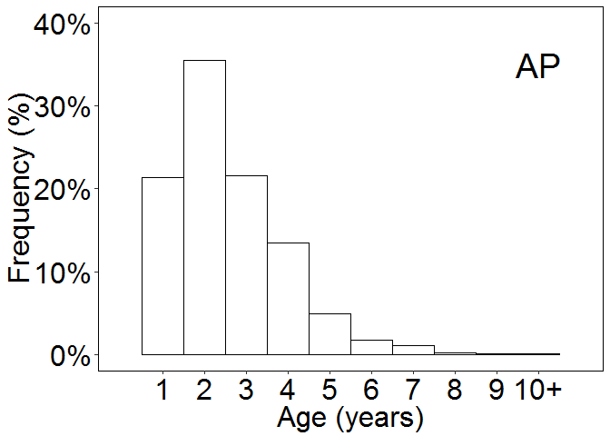 Now do the others

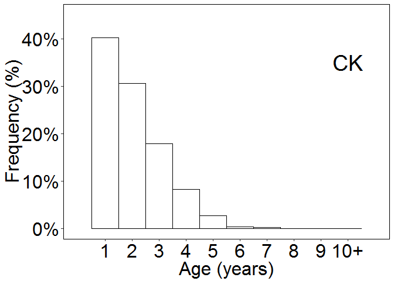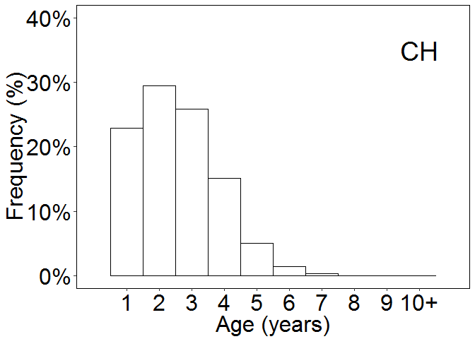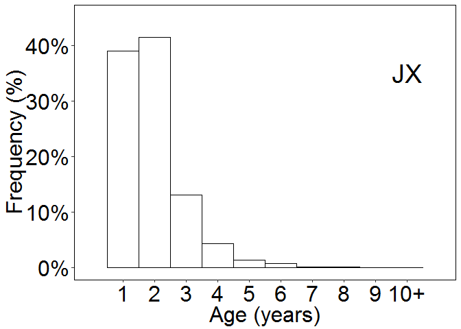

#### Length histograms.

``` r
length_AP <- ggplot(Agelength_AP, aes(x=tl))+ 
  geom_histogram(aes(y=(..count..)/sum(..count..)), binwidth=1, boundary=-0.5, fill="white", color="black")+    # plotting in percent frequency
  scale_y_continuous(labels=percent_format(), name="Frequency (%)", limits=c(0,.10), breaks=seq(0,.10, .02))+  ## plotting in percent frequency
  scale_x_continuous(name="Length (cm)", limits=c(0,80), breaks=seq(0,80,20))+
  theme(panel.grid.major=element_blank(), panel.grid.minor=element_blank(), 
        panel.background=element_rect(colour="black",fill="white"), 
        axis.text.x=element_text(colour="black", size=24, family="Times New Roman"), #changing  colour of x axisaxis.text.y=element_text(colour="black"), #changing colour of y acis
        axis.text.y=element_text(colour="black", size=24, family="Times New Roman"), #changing colour of y acis
        axis.title.x=element_text(size=24, family="Times New Roman"),
        axis.title.y=element_text(size=24, family="Times New Roman"),
        plot.title=element_text(size=14))+
  annotate("text", x=65, y= .08, label="AP", size=10, family="Times New Roman")
length_AP
```

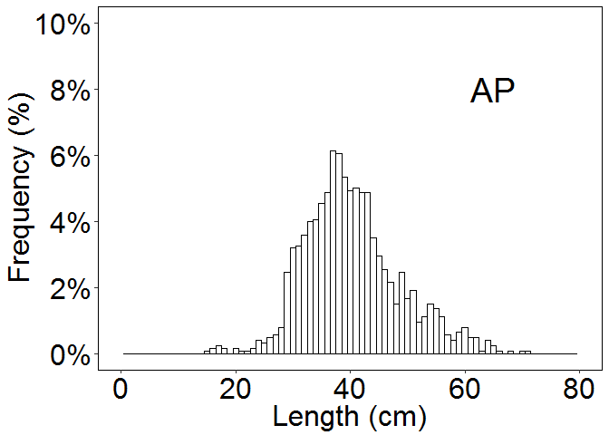 Now make plots for others.

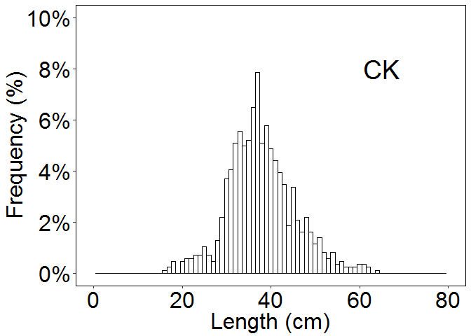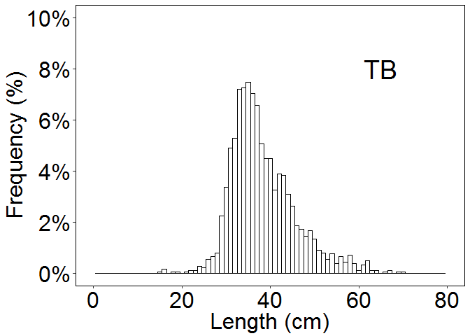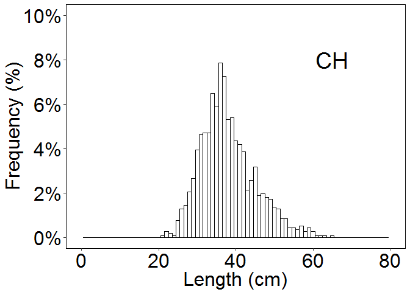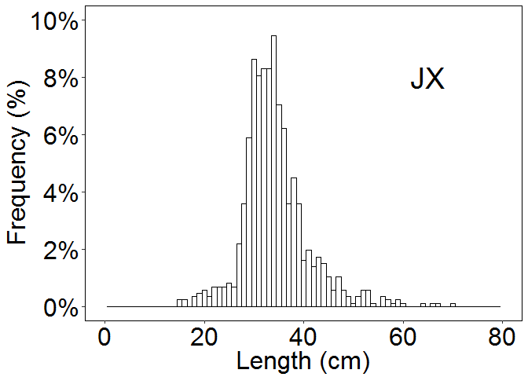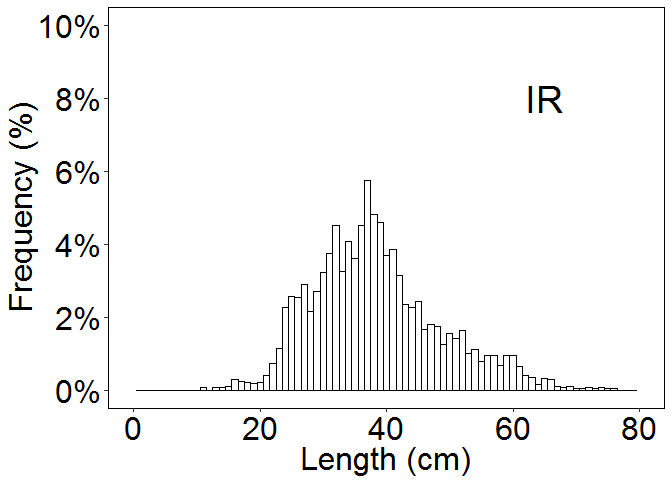

#### Make crossbar plots to show standard error

use a function to adjust the geom\_crossbar call to ggplot

``` r
#CROSSBAR PLOT for mean and standard error ####

MinMeanSEM196Max <- function(x) {
  v <- c(mean(x) - (sd(x)/sqrt(length(x))*1.96), mean(x), mean(x) + (sd(x)/sqrt(length(x))*1.96))
  names(v) <- c("ymin", "y", "ymax")
  v
}


All_min <- subset(All, sex %in% c("F", "M"))
labels <- c(F="Female", M="Male")

levels(All_min$bay) <- c("W1_AP", "W2_CK", "W3_TB", "W4_CH", "E1_JX", "E2_IR")

File <- ("U:/PhD_projectfiles/Figures/age_crossbar.tiff")
#if (file.exists(File)) stop(File, " already exists")
dir.create(dirname(File), showWarnings = FALSE)

tiff(File, units="in", width=5, height=7, res=300)

scaleFUN <- function(x) sprintf("%.1f", x)


#test <- All_min %>% group_by(bay) %>% summarize(n=length(final_age), mean_age=mean(final_age), UCI = mean_age + (sd(final_age)/sqrt(n)*1.96) , LCI = mean_age - (sd(final_age)/sqrt(n)*1.96))
#ggplot(test, aes(bay, mean_age)) + geom_crossbar(aes(ymin=LCI, ymax=UCI))

grid.arrange(ggplot(All_min %>% group_by(bay) %>% summarize(n=length(final_age), mean_age=mean(final_age), UCI = mean_age + (sd(final_age)/sqrt(n)*1.96) , LCI = mean_age - (sd(final_age)/sqrt(n)*1.96)), aes(bay, mean_age)) +
  stat_summary(fun.data=MinMeanSEM196Max, geom="crossbar", alpha=0.5) + #, colour="black") + 
  geom_crossbar(aes(ymin=LCI, ymax=UCI))+
  scale_y_continuous(limits=c(0,4), breaks=seq(0,5,0.5), labels=scaleFUN)+
  #facet_grid(sex ~., labeller=labeller(sex=labels)) +
  xlab("Estuary")+
  ylab("Age (yrs)")+
  theme(panel.grid.minor=element_blank(), panel.grid.major=element_blank(),                                     
        panel.background=element_rect(fill='white', colour='black'),
        axis.title.y = element_text(colour="black", size=18), # changing font of y axis title
        axis.title.x = element_blank(),
        axis.text.x=element_text(colour="black", size=12), #changing  colour and font of x axis text
        axis.text.y=element_text(colour="black", size=12),
        strip.text.y = element_text(size=16)) + 
  annotate("text", label= "a", x= 1, y = 2.8, size = 4) + 
annotate("text", label= "a", x= 3, y = 2.85, size = 4) +
  annotate("text", label= "a", x= 4, y = 2.79, size = 4) +
  annotate("text", label= "a", x= 6, y = 2.75, size = 4) +
  annotate("text", label= "b", x= 2, y = 2.22, size = 4) +
  annotate("text", label= "b", x= 5, y = 2.08, size = 4),
ggplot(All_min %>% group_by(bay,sex) %>% summarize(n=length(final_age), mean_age=mean(final_age), UCI = mean_age + (sd(final_age)/sqrt(n)*1.96) , LCI = mean_age - (sd(final_age)/sqrt(n)*1.96)), aes(bay, mean_age, fill=sex)) +
  geom_crossbar(aes(ymin=LCI, ymax=UCI), alpha=0.5)+
  scale_y_continuous(limits=c(0,4), breaks=seq(0,5,0.5), labels=scaleFUN)+
  #facet_grid(sex ~., labeller=labeller(sex=labels)) +
  xlab("Estuary")+
  ylab("Age (yrs)")+
  theme(panel.grid.minor=element_blank(), panel.grid.major=element_blank(),                                     
        panel.background=element_rect(fill='white', colour='black'),
        axis.title.y = element_text(colour="black", size=18), # changing font of y axis title
        axis.title.x = element_text(colour="black", size=18),
        axis.text.x=element_text(colour="black", size=12), #changing  colour and font of x axis text
        axis.text.y=element_text(colour="black", size=12),
        strip.text.y = element_text(size=16),
        legend.position= c(0.92,0.3), 
        legend.background= element_rect(color="black", linetype="solid"))  , nrow=2)

#changing colour and font of y axis
dev.off()
```

    ## png 
    ##   2

``` r
#plot.title=element_text(size=14), # changing size of plot title)


File <- ("U:/PhD_projectfiles/Figures/FIM_length_crossbar.tiff")
#if (file.exists(File)) stop(File, " already exists")
dir.create(dirname(File), showWarnings = FALSE)

tiff(File, units="in", width=5, height=7, res=300)

MinMedianSEM196Max <- function(x) {
  v <- c(median(x) - (sd(x)/sqrt(length(x))*1.96), median(x), median(x) + (sd(x)/sqrt(length(x))*1.96))
  names(v) <- c("ymin", "y", "ymax")
  v
}

#All_MF %>% group_by(bay, sex) %>% summarize(n=length(tl), mean_tl=mean(tl), UCI = mean_tl + (sd(tl)/sqrt(n)*1.96) , LCI = mean_tl - (sd(tl)/sqrt(n)*1.96))
#ggplot(test, aes(bay, mean_tl)) + geom_crossbar(aes(ymin=LCI, ymax=UCI))


scaleFUN <- function(x) sprintf("%.1f", x)
 grid.arrange(ggplot(All_min %>% group_by(bay) %>% summarize(n=length(tl), mean_tl=mean(tl), UCI = mean_tl + (sd(tl)/sqrt(n)*1.96) , LCI = mean_tl - (sd(tl)/sqrt(n)*1.96)), aes(bay, mean_tl)) +
  geom_crossbar(aes(ymin=LCI, ymax=UCI))+
  #scale_y_continuous(breaks=seq(10,80,1.5), labels=scaleFUN)+
    scale_y_continuous(limits=c(30,45), breaks=seq(30,45,2), labels=seq(30,45,2))+
  #facet_grid(sex ~., labeller=labeller(sex=labels)) +
  xlab("Estuary")+
  ylab("Total length (cm) ")+
  theme(panel.grid.minor=element_blank(), panel.grid.major=element_blank(),                                     
        panel.background=element_rect(fill='white', colour='black'),
        axis.title.y = element_text(colour="black", size=18), # changing font of y axis title
        axis.title.x = element_blank(),
        axis.text.x=element_text(colour="black", size=12), #changing  colour and font of x axis text
        axis.text.y=element_text(colour="black", size=12),
        strip.text.y = element_text(size=16))+
   annotate("text", label = "c", x=1, y= 41.05) +
   annotate("text", label = "d", x=2, y= 38.78) +
   annotate("text", label = "d", x=3, y= 39.08) +
   annotate("text", label = "d", x=4, y= 39.3) +
   annotate("text", label = "e", x=5, y= 35.19) +
   annotate("text", label = "d", x=6, y= 39.08),
 ggplot(All_min %>% group_by(bay, sex) %>% summarize(n=length(tl), mean_tl=mean(tl), UCI = mean_tl + (sd(tl)/sqrt(n)*1.96) , LCI = mean_tl - (sd(tl)/sqrt(n)*1.96)), aes(bay, mean_tl, fill=sex)) +
   stat_summary(fun.data=MinMeanSEM196Max, geom="crossbar", alpha=0.5) + #, colour="black") + 
   geom_crossbar(aes(ymin=LCI, ymax=UCI))+
   scale_y_continuous(limits=c(30,45), breaks=seq(30,45,2), labels=seq(30,45,2))+
   #facet_grid(sex ~., labeller=labeller(sex=labels)) +
   xlab("Estuary")+
   ylab("Total length (cm) ")+
   theme(panel.grid.minor=element_blank(), panel.grid.major=element_blank(),                                    
         panel.background=element_rect(fill='white', colour='black'),
         axis.title.y = element_text(colour="black", size=18), # changing font of y axis title
         axis.title.x = element_text(colour="black", size=18),
         axis.text.x=element_text(colour="black", size=12), #changing  colour and font of x axis text
         axis.text.y=element_text(colour="black", size=12),
         strip.text.y = element_text(size=16),
        legend.position= c(0.92,0.85), 
        legend.background= element_rect(color="black", linetype="solid")), nrow=2)
  
 #changing colour and font of y axis

#plot.title=element_text(size=14), # changing size of plot title)
dev.off()
```

    ## png 
    ##   2

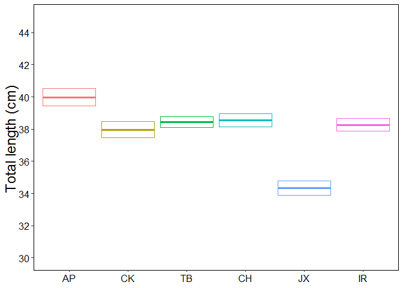

    ## Warning: Removed 6 rows containing missing values (geom_crossbar).

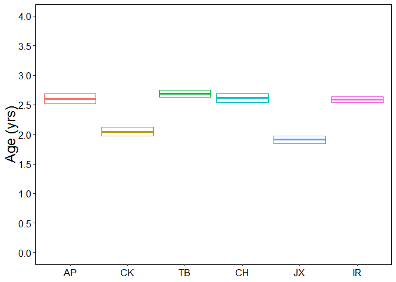

    ## # weights:  27 (16 variable)
    ## initial  value 4117.598858 
    ## iter  10 value 3179.551528
    ## iter  20 value 2651.350294
    ## iter  30 value 2644.069020
    ## iter  40 value 2643.607161
    ## iter  50 value 2642.723677
    ## final  value 2642.057178 
    ## converged

    ##        1     2     3     4     5     6     7     8     9
    ## 0  0.998 0.002 0.000 0.000 0.000 0.000 0.000 0.000 0.000
    ## 1  0.997 0.003 0.000 0.000 0.000 0.000 0.000 0.000 0.000
    ## 2  0.997 0.003 0.000 0.000 0.000 0.000 0.000 0.000 0.000
    ## 3  0.996 0.004 0.000 0.000 0.000 0.000 0.000 0.000 0.000
    ## 4  0.995 0.005 0.000 0.000 0.000 0.000 0.000 0.000 0.000
    ## 5  0.994 0.006 0.000 0.000 0.000 0.000 0.000 0.000 0.000
    ## 6  0.992 0.007 0.001 0.000 0.000 0.000 0.000 0.000 0.000
    ## 7  0.991 0.009 0.001 0.000 0.000 0.000 0.000 0.000 0.000
    ## 8  0.989 0.010 0.001 0.000 0.000 0.000 0.000 0.000 0.000
    ## 9  0.986 0.012 0.001 0.000 0.000 0.000 0.000 0.000 0.000
    ## 10 0.983 0.015 0.002 0.000 0.000 0.000 0.000 0.000 0.000
    ## 11 0.980 0.018 0.002 0.000 0.000 0.000 0.000 0.000 0.000
    ## 12 0.976 0.022 0.003 0.000 0.000 0.000 0.000 0.000 0.000
    ## 13 0.970 0.026 0.003 0.000 0.000 0.000 0.000 0.000 0.000
    ## 14 0.964 0.031 0.004 0.000 0.000 0.000 0.000 0.000 0.000
    ## 15 0.956 0.038 0.006 0.000 0.000 0.000 0.000 0.000 0.000
    ## 16 0.947 0.045 0.008 0.001 0.000 0.000 0.000 0.000 0.000
    ## 17 0.936 0.054 0.010 0.001 0.000 0.000 0.000 0.000 0.000
    ## 18 0.922 0.064 0.013 0.001 0.000 0.000 0.000 0.000 0.000
    ## 19 0.906 0.076 0.016 0.001 0.000 0.000 0.000 0.000 0.000
    ## 20 0.887 0.090 0.021 0.002 0.000 0.000 0.000 0.000 0.000
    ## 21 0.864 0.107 0.027 0.003 0.000 0.000 0.000 0.000 0.000
    ## 22 0.837 0.125 0.034 0.004 0.000 0.000 0.000 0.000 0.000
    ## 23 0.806 0.145 0.043 0.005 0.000 0.000 0.000 0.000 0.000
    ## 24 0.770 0.168 0.053 0.007 0.001 0.000 0.000 0.000 0.000
    ## 25 0.730 0.193 0.066 0.010 0.001 0.000 0.000 0.000 0.000
    ## 26 0.685 0.219 0.082 0.013 0.001 0.000 0.000 0.000 0.000
    ## 27 0.636 0.246 0.099 0.018 0.002 0.000 0.000 0.000 0.000
    ## 28 0.583 0.272 0.119 0.023 0.002 0.001 0.000 0.000 0.000
    ## 29 0.527 0.298 0.141 0.030 0.004 0.001 0.000 0.000 0.000
    ## 30 0.470 0.321 0.165 0.038 0.005 0.001 0.000 0.000 0.000
    ## 31 0.413 0.341 0.190 0.047 0.007 0.002 0.000 0.000 0.000
    ## 32 0.357 0.357 0.216 0.058 0.009 0.002 0.000 0.000 0.000
    ## 33 0.304 0.368 0.241 0.071 0.012 0.003 0.000 0.000 0.000
    ## 34 0.255 0.374 0.265 0.084 0.016 0.004 0.001 0.000 0.000
    ## 35 0.211 0.374 0.288 0.099 0.021 0.006 0.001 0.000 0.000
    ## 36 0.172 0.368 0.307 0.115 0.027 0.008 0.001 0.000 0.000
    ## 37 0.138 0.358 0.324 0.132 0.035 0.010 0.002 0.000 0.000
    ## 38 0.110 0.344 0.337 0.150 0.043 0.013 0.003 0.001 0.000
    ## 39 0.086 0.326 0.347 0.167 0.053 0.017 0.004 0.001 0.000
    ## 40 0.067 0.306 0.352 0.185 0.064 0.021 0.005 0.001 0.000
    ## 41 0.051 0.283 0.353 0.201 0.078 0.026 0.006 0.001 0.000
    ## 42 0.039 0.259 0.351 0.217 0.092 0.032 0.008 0.002 0.000
    ## 43 0.029 0.235 0.344 0.232 0.108 0.039 0.011 0.002 0.000
    ## 44 0.021 0.210 0.334 0.245 0.126 0.048 0.014 0.003 0.000
    ## 45 0.016 0.186 0.321 0.255 0.145 0.057 0.017 0.003 0.000
    ## 46 0.011 0.163 0.304 0.263 0.165 0.067 0.022 0.004 0.000
    ## 47 0.008 0.141 0.286 0.269 0.186 0.078 0.027 0.005 0.000
    ## 48 0.006 0.121 0.266 0.272 0.207 0.090 0.033 0.006 0.000
    ## 49 0.004 0.103 0.244 0.271 0.227 0.103 0.040 0.007 0.000
    ## 50 0.003 0.086 0.222 0.268 0.248 0.116 0.048 0.009 0.000
    ## 51 0.002 0.071 0.200 0.262 0.267 0.130 0.057 0.010 0.000
    ## 52 0.001 0.059 0.178 0.254 0.285 0.144 0.067 0.012 0.000
    ## 53 0.001 0.048 0.157 0.243 0.301 0.158 0.079 0.014 0.000
    ## 54 0.001 0.039 0.137 0.231 0.315 0.171 0.091 0.015 0.000
    ## 55 0.000 0.031 0.119 0.217 0.327 0.184 0.104 0.018 0.001
    ## 56 0.000 0.024 0.102 0.203 0.336 0.197 0.118 0.020 0.001
    ## 57 0.000 0.019 0.087 0.188 0.343 0.208 0.132 0.022 0.001
    ## 58 0.000 0.015 0.073 0.172 0.347 0.218 0.148 0.024 0.002
    ## 59 0.000 0.012 0.061 0.157 0.349 0.227 0.164 0.026 0.004
    ## 60 0.000 0.009 0.051 0.142 0.348 0.235 0.180 0.029 0.006
    ## 61 0.000 0.007 0.042 0.128 0.344 0.242 0.197 0.031 0.009
    ## 62 0.000 0.005 0.035 0.114 0.338 0.247 0.213 0.033 0.015
    ## 63 0.000 0.004 0.028 0.101 0.330 0.249 0.229 0.035 0.023
    ## 64 0.000 0.003 0.023 0.088 0.319 0.250 0.245 0.037 0.035
    ## 65 0.000 0.002 0.018 0.077 0.305 0.248 0.258 0.039 0.053
    ## 66 0.000 0.002 0.014 0.066 0.288 0.243 0.268 0.040 0.080
    ## 67 0.000 0.001 0.011 0.055 0.267 0.233 0.274 0.040 0.117
    ## 68 0.000 0.001 0.008 0.045 0.242 0.220 0.275 0.040 0.169
    ## 69 0.000 0.001 0.006 0.036 0.214 0.201 0.267 0.038 0.237
    ## 70 0.000 0.000 0.004 0.028 0.182 0.178 0.251 0.036 0.320
    ## 71 0.000 0.000 0.003 0.021 0.149 0.151 0.227 0.032 0.416
    ## 72 0.000 0.000 0.002 0.015 0.117 0.123 0.197 0.027 0.519
    ## 73 0.000 0.000 0.001 0.010 0.088 0.096 0.163 0.022 0.619
    ## 74 0.000 0.000 0.001 0.007 0.064 0.072 0.130 0.018 0.709
    ## 75 0.000 0.000 0.000 0.004 0.044 0.052 0.100 0.013 0.785
    ## 76 0.000 0.000 0.000 0.003 0.030 0.037 0.075 0.010 0.846
    ## 77 0.000 0.000 0.000 0.002 0.020 0.025 0.055 0.007 0.891
    ## 78 0.000 0.000 0.000 0.001 0.013 0.017 0.040 0.005 0.924
    ## 79 0.000 0.000 0.000 0.001 0.008 0.011 0.028 0.004 0.948
    ## 80 0.000 0.000 0.000 0.000 0.005 0.008 0.020 0.003 0.964

    ## # weights:  21 (12 variable)
    ## initial  value 1681.266369 
    ## iter  10 value 1268.858965
    ## iter  20 value 891.630042
    ## iter  30 value 887.154174
    ## iter  40 value 885.943516
    ## final  value 885.879974 
    ## converged

    ##        1     2     3     4     5     6     7
    ## 0  1.000 0.000 0.000 0.000 0.000 0.000 0.000
    ## 1  0.999 0.001 0.000 0.000 0.000 0.000 0.000
    ## 2  0.999 0.001 0.000 0.000 0.000 0.000 0.000
    ## 3  0.999 0.001 0.000 0.000 0.000 0.000 0.000
    ## 4  0.999 0.001 0.000 0.000 0.000 0.000 0.000
    ## 5  0.999 0.001 0.000 0.000 0.000 0.000 0.000
    ## 6  0.998 0.002 0.000 0.000 0.000 0.000 0.000
    ## 7  0.998 0.002 0.000 0.000 0.000 0.000 0.000
    ## 8  0.997 0.003 0.000 0.000 0.000 0.000 0.000
    ## 9  0.997 0.003 0.000 0.000 0.000 0.000 0.000
    ## 10 0.996 0.004 0.000 0.000 0.000 0.000 0.000
    ## 11 0.995 0.005 0.000 0.000 0.000 0.000 0.000
    ## 12 0.994 0.006 0.000 0.000 0.000 0.000 0.000
    ## 13 0.993 0.007 0.000 0.000 0.000 0.000 0.000
    ## 14 0.991 0.009 0.000 0.000 0.000 0.000 0.000
    ## 15 0.989 0.011 0.000 0.000 0.000 0.000 0.000
    ## 16 0.986 0.014 0.000 0.000 0.000 0.000 0.000
    ## 17 0.983 0.017 0.000 0.000 0.000 0.000 0.000
    ## 18 0.979 0.021 0.000 0.000 0.000 0.000 0.000
    ## 19 0.974 0.026 0.000 0.000 0.000 0.000 0.000
    ## 20 0.967 0.032 0.001 0.000 0.000 0.000 0.000
    ## 21 0.960 0.039 0.001 0.000 0.000 0.000 0.000
    ## 22 0.950 0.048 0.001 0.000 0.000 0.000 0.000
    ## 23 0.939 0.059 0.002 0.000 0.000 0.000 0.000
    ## 24 0.925 0.072 0.003 0.000 0.000 0.000 0.000
    ## 25 0.908 0.088 0.004 0.000 0.000 0.000 0.000
    ## 26 0.887 0.107 0.006 0.000 0.000 0.000 0.000
    ## 27 0.863 0.128 0.009 0.000 0.000 0.000 0.000
    ## 28 0.833 0.154 0.012 0.001 0.000 0.000 0.000
    ## 29 0.799 0.183 0.017 0.001 0.000 0.000 0.000
    ## 30 0.759 0.215 0.024 0.001 0.000 0.000 0.000
    ## 31 0.713 0.250 0.034 0.002 0.000 0.000 0.000
    ## 32 0.662 0.288 0.046 0.004 0.000 0.000 0.000
    ## 33 0.605 0.326 0.063 0.006 0.000 0.000 0.000
    ## 34 0.544 0.364 0.083 0.009 0.001 0.000 0.000
    ## 35 0.479 0.398 0.108 0.013 0.001 0.000 0.000
    ## 36 0.414 0.426 0.138 0.020 0.002 0.000 0.000
    ## 37 0.350 0.446 0.172 0.028 0.003 0.000 0.001
    ## 38 0.289 0.456 0.209 0.040 0.005 0.000 0.001
    ## 39 0.233 0.455 0.249 0.054 0.007 0.000 0.001
    ## 40 0.183 0.443 0.289 0.073 0.011 0.000 0.002
    ## 41 0.140 0.421 0.326 0.095 0.015 0.000 0.002
    ## 42 0.105 0.390 0.360 0.121 0.021 0.000 0.003
    ## 43 0.076 0.353 0.387 0.150 0.029 0.000 0.004
    ## 44 0.054 0.312 0.407 0.182 0.039 0.001 0.005
    ## 45 0.038 0.269 0.419 0.217 0.050 0.001 0.006
    ## 46 0.026 0.228 0.422 0.252 0.064 0.002 0.007
    ## 47 0.017 0.189 0.416 0.287 0.080 0.003 0.008
    ## 48 0.011 0.154 0.403 0.321 0.098 0.004 0.009
    ## 49 0.007 0.123 0.384 0.352 0.118 0.006 0.010
    ## 50 0.005 0.096 0.359 0.380 0.140 0.008 0.012
    ## 51 0.003 0.075 0.331 0.404 0.163 0.012 0.013
    ## 52 0.002 0.057 0.300 0.424 0.187 0.016 0.014
    ## 53 0.001 0.043 0.269 0.438 0.212 0.022 0.015
    ## 54 0.001 0.032 0.238 0.447 0.237 0.030 0.015
    ## 55 0.000 0.023 0.208 0.451 0.262 0.040 0.016
    ## 56 0.000 0.017 0.179 0.449 0.286 0.052 0.016
    ## 57 0.000 0.012 0.153 0.442 0.308 0.068 0.017
    ## 58 0.000 0.009 0.129 0.430 0.329 0.087 0.017
    ## 59 0.000 0.006 0.107 0.413 0.346 0.111 0.017
    ## 60 0.000 0.004 0.088 0.392 0.360 0.139 0.016
    ## 61 0.000 0.003 0.072 0.368 0.370 0.172 0.016
    ## 62 0.000 0.002 0.057 0.340 0.376 0.210 0.015
    ## 63 0.000 0.001 0.045 0.311 0.376 0.253 0.014
    ## 64 0.000 0.001 0.035 0.280 0.371 0.300 0.013
    ## 65 0.000 0.001 0.027 0.248 0.360 0.352 0.012
    ## 66 0.000 0.000 0.021 0.217 0.345 0.406 0.011
    ## 67 0.000 0.000 0.015 0.187 0.326 0.462 0.010
    ## 68 0.000 0.000 0.011 0.159 0.304 0.518 0.008
    ## 69 0.000 0.000 0.008 0.133 0.279 0.572 0.007
    ## 70 0.000 0.000 0.006 0.110 0.253 0.625 0.006
    ## 71 0.000 0.000 0.004 0.090 0.227 0.674 0.005
    ## 72 0.000 0.000 0.003 0.073 0.201 0.719 0.004
    ## 73 0.000 0.000 0.002 0.058 0.176 0.760 0.004
    ## 74 0.000 0.000 0.001 0.046 0.153 0.796 0.003
    ## 75 0.000 0.000 0.001 0.036 0.132 0.828 0.002
    ## 76 0.000 0.000 0.001 0.028 0.113 0.855 0.002
    ## 77 0.000 0.000 0.000 0.022 0.097 0.879 0.002
    ## 78 0.000 0.000 0.000 0.017 0.082 0.899 0.001
    ## 79 0.000 0.000 0.000 0.013 0.070 0.916 0.001
    ## 80 0.000 0.000 0.000 0.010 0.059 0.930 0.001

    ## # weights:  21 (12 variable)
    ## initial  value 2274.768964 
    ## iter  10 value 1692.830890
    ## iter  20 value 1536.690458
    ## iter  30 value 1536.455863
    ## final  value 1536.455785 
    ## converged

    ##        1     2     3     4     5     6     7
    ## 0  0.999 0.001 0.000 0.000 0.000 0.000 0.000
    ## 1  0.998 0.002 0.000 0.000 0.000 0.000 0.000
    ## 2  0.998 0.002 0.000 0.000 0.000 0.000 0.000
    ## 3  0.997 0.003 0.000 0.000 0.000 0.000 0.000
    ## 4  0.997 0.003 0.000 0.000 0.000 0.000 0.000
    ## 5  0.996 0.004 0.000 0.000 0.000 0.000 0.000
    ## 6  0.995 0.005 0.000 0.000 0.000 0.000 0.000
    ## 7  0.994 0.006 0.000 0.000 0.000 0.000 0.000
    ## 8  0.992 0.007 0.000 0.000 0.000 0.000 0.000
    ## 9  0.991 0.009 0.001 0.000 0.000 0.000 0.000
    ## 10 0.988 0.011 0.001 0.000 0.000 0.000 0.000
    ## 11 0.986 0.013 0.001 0.000 0.000 0.000 0.000
    ## 12 0.982 0.016 0.001 0.000 0.000 0.000 0.000
    ## 13 0.978 0.020 0.002 0.000 0.000 0.000 0.000
    ## 14 0.973 0.024 0.003 0.000 0.000 0.000 0.000
    ## 15 0.967 0.029 0.003 0.000 0.000 0.000 0.000
    ## 16 0.960 0.036 0.005 0.000 0.000 0.000 0.000
    ## 17 0.950 0.043 0.006 0.000 0.000 0.000 0.000
    ## 18 0.939 0.052 0.008 0.001 0.000 0.000 0.000
    ## 19 0.925 0.063 0.011 0.001 0.000 0.000 0.000
    ## 20 0.909 0.076 0.014 0.001 0.000 0.000 0.000
    ## 21 0.889 0.091 0.019 0.002 0.000 0.000 0.000
    ## 22 0.865 0.109 0.024 0.002 0.000 0.000 0.000
    ## 23 0.836 0.129 0.032 0.003 0.000 0.000 0.000
    ## 24 0.803 0.151 0.041 0.005 0.000 0.000 0.000
    ## 25 0.765 0.177 0.052 0.007 0.000 0.000 0.000
    ## 26 0.721 0.204 0.066 0.009 0.001 0.000 0.000
    ## 27 0.672 0.233 0.082 0.013 0.001 0.000 0.000
    ## 28 0.618 0.262 0.101 0.017 0.001 0.000 0.000
    ## 29 0.560 0.292 0.123 0.023 0.002 0.000 0.000
    ## 30 0.500 0.319 0.147 0.031 0.003 0.000 0.000
    ## 31 0.439 0.343 0.174 0.040 0.004 0.000 0.001
    ## 32 0.379 0.363 0.201 0.051 0.005 0.000 0.001
    ## 33 0.321 0.377 0.229 0.064 0.007 0.001 0.001
    ## 34 0.268 0.385 0.256 0.079 0.010 0.001 0.001
    ## 35 0.219 0.386 0.281 0.097 0.013 0.002 0.001
    ## 36 0.177 0.382 0.305 0.115 0.017 0.002 0.002
    ## 37 0.140 0.371 0.324 0.136 0.023 0.003 0.002
    ## 38 0.110 0.356 0.341 0.158 0.029 0.004 0.003
    ## 39 0.085 0.337 0.353 0.181 0.036 0.005 0.003
    ## 40 0.065 0.315 0.361 0.204 0.044 0.007 0.004
    ## 41 0.049 0.290 0.365 0.228 0.054 0.009 0.005
    ## 42 0.036 0.265 0.364 0.252 0.066 0.012 0.005
    ## 43 0.027 0.239 0.360 0.275 0.079 0.015 0.006
    ## 44 0.019 0.213 0.351 0.297 0.093 0.019 0.007
    ## 45 0.014 0.188 0.340 0.317 0.109 0.024 0.008
    ## 46 0.010 0.164 0.325 0.336 0.127 0.030 0.009
    ## 47 0.007 0.142 0.308 0.352 0.145 0.036 0.010
    ## 48 0.005 0.122 0.289 0.365 0.165 0.044 0.010
    ## 49 0.003 0.103 0.269 0.375 0.186 0.053 0.011
    ## 50 0.002 0.087 0.247 0.382 0.207 0.063 0.012
    ## 51 0.002 0.072 0.226 0.385 0.229 0.074 0.013
    ## 52 0.001 0.060 0.204 0.385 0.251 0.087 0.013
    ## 53 0.001 0.049 0.183 0.381 0.272 0.101 0.014
    ## 54 0.000 0.040 0.163 0.375 0.293 0.116 0.014
    ## 55 0.000 0.032 0.143 0.365 0.313 0.132 0.014
    ## 56 0.000 0.026 0.125 0.353 0.332 0.149 0.015
    ## 57 0.000 0.020 0.109 0.339 0.349 0.168 0.015
    ## 58 0.000 0.016 0.094 0.324 0.365 0.187 0.015
    ## 59 0.000 0.012 0.081 0.306 0.378 0.207 0.014
    ## 60 0.000 0.010 0.069 0.289 0.390 0.228 0.014
    ## 61 0.000 0.008 0.058 0.270 0.400 0.250 0.014
    ## 62 0.000 0.006 0.049 0.251 0.408 0.272 0.014
    ## 63 0.000 0.004 0.041 0.233 0.414 0.295 0.013
    ## 64 0.000 0.003 0.034 0.214 0.418 0.318 0.013
    ## 65 0.000 0.003 0.028 0.196 0.420 0.341 0.012
    ## 66 0.000 0.002 0.023 0.179 0.420 0.364 0.012
    ## 67 0.000 0.001 0.019 0.163 0.418 0.387 0.011
    ## 68 0.000 0.001 0.016 0.148 0.415 0.410 0.011
    ## 69 0.000 0.001 0.013 0.133 0.410 0.433 0.010
    ## 70 0.000 0.001 0.010 0.120 0.404 0.456 0.009
    ## 71 0.000 0.000 0.008 0.107 0.397 0.478 0.009
    ## 72 0.000 0.000 0.007 0.096 0.389 0.500 0.008
    ## 73 0.000 0.000 0.006 0.086 0.380 0.521 0.008
    ## 74 0.000 0.000 0.004 0.076 0.370 0.542 0.007
    ## 75 0.000 0.000 0.004 0.068 0.360 0.562 0.007
    ## 76 0.000 0.000 0.003 0.060 0.349 0.582 0.006
    ## 77 0.000 0.000 0.002 0.053 0.337 0.602 0.006
    ## 78 0.000 0.000 0.002 0.047 0.326 0.620 0.005
    ## 79 0.000 0.000 0.001 0.041 0.314 0.639 0.005
    ## 80 0.000 0.000 0.001 0.036 0.302 0.656 0.005

    ## # weights:  30 (18 variable)
    ## initial  value 2889.744292 
    ## iter  10 value 2124.374392
    ## iter  20 value 1562.087512
    ## iter  30 value 1535.380079
    ## iter  40 value 1533.681531
    ## iter  50 value 1533.392920
    ## iter  60 value 1531.638787
    ## iter  70 value 1530.300375
    ## final  value 1530.189580 
    ## converged

    ##        1     2     3     4     5     6     7     8     9    10
    ## 0  1.000 0.000 0.000 0.000 0.000 0.000 0.000 0.000 0.000 0.000
    ## 1  1.000 0.000 0.000 0.000 0.000 0.000 0.000 0.000 0.000 0.000
    ## 2  1.000 0.000 0.000 0.000 0.000 0.000 0.000 0.000 0.000 0.000
    ## 3  1.000 0.000 0.000 0.000 0.000 0.000 0.000 0.000 0.000 0.000
    ## 4  1.000 0.000 0.000 0.000 0.000 0.000 0.000 0.000 0.000 0.000
    ## 5  1.000 0.000 0.000 0.000 0.000 0.000 0.000 0.000 0.000 0.000
    ## 6  0.999 0.001 0.000 0.000 0.000 0.000 0.000 0.000 0.000 0.000
    ## 7  0.999 0.001 0.000 0.000 0.000 0.000 0.000 0.000 0.000 0.000
    ## 8  0.999 0.001 0.000 0.000 0.000 0.000 0.000 0.000 0.000 0.000
    ## 9  0.999 0.001 0.000 0.000 0.000 0.000 0.000 0.000 0.000 0.000
    ## 10 0.998 0.002 0.000 0.000 0.000 0.000 0.000 0.000 0.000 0.000
    ## 11 0.998 0.002 0.000 0.000 0.000 0.000 0.000 0.000 0.000 0.000
    ## 12 0.997 0.003 0.000 0.000 0.000 0.000 0.000 0.000 0.000 0.000
    ## 13 0.996 0.004 0.000 0.000 0.000 0.000 0.000 0.000 0.000 0.000
    ## 14 0.995 0.005 0.000 0.000 0.000 0.000 0.000 0.000 0.000 0.000
    ## 15 0.993 0.007 0.000 0.000 0.000 0.000 0.000 0.000 0.000 0.000
    ## 16 0.990 0.009 0.000 0.000 0.000 0.000 0.000 0.000 0.000 0.000
    ## 17 0.987 0.012 0.001 0.000 0.000 0.000 0.000 0.000 0.000 0.000
    ## 18 0.983 0.016 0.001 0.000 0.000 0.000 0.000 0.000 0.000 0.000
    ## 19 0.978 0.021 0.001 0.000 0.000 0.000 0.000 0.000 0.000 0.000
    ## 20 0.970 0.028 0.002 0.000 0.000 0.000 0.000 0.000 0.000 0.000
    ## 21 0.961 0.036 0.003 0.000 0.000 0.000 0.000 0.000 0.000 0.000
    ## 22 0.948 0.048 0.004 0.000 0.000 0.000 0.000 0.000 0.000 0.000
    ## 23 0.932 0.062 0.005 0.000 0.000 0.000 0.000 0.000 0.000 0.000
    ## 24 0.911 0.080 0.008 0.001 0.000 0.000 0.000 0.000 0.000 0.000
    ## 25 0.885 0.103 0.011 0.001 0.000 0.000 0.000 0.000 0.000 0.000
    ## 26 0.851 0.131 0.016 0.001 0.000 0.000 0.000 0.000 0.000 0.000
    ## 27 0.810 0.165 0.023 0.002 0.000 0.000 0.000 0.000 0.000 0.000
    ## 28 0.759 0.204 0.032 0.004 0.001 0.000 0.000 0.000 0.000 0.000
    ## 29 0.700 0.249 0.044 0.005 0.001 0.000 0.000 0.000 0.000 0.000
    ## 30 0.633 0.298 0.059 0.008 0.001 0.000 0.000 0.000 0.000 0.000
    ## 31 0.560 0.348 0.078 0.012 0.002 0.000 0.000 0.000 0.001 0.000
    ## 32 0.482 0.397 0.100 0.017 0.003 0.000 0.000 0.000 0.001 0.000
    ## 33 0.405 0.442 0.124 0.024 0.004 0.000 0.000 0.000 0.001 0.000
    ## 34 0.331 0.478 0.151 0.032 0.006 0.000 0.000 0.000 0.001 0.000
    ## 35 0.264 0.504 0.179 0.043 0.009 0.001 0.000 0.000 0.001 0.000
    ## 36 0.205 0.518 0.208 0.055 0.012 0.001 0.000 0.000 0.001 0.000
    ## 37 0.156 0.522 0.235 0.069 0.015 0.001 0.000 0.000 0.001 0.000
    ## 38 0.116 0.514 0.260 0.086 0.020 0.002 0.000 0.000 0.001 0.000
    ## 39 0.085 0.498 0.283 0.104 0.025 0.003 0.000 0.000 0.001 0.000
    ## 40 0.061 0.474 0.303 0.124 0.032 0.004 0.000 0.000 0.001 0.000
    ## 41 0.043 0.445 0.320 0.146 0.039 0.005 0.000 0.000 0.001 0.000
    ## 42 0.030 0.411 0.333 0.170 0.048 0.007 0.000 0.000 0.001 0.000
    ## 43 0.021 0.375 0.341 0.194 0.057 0.009 0.000 0.000 0.001 0.000
    ## 44 0.014 0.338 0.346 0.220 0.068 0.012 0.001 0.000 0.001 0.000
    ## 45 0.010 0.301 0.346 0.245 0.079 0.016 0.001 0.000 0.001 0.000
    ## 46 0.006 0.265 0.343 0.271 0.092 0.020 0.001 0.000 0.001 0.000
    ## 47 0.004 0.231 0.335 0.296 0.105 0.025 0.002 0.001 0.001 0.000
    ## 48 0.003 0.199 0.324 0.319 0.119 0.031 0.003 0.001 0.001 0.000
    ## 49 0.002 0.169 0.310 0.340 0.134 0.039 0.004 0.001 0.001 0.000
    ## 50 0.001 0.142 0.294 0.359 0.148 0.047 0.006 0.002 0.001 0.000
    ## 51 0.001 0.118 0.275 0.375 0.162 0.056 0.009 0.003 0.001 0.000
    ## 52 0.000 0.097 0.255 0.387 0.175 0.067 0.014 0.003 0.000 0.000
    ## 53 0.000 0.079 0.233 0.396 0.188 0.079 0.020 0.005 0.000 0.000
    ## 54 0.000 0.064 0.211 0.399 0.199 0.092 0.028 0.006 0.000 0.000
    ## 55 0.000 0.051 0.189 0.398 0.209 0.105 0.040 0.008 0.000 0.000
    ## 56 0.000 0.040 0.167 0.392 0.215 0.119 0.055 0.011 0.000 0.000
    ## 57 0.000 0.031 0.145 0.381 0.220 0.134 0.075 0.013 0.000 0.000
    ## 58 0.000 0.024 0.125 0.365 0.221 0.147 0.102 0.017 0.000 0.000
    ## 59 0.000 0.018 0.105 0.343 0.218 0.160 0.135 0.021 0.000 0.000
    ## 60 0.000 0.013 0.087 0.317 0.211 0.170 0.176 0.026 0.000 0.000
    ## 61 0.000 0.009 0.071 0.287 0.200 0.177 0.224 0.031 0.000 0.000
    ## 62 0.000 0.007 0.056 0.254 0.186 0.180 0.280 0.036 0.000 0.000
    ## 63 0.000 0.005 0.044 0.220 0.169 0.180 0.342 0.041 0.000 0.000
    ## 64 0.000 0.003 0.033 0.186 0.150 0.175 0.407 0.046 0.000 0.000
    ## 65 0.000 0.002 0.024 0.154 0.130 0.166 0.473 0.050 0.000 0.001
    ## 66 0.000 0.001 0.018 0.124 0.110 0.154 0.538 0.053 0.000 0.002
    ## 67 0.000 0.001 0.012 0.097 0.090 0.139 0.594 0.055 0.000 0.011
    ## 68 0.000 0.000 0.008 0.072 0.071 0.120 0.626 0.054 0.000 0.048
    ## 69 0.000 0.000 0.005 0.048 0.049 0.090 0.578 0.047 0.000 0.183
    ## 70 0.000 0.000 0.002 0.022 0.024 0.048 0.379 0.029 0.000 0.496
    ## 71 0.000 0.000 0.001 0.006 0.007 0.016 0.150 0.011 0.000 0.810
    ## 72 0.000 0.000 0.000 0.001 0.001 0.004 0.042 0.003 0.000 0.948
    ## 73 0.000 0.000 0.000 0.000 0.000 0.001 0.011 0.001 0.000 0.987
    ## 74 0.000 0.000 0.000 0.000 0.000 0.000 0.003 0.000 0.000 0.997
    ## 75 0.000 0.000 0.000 0.000 0.000 0.000 0.001 0.000 0.000 0.999
    ## 76 0.000 0.000 0.000 0.000 0.000 0.000 0.000 0.000 0.000 1.000
    ## 77 0.000 0.000 0.000 0.000 0.000 0.000 0.000 0.000 0.000 1.000
    ## 78 0.000 0.000 0.000 0.000 0.000 0.000 0.000 0.000 0.000 1.000
    ## 79 0.000 0.000 0.000 0.000 0.000 0.000 0.000 0.000 0.000 1.000
    ## 80 0.000 0.000 0.000 0.000 0.000 0.000 0.000 0.000 0.000 1.000

    ## # weights:  24 (14 variable)
    ## initial  value 1804.955258 
    ## iter  10 value 1082.003331
    ## iter  20 value 885.822787
    ## iter  30 value 882.894632
    ## iter  40 value 882.206368
    ## iter  50 value 881.454964
    ## final  value 881.315741 
    ## converged

    ##        1     2     3     4     5     6     7     8
    ## 0  0.996 0.004 0.000 0.000 0.000 0.000 0.000 0.000
    ## 1  0.995 0.005 0.000 0.000 0.000 0.000 0.000 0.000
    ## 2  0.994 0.006 0.000 0.000 0.000 0.000 0.000 0.000
    ## 3  0.993 0.007 0.000 0.000 0.000 0.000 0.000 0.000
    ## 4  0.991 0.009 0.000 0.000 0.000 0.000 0.000 0.000
    ## 5  0.990 0.010 0.000 0.000 0.000 0.000 0.000 0.000
    ## 6  0.988 0.012 0.000 0.000 0.000 0.000 0.000 0.000
    ## 7  0.985 0.014 0.000 0.000 0.000 0.000 0.000 0.000
    ## 8  0.983 0.017 0.000 0.000 0.000 0.000 0.000 0.000
    ## 9  0.980 0.020 0.000 0.000 0.000 0.000 0.000 0.000
    ## 10 0.976 0.024 0.000 0.000 0.000 0.000 0.000 0.000
    ## 11 0.971 0.029 0.000 0.000 0.000 0.000 0.000 0.000
    ## 12 0.966 0.034 0.000 0.000 0.000 0.000 0.000 0.000
    ## 13 0.960 0.040 0.000 0.000 0.000 0.000 0.000 0.000
    ## 14 0.952 0.047 0.000 0.000 0.000 0.000 0.000 0.000
    ## 15 0.944 0.056 0.001 0.000 0.000 0.000 0.000 0.000
    ## 16 0.934 0.066 0.001 0.000 0.000 0.000 0.000 0.000
    ## 17 0.922 0.077 0.001 0.000 0.000 0.000 0.000 0.000
    ## 18 0.908 0.090 0.002 0.000 0.000 0.000 0.000 0.000
    ## 19 0.892 0.105 0.002 0.000 0.000 0.000 0.000 0.000
    ## 20 0.874 0.123 0.003 0.000 0.000 0.000 0.000 0.000
    ## 21 0.853 0.143 0.004 0.000 0.000 0.000 0.000 0.000
    ## 22 0.829 0.165 0.006 0.000 0.000 0.000 0.000 0.000
    ## 23 0.802 0.190 0.008 0.000 0.000 0.000 0.000 0.000
    ## 24 0.772 0.217 0.010 0.001 0.000 0.000 0.000 0.000
    ## 25 0.738 0.247 0.014 0.001 0.000 0.000 0.000 0.000
    ## 26 0.701 0.279 0.018 0.001 0.000 0.000 0.000 0.000
    ## 27 0.660 0.313 0.024 0.002 0.000 0.000 0.000 0.000
    ## 28 0.617 0.348 0.032 0.003 0.000 0.000 0.000 0.000
    ## 29 0.571 0.383 0.042 0.004 0.001 0.000 0.000 0.000
    ## 30 0.522 0.417 0.054 0.006 0.001 0.000 0.000 0.000
    ## 31 0.473 0.449 0.068 0.008 0.001 0.000 0.000 0.000
    ## 32 0.423 0.478 0.086 0.011 0.002 0.000 0.000 0.000
    ## 33 0.373 0.502 0.106 0.016 0.003 0.000 0.000 0.000
    ## 34 0.325 0.520 0.130 0.022 0.004 0.000 0.000 0.000
    ## 35 0.278 0.530 0.157 0.029 0.005 0.000 0.001 0.000
    ## 36 0.235 0.532 0.186 0.038 0.008 0.000 0.001 0.000
    ## 37 0.195 0.526 0.217 0.050 0.011 0.001 0.001 0.000
    ## 38 0.160 0.511 0.249 0.064 0.014 0.001 0.001 0.000
    ## 39 0.128 0.489 0.281 0.080 0.019 0.001 0.002 0.000
    ## 40 0.101 0.459 0.312 0.099 0.025 0.002 0.002 0.000
    ## 41 0.078 0.424 0.340 0.120 0.032 0.003 0.003 0.000
    ## 42 0.060 0.384 0.365 0.143 0.040 0.005 0.003 0.000
    ## 43 0.045 0.343 0.384 0.168 0.050 0.007 0.004 0.000
    ## 44 0.033 0.300 0.398 0.194 0.060 0.009 0.005 0.000
    ## 45 0.024 0.259 0.405 0.220 0.072 0.013 0.006 0.000
    ## 46 0.017 0.220 0.406 0.246 0.085 0.018 0.007 0.000
    ## 47 0.012 0.184 0.401 0.271 0.099 0.024 0.008 0.000
    ## 48 0.008 0.152 0.391 0.293 0.114 0.033 0.009 0.000
    ## 49 0.006 0.123 0.375 0.314 0.128 0.043 0.010 0.000
    ## 50 0.004 0.099 0.355 0.331 0.143 0.056 0.012 0.000
    ## 51 0.003 0.078 0.332 0.345 0.157 0.072 0.013 0.000
    ## 52 0.002 0.061 0.306 0.354 0.171 0.092 0.014 0.000
    ## 53 0.001 0.047 0.279 0.360 0.183 0.115 0.014 0.001
    ## 54 0.001 0.036 0.251 0.360 0.194 0.142 0.015 0.001
    ## 55 0.000 0.027 0.223 0.356 0.203 0.173 0.016 0.002
    ## 56 0.000 0.020 0.196 0.348 0.209 0.208 0.016 0.003
    ## 57 0.000 0.015 0.169 0.335 0.213 0.247 0.016 0.005
    ## 58 0.000 0.011 0.144 0.318 0.213 0.290 0.016 0.008
    ## 59 0.000 0.007 0.121 0.297 0.211 0.334 0.016 0.014
    ## 60 0.000 0.005 0.100 0.273 0.205 0.379 0.015 0.023
    ## 61 0.000 0.004 0.081 0.247 0.195 0.422 0.014 0.037
    ## 62 0.000 0.002 0.064 0.218 0.182 0.460 0.013 0.059
    ## 63 0.000 0.002 0.050 0.189 0.166 0.490 0.012 0.091
    ## 64 0.000 0.001 0.038 0.158 0.148 0.508 0.011 0.137
    ## 65 0.000 0.001 0.027 0.129 0.127 0.508 0.009 0.199
    ## 66 0.000 0.000 0.019 0.100 0.104 0.489 0.007 0.279
    ## 67 0.000 0.000 0.013 0.075 0.082 0.451 0.006 0.373
    ## 68 0.000 0.000 0.008 0.053 0.062 0.396 0.004 0.476
    ## 69 0.000 0.000 0.005 0.036 0.044 0.332 0.003 0.579
    ## 70 0.000 0.000 0.003 0.024 0.031 0.266 0.002 0.675
    ## 71 0.000 0.000 0.002 0.015 0.020 0.205 0.001 0.757
    ## 72 0.000 0.000 0.001 0.009 0.013 0.154 0.001 0.823
    ## 73 0.000 0.000 0.000 0.005 0.008 0.112 0.001 0.873
    ## 74 0.000 0.000 0.000 0.003 0.005 0.081 0.000 0.911
    ## 75 0.000 0.000 0.000 0.002 0.003 0.057 0.000 0.938
    ## 76 0.000 0.000 0.000 0.001 0.002 0.040 0.000 0.957
    ## 77 0.000 0.000 0.000 0.001 0.001 0.028 0.000 0.970
    ## 78 0.000 0.000 0.000 0.000 0.001 0.020 0.000 0.979
    ## 79 0.000 0.000 0.000 0.000 0.000 0.014 0.000 0.986
    ## 80 0.000 0.000 0.000 0.000 0.000 0.009 0.000 0.990

    ## # weights:  27 (16 variable)
    ## initial  value 6077.523181 
    ## iter  10 value 4483.767642
    ## iter  20 value 3636.475492
    ## iter  30 value 3608.333577
    ## iter  40 value 3607.375551
    ## iter  50 value 3607.261048
    ## final  value 3607.256225 
    ## converged

    ##        1     2     3     4     5     6     7     8     9
    ## 0  0.993 0.007 0.000 0.000 0.000 0.000 0.000 0.000 0.000
    ## 1  0.991 0.008 0.001 0.000 0.000 0.000 0.000 0.000 0.000
    ## 2  0.990 0.009 0.001 0.000 0.000 0.000 0.000 0.000 0.000
    ## 3  0.988 0.011 0.001 0.000 0.000 0.000 0.000 0.000 0.000
    ## 4  0.986 0.013 0.001 0.000 0.000 0.000 0.000 0.000 0.000
    ## 5  0.983 0.015 0.001 0.000 0.000 0.000 0.000 0.000 0.000
    ## 6  0.980 0.018 0.002 0.000 0.000 0.000 0.000 0.000 0.000
    ## 7  0.977 0.021 0.002 0.000 0.000 0.000 0.000 0.000 0.000
    ## 8  0.973 0.025 0.003 0.000 0.000 0.000 0.000 0.000 0.000
    ## 9  0.968 0.029 0.003 0.000 0.000 0.000 0.000 0.000 0.000
    ## 10 0.962 0.034 0.004 0.000 0.000 0.000 0.000 0.000 0.000
    ## 11 0.955 0.039 0.005 0.000 0.000 0.000 0.000 0.000 0.000
    ## 12 0.947 0.046 0.007 0.000 0.000 0.000 0.000 0.000 0.000
    ## 13 0.938 0.054 0.008 0.000 0.000 0.000 0.000 0.000 0.000
    ## 14 0.927 0.062 0.010 0.001 0.000 0.000 0.000 0.000 0.000
    ## 15 0.914 0.072 0.013 0.001 0.000 0.000 0.000 0.000 0.000
    ## 16 0.899 0.084 0.016 0.001 0.000 0.000 0.000 0.000 0.000
    ## 17 0.881 0.097 0.020 0.002 0.000 0.000 0.000 0.000 0.000
    ## 18 0.861 0.111 0.025 0.002 0.000 0.000 0.000 0.000 0.000
    ## 19 0.839 0.128 0.031 0.003 0.000 0.000 0.000 0.000 0.000
    ## 20 0.813 0.145 0.038 0.004 0.000 0.000 0.000 0.000 0.000
    ## 21 0.783 0.165 0.046 0.005 0.000 0.000 0.000 0.000 0.000
    ## 22 0.750 0.186 0.056 0.007 0.000 0.000 0.000 0.000 0.000
    ## 23 0.714 0.209 0.068 0.008 0.001 0.000 0.000 0.000 0.000
    ## 24 0.674 0.232 0.082 0.011 0.001 0.000 0.000 0.000 0.000
    ## 25 0.632 0.256 0.097 0.014 0.001 0.000 0.000 0.000 0.000
    ## 26 0.586 0.279 0.114 0.018 0.002 0.000 0.000 0.000 0.000
    ## 27 0.539 0.302 0.133 0.023 0.002 0.000 0.000 0.000 0.000
    ## 28 0.490 0.324 0.154 0.028 0.003 0.000 0.000 0.000 0.000
    ## 29 0.441 0.343 0.176 0.035 0.004 0.000 0.000 0.000 0.000
    ## 30 0.393 0.360 0.199 0.043 0.005 0.001 0.000 0.000 0.000
    ## 31 0.346 0.373 0.222 0.052 0.006 0.001 0.000 0.000 0.000
    ## 32 0.301 0.382 0.245 0.062 0.008 0.001 0.001 0.000 0.000
    ## 33 0.259 0.387 0.268 0.073 0.010 0.001 0.001 0.000 0.000
    ## 34 0.221 0.389 0.289 0.086 0.012 0.002 0.001 0.000 0.000
    ## 35 0.186 0.386 0.310 0.099 0.015 0.002 0.001 0.000 0.000
    ## 36 0.156 0.379 0.328 0.114 0.019 0.003 0.002 0.000 0.000
    ## 37 0.129 0.369 0.344 0.129 0.023 0.004 0.002 0.000 0.000
    ## 38 0.105 0.356 0.358 0.146 0.027 0.005 0.002 0.000 0.000
    ## 39 0.086 0.341 0.369 0.162 0.033 0.006 0.003 0.000 0.000
    ## 40 0.069 0.324 0.378 0.180 0.039 0.007 0.003 0.000 0.000
    ## 41 0.055 0.305 0.384 0.198 0.045 0.009 0.004 0.000 0.000
    ## 42 0.044 0.285 0.386 0.215 0.053 0.011 0.005 0.000 0.000
    ## 43 0.035 0.265 0.387 0.233 0.061 0.013 0.006 0.000 0.000
    ## 44 0.027 0.244 0.384 0.251 0.070 0.016 0.007 0.000 0.001
    ## 45 0.021 0.224 0.379 0.268 0.080 0.019 0.008 0.000 0.001
    ## 46 0.016 0.203 0.372 0.284 0.090 0.023 0.009 0.000 0.001
    ## 47 0.013 0.184 0.363 0.300 0.102 0.028 0.010 0.001 0.001
    ## 48 0.010 0.165 0.351 0.314 0.114 0.033 0.012 0.001 0.001
    ## 49 0.007 0.148 0.338 0.327 0.126 0.038 0.013 0.001 0.001
    ## 50 0.005 0.131 0.323 0.339 0.140 0.044 0.015 0.001 0.001
    ## 51 0.004 0.116 0.307 0.348 0.154 0.051 0.017 0.002 0.001
    ## 52 0.003 0.101 0.290 0.356 0.168 0.059 0.019 0.002 0.001
    ## 53 0.002 0.088 0.273 0.362 0.182 0.068 0.021 0.003 0.001
    ## 54 0.002 0.077 0.255 0.366 0.196 0.077 0.023 0.004 0.001
    ## 55 0.001 0.066 0.237 0.368 0.211 0.087 0.025 0.005 0.001
    ## 56 0.001 0.056 0.218 0.367 0.225 0.098 0.027 0.006 0.001
    ## 57 0.001 0.048 0.201 0.365 0.238 0.110 0.029 0.007 0.002
    ## 58 0.000 0.041 0.183 0.361 0.251 0.122 0.032 0.009 0.002
    ## 59 0.000 0.034 0.166 0.354 0.264 0.135 0.034 0.011 0.002
    ## 60 0.000 0.029 0.150 0.346 0.275 0.148 0.036 0.013 0.002
    ## 61 0.000 0.024 0.135 0.337 0.286 0.163 0.038 0.016 0.002
    ## 62 0.000 0.020 0.121 0.326 0.295 0.177 0.040 0.019 0.002
    ## 63 0.000 0.016 0.108 0.314 0.304 0.192 0.042 0.023 0.002
    ## 64 0.000 0.014 0.095 0.301 0.311 0.207 0.044 0.027 0.002
    ## 65 0.000 0.011 0.084 0.287 0.316 0.222 0.045 0.032 0.002
    ## 66 0.000 0.009 0.074 0.273 0.321 0.238 0.047 0.038 0.002
    ## 67 0.000 0.007 0.064 0.258 0.324 0.253 0.048 0.044 0.002
    ## 68 0.000 0.006 0.056 0.242 0.325 0.268 0.049 0.052 0.002
    ## 69 0.000 0.005 0.048 0.227 0.325 0.282 0.050 0.061 0.002
    ## 70 0.000 0.004 0.042 0.212 0.324 0.296 0.051 0.070 0.002
    ## 71 0.000 0.003 0.036 0.196 0.321 0.309 0.051 0.081 0.002
    ## 72 0.000 0.002 0.031 0.182 0.316 0.322 0.052 0.094 0.002
    ## 73 0.000 0.002 0.026 0.167 0.311 0.333 0.052 0.107 0.002
    ## 74 0.000 0.001 0.022 0.153 0.304 0.344 0.051 0.123 0.002
    ## 75 0.000 0.001 0.019 0.140 0.296 0.353 0.051 0.139 0.002
    ## 76 0.000 0.001 0.016 0.127 0.287 0.361 0.050 0.157 0.002
    ## 77 0.000 0.001 0.013 0.114 0.277 0.367 0.050 0.177 0.002
    ## 78 0.000 0.001 0.011 0.103 0.266 0.371 0.048 0.198 0.001
    ## 79 0.000 0.000 0.009 0.092 0.254 0.374 0.047 0.221 0.001
    ## 80 0.000 0.000 0.007 0.082 0.242 0.376 0.046 0.246 0.001

### 6. Among group statistical comparisons of ALKs

#### Following methods on page 102 in Ogle, Fisheries Analysis in R

``` r
setwd("U:/PhD_projectfiles/Raw_Data/Age_Length_Data")
Agelength_ALL<- droplevels(subset(as.data.frame(read.csv("ALK_Bay_and_Weight.csv", header=T)),tl>20 & final_age >0 & (bay== "TB" | bay== "CK" | bay== "CH" | bay=="IR" |bay=="AP" | bay=="JX"),select=c(SpecimenNumber, bay, tl, final_age)) %>% mutate(tl=tl/10, lcat2 =lencat(tl, w=1))) # as.fact=TRUE))
mod1 <- multinom(final_age~lcat2, data=Agelength_ALL, maxit=500) #simple model
```

    ## # weights:  30 (18 variable)
    ## initial  value 56084.065110 
    ## iter  10 value 41950.211400
    ## iter  20 value 34158.898977
    ## iter  30 value 33260.749638
    ## iter  40 value 33256.232946
    ## iter  50 value 33255.735052
    ## iter  60 value 33253.453685
    ## final  value 33253.377699 
    ## converged

``` r
mod2 <- multinom(final_age~lcat2*bay,data=Agelength_ALL, maxit=500) #more complex model
```

    ## # weights:  130 (108 variable)
    ## initial  value 56084.065110 
    ## iter  10 value 45486.491502
    ## iter  20 value 45321.398698
    ## iter  30 value 43847.901168
    ## iter  40 value 42870.978758
    ## iter  50 value 41526.908578
    ## iter  60 value 38678.261147
    ## iter  70 value 33960.919337
    ## iter  80 value 32856.580790
    ## iter  90 value 32568.784481
    ## iter 100 value 32523.901022
    ## iter 110 value 32513.960755
    ## iter 120 value 32508.992680
    ## iter 130 value 32507.129336
    ## iter 140 value 32506.469287
    ## iter 150 value 32505.892333
    ## iter 160 value 32505.232804
    ## iter 170 value 32504.946254
    ## iter 180 value 32504.660976
    ## iter 190 value 32504.389165
    ## iter 200 value 32504.237449
    ## iter 210 value 32504.060837
    ## final  value 32503.945415 
    ## converged

``` r
#likelihood ratio test is computed with anova
test <- anova(mod1, mod2)
# 1       lcat2    219195   66506.76                      
# 2 lcat2 * bay    219105   65007.89 1 vs 2    90 1498.865
# Pr(Chi)

#Drop Bays to test hypothesis of bay influence
      #Null Hypothesis- there is no significant difference in alk between groups

  #removing IR
Agelength_minIR<- droplevels(subset(as.data.frame(read.csv("ALK_Bay_and_Weight.csv", header=T)),tl>20 & final_age >0 & (bay== "TB" | bay== "CK" | bay== "CH" | bay=="AP" | bay=="JX"),select=c(SpecimenNumber, bay, tl, final_age)) %>% mutate(tl=tl/10, lcat2 =lencat(tl, w=1))) # as.fact=TRUE))
mod1 <- multinom(final_age~lcat2, data=Agelength_minIR, maxit=500) #simple model
```

    ## # weights:  30 (18 variable)
    ## initial  value 35312.444986 
    ## iter  10 value 27095.885334
    ## iter  20 value 21399.231748
    ## iter  30 value 20776.554417
    ## iter  40 value 20763.035767
    ## iter  50 value 20762.404076
    ## iter  60 value 20758.999278
    ## iter  70 value 20756.909232
    ## final  value 20756.841062 
    ## converged

``` r
mod2 <- multinom(final_age~lcat2*bay,data=Agelength_minIR, maxit=500) #more complex model
```

    ## # weights:  110 (90 variable)
    ## initial  value 35312.444986 
    ## iter  10 value 26415.246184
    ## iter  20 value 26229.642999
    ## iter  30 value 25250.195264
    ## iter  40 value 24600.741817
    ## iter  50 value 23076.462158
    ## iter  60 value 20530.477666
    ## iter  70 value 20273.411457
    ## iter  80 value 20207.929153
    ## iter  90 value 20187.733561
    ## iter 100 value 20183.495995
    ## iter 110 value 20181.290496
    ## iter 120 value 20180.437309
    ## iter 130 value 20179.988985
    ## iter 140 value 20179.466254
    ## iter 150 value 20179.246567
    ## iter 160 value 20179.166685
    ## iter 170 value 20179.025252
    ## iter 180 value 20178.510968
    ## final  value 20178.473052 
    ## converged

``` r
anova(mod1, mod2)
```

    ## Likelihood ratio tests of Multinomial Models
    ## 
    ## Response: final_age
    ##         Model Resid. df Resid. Dev   Test    Df LR stat. Pr(Chi)
    ## 1       lcat2    138006   41513.68                              
    ## 2 lcat2 * bay    137934   40356.95 1 vs 2    72 1156.736       0

``` r
  #still significantly different

  #now remove JX also
Agelength_minIRJX<- droplevels(subset(as.data.frame(read.csv("ALK_Bay_and_Weight.csv", header=T)),tl>20 & final_age >0 & (bay== "TB" | bay== "CK" | bay== "CH" | bay=="AP"),select=c(SpecimenNumber, bay, tl, final_age)) %>% mutate(tl=tl/10, lcat2 =lencat(tl, w=1))) # as.fact=TRUE))
mod1 <- multinom(final_age~lcat2, data=Agelength_minIRJX, maxit=500) #simple model
```

    ## # weights:  30 (18 variable)
    ## initial  value 33191.764116 
    ## iter  10 value 24553.855127
    ## iter  20 value 20415.434809
    ## iter  30 value 19766.347966
    ## iter  40 value 19756.955192
    ## iter  50 value 19756.687864
    ## iter  60 value 19752.482144
    ## iter  70 value 19749.723716
    ## final  value 19749.611005 
    ## converged

``` r
mod2 <- multinom(final_age~lcat2*bay,data=Agelength_minIRJX, maxit=500) #more complex model
```

    ## # weights:  90 (72 variable)
    ## initial  value 33191.764116 
    ## iter  10 value 25022.942980
    ## iter  20 value 24684.380972
    ## iter  30 value 23351.351245
    ## iter  40 value 21568.524217
    ## iter  50 value 19537.938517
    ## iter  60 value 19317.029322
    ## iter  70 value 19261.207742
    ## iter  80 value 19250.193761
    ## iter  90 value 19247.538010
    ## iter 100 value 19246.024844
    ## iter 110 value 19245.109870
    ## iter 120 value 19244.629904
    ## iter 130 value 19244.320608
    ## iter 140 value 19243.966367
    ## iter 150 value 19243.912570
    ## iter 160 value 19243.907704
    ## final  value 19243.905827 
    ## converged

``` r
anova(mod1, mod2)
```

    ## Likelihood ratio tests of Multinomial Models
    ## 
    ## Response: final_age
    ##         Model Resid. df Resid. Dev   Test    Df LR stat. Pr(Chi)
    ## 1       lcat2    129717   39499.22                              
    ## 2 lcat2 * bay    129663   38487.81 1 vs 2    54  1011.41       0

``` r
  #still significantly different

  #now remove AP also
Agelength_minIRJXAP<- droplevels(subset(as.data.frame(read.csv("ALK_Bay_and_Weight.csv", header=T)),tl>20 & final_age >0 & (bay== "TB" | bay== "CK" | bay== "CH"),select=c(SpecimenNumber, bay, tl, final_age)) %>% mutate(tl=tl/10, lcat2 =lencat(tl, w=1))) # as.fact=TRUE))
mod1 <- multinom(final_age~lcat2, data=Agelength_minIRJXAP, maxit=500) #simple model
```

    ## # weights:  27 (16 variable)
    ## initial  value 27889.371560 
    ## iter  10 value 20518.820140
    ## iter  20 value 17495.241037
    ## iter  30 value 17393.359227
    ## iter  40 value 17389.705327
    ## iter  50 value 17388.934250
    ## final  value 17388.808137 
    ## converged

``` r
mod2 <- multinom(final_age~lcat2*bay,data=Agelength_minIRJXAP, maxit=500) #more complex model
```

    ## # weights:  63 (48 variable)
    ## initial  value 27889.371560 
    ## iter  10 value 22051.362420
    ## iter  20 value 21319.893275
    ## iter  30 value 19184.726330
    ## iter  40 value 17178.697041
    ## iter  50 value 17097.334137
    ## iter  60 value 17079.811422
    ## iter  70 value 17077.941173
    ## iter  80 value 17077.437156
    ## iter  90 value 17077.133654
    ## final  value 17077.048637 
    ## converged

``` r
anova(mod1, mod2)
```

    ## Likelihood ratio tests of Multinomial Models
    ## 
    ## Response: final_age
    ##         Model Resid. df Resid. Dev   Test    Df LR stat. Pr(Chi)
    ## 1       lcat2    101528   34777.62                              
    ## 2 lcat2 * bay    101496   34154.10 1 vs 2    32  623.519       0

``` r
#now remove CH also
Agelength_minIRJXAPCH<- droplevels(subset(as.data.frame(read.csv("ALK_Bay_and_Weight.csv", header=T)),tl>20 & final_age >0 & (bay== "TB" | bay== "CK"),select=c(SpecimenNumber, bay, tl, final_age)) %>% mutate(tl=tl/10, lcat2 =lencat(tl, w=1))) # as.fact=TRUE))
mod1 <- multinom(final_age~lcat2, data=Agelength_minIRJXAPCH, maxit=500) #simple model
```

    ## # weights:  27 (16 variable)
    ## initial  value 20497.908082 
    ## iter  10 value 15475.433445
    ## iter  20 value 12778.576663
    ## iter  30 value 12716.098324
    ## iter  40 value 12710.822071
    ## iter  50 value 12709.182187
    ## final  value 12708.953321 
    ## converged

``` r
mod2 <- multinom(final_age~lcat2*bay,data=Agelength_minIRJXAPCH, maxit=500) #more complex model
```

    ## # weights:  45 (32 variable)
    ## initial  value 20497.908082 
    ## iter  10 value 16204.416213
    ## iter  20 value 14209.914667
    ## iter  30 value 12652.966449
    ## iter  40 value 12478.245362
    ## iter  50 value 12468.338797
    ## iter  60 value 12467.089814
    ## iter  70 value 12466.791386
    ## iter  80 value 12466.770685
    ## iter  90 value 12466.573775
    ## iter 100 value 12466.426836
    ## iter 110 value 12466.345677
    ## final  value 12466.338396 
    ## converged

``` r
anova(mod1, mod2)
```

    ## Likelihood ratio tests of Multinomial Models
    ## 
    ## Response: final_age
    ##         Model Resid. df Resid. Dev   Test    Df LR stat. Pr(Chi)
    ## 1       lcat2     74616   25417.91                              
    ## 2 lcat2 * bay     74600   24932.68 1 vs 2    16 485.2299       0

``` r
  #still significantly different
```

#### Bay vs Bay comparison

Null Hypothesis- there is no significant difference in alk between groups

``` r
#TB vs CK 
setwd("U:/PhD_projectfiles/Raw_Data/Age_Length_Data")
Agelength_TBCK<- droplevels(subset(as.data.frame(read.csv("ALK_Bay_and_Weight.csv", header=T)),tl>20 & final_age >0 & (bay== "TB" |  bay== "CK" ),select=c(SpecimenNumber, bay, tl, final_age)) %>% mutate(tl=tl/10, lcat2 =lencat(tl, w=1))) # as.fact=TRUE))
mod1 <- multinom(final_age~lcat2, data=Agelength_TBCK, maxit=500) #simple model
```

    ## # weights:  27 (16 variable)
    ## initial  value 20497.908082 
    ## iter  10 value 15475.433445
    ## iter  20 value 12778.576663
    ## iter  30 value 12716.098324
    ## iter  40 value 12710.822071
    ## iter  50 value 12709.182187
    ## final  value 12708.953321 
    ## converged

``` r
mod2 <- multinom(final_age~lcat2*bay,data=Agelength_TBCK, maxit=500) #more complex model
```

    ## # weights:  45 (32 variable)
    ## initial  value 20497.908082 
    ## iter  10 value 16204.416213
    ## iter  20 value 14209.914667
    ## iter  30 value 12652.966449
    ## iter  40 value 12478.245362
    ## iter  50 value 12468.338797
    ## iter  60 value 12467.089814
    ## iter  70 value 12466.791386
    ## iter  80 value 12466.770685
    ## iter  90 value 12466.573775
    ## iter 100 value 12466.426836
    ## iter 110 value 12466.345677
    ## final  value 12466.338396 
    ## converged

``` r
anova(mod1, mod2)
```

    ## Likelihood ratio tests of Multinomial Models
    ## 
    ## Response: final_age
    ##         Model Resid. df Resid. Dev   Test    Df LR stat. Pr(Chi)
    ## 1       lcat2     74616   25417.91                              
    ## 2 lcat2 * bay     74600   24932.68 1 vs 2    16 485.2299       0

``` r
# The p value for testing the effect of the group in explaining the distribution of lengths within each age is obtained by computing a chi-square test-statistic
#Null Hypothesis- thre is no significant difference in alk between groups
# the likelihood ratio statistic is -2*LL (final value output) of model 1 MINUS
# -2*LL of model 2

#TB vs CH
Agelength_TBCH<- droplevels(subset(as.data.frame(read.csv("ALK_Bay_and_Weight.csv", header=T)),tl>20 & final_age >0 & (bay== "TB" |  bay== "CH" ),select=c(SpecimenNumber, bay, tl, final_age)) %>% mutate(tl=tl/10, lcat2 =lencat(tl, w=1))) # as.fact=TRUE))
mod1 <- multinom(final_age~lcat2, data=Agelength_TBCH, maxit=500) #simple model
```

    ## # weights:  27 (16 variable)
    ## initial  value 25643.808042 
    ## iter  10 value 18935.452947
    ## iter  20 value 16196.384538
    ## iter  30 value 16096.564055
    ## iter  40 value 16091.636207
    ## iter  50 value 16089.586612
    ## final  value 16089.313447 
    ## converged

``` r
mod2 <- multinom(final_age~lcat2*bay,data=Agelength_TBCH, maxit=500) #more complex model
```

    ## # weights:  45 (32 variable)
    ## initial  value 25643.808042 
    ## iter  10 value 20206.674424
    ## iter  20 value 18532.233378
    ## iter  30 value 16121.116421
    ## iter  40 value 16001.719216
    ## iter  50 value 15992.816324
    ## iter  60 value 15992.314027
    ## final  value 15992.257437 
    ## converged

``` r
anova(mod1, mod2)
```

    ## Likelihood ratio tests of Multinomial Models
    ## 
    ## Response: final_age
    ##         Model Resid. df Resid. Dev   Test    Df LR stat. Pr(Chi)
    ## 1       lcat2     93352   32178.63                              
    ## 2 lcat2 * bay     93336   31984.51 1 vs 2    16  194.112       0

``` r
#TB vs AP
Agelength_TBAP<- droplevels(subset(as.data.frame(read.csv("ALK_Bay_and_Weight.csv", header=T)),tl>20 & final_age >0 & (bay== "TB" |  bay== "AP" ),select=c(SpecimenNumber, bay, tl, final_age)) %>% mutate(tl=tl/10, lcat2 =lencat(tl, w=1))) # as.fact=TRUE))
mod1 <- multinom(final_age~lcat2, data=Agelength_TBAP, maxit=500) #simple model
```

    ## # weights:  30 (18 variable)
    ## initial  value 23092.625898 
    ## iter  10 value 17339.947837
    ## iter  20 value 14051.057053
    ## iter  30 value 13840.047727
    ## iter  40 value 13832.293172
    ## iter  50 value 13830.899036
    ## iter  60 value 13826.697223
    ## iter  70 value 13824.728241
    ## final  value 13824.660279 
    ## converged

``` r
mod2 <- multinom(final_age~lcat2*bay,data=Agelength_TBAP, maxit=500) #more complex model
```

    ## # weights:  50 (36 variable)
    ## initial  value 23092.625898 
    ## iter  10 value 17607.255491
    ## iter  20 value 16777.384016
    ## iter  30 value 13969.682881
    ## iter  40 value 13592.631604
    ## iter  50 value 13554.250369
    ## iter  60 value 13550.557147
    ## iter  70 value 13549.140844
    ## iter  80 value 13548.902490
    ## iter  90 value 13548.893221
    ## final  value 13548.892921 
    ## converged

``` r
anova(mod1, mod2)
```

    ## Likelihood ratio tests of Multinomial Models
    ## 
    ## Response: final_age
    ##         Model Resid. df Resid. Dev   Test    Df LR stat. Pr(Chi)
    ## 1       lcat2     90243   27649.32                              
    ## 2 lcat2 * bay     90225   27097.79 1 vs 2    18 551.5347       0

``` r
#An alternative way to do a likelihood ratio test of nested models. 
library(lmtest)
```

    ## Loading required package: zoo

    ## 
    ## Attaching package: 'zoo'

    ## The following objects are masked from 'package:base':
    ## 
    ##     as.Date, as.Date.numeric

``` r
#t <- lrtest(mod1, mod2)

#TB vs JX
Agelength_TBJX<- droplevels(subset(as.data.frame(read.csv("ALK_Bay_and_Weight.csv", header=T)),tl>20 & final_age >0 & (bay== "TB" |  bay== "JX" ),select=c(SpecimenNumber, bay, tl, final_age)) %>% mutate(tl=tl/10, lcat2 =lencat(tl, w=1))) # as.fact=TRUE))
mod1 <- multinom(final_age~lcat2, data=Agelength_TBJX, maxit=500) #simple model
```

    ## # weights:  27 (16 variable)
    ## initial  value 20275.988400 
    ## iter  10 value 15249.472525
    ## iter  20 value 12545.938709
    ## iter  30 value 12445.867752
    ## iter  40 value 12441.674028
    ## iter  50 value 12441.294711
    ## iter  60 value 12438.083458
    ## final  value 12438.080354 
    ## converged

``` r
mod2 <- multinom(final_age~lcat2*bay,data=Agelength_TBJX, maxit=500) #more complex model
```

    ## # weights:  45 (32 variable)
    ## initial  value 20275.988400 
    ## iter  10 value 15924.055326
    ## iter  20 value 14851.634965
    ## iter  30 value 12399.181471
    ## iter  40 value 12323.022532
    ## iter  50 value 12318.013822
    ## iter  60 value 12317.090259
    ## iter  70 value 12316.799574
    ## iter  80 value 12316.787725
    ## iter  90 value 12316.714853
    ## iter 100 value 12316.605973
    ## iter 110 value 12316.576388
    ## final  value 12316.533813 
    ## converged

``` r
anova(mod1, mod2)
```

    ## Likelihood ratio tests of Multinomial Models
    ## 
    ## Response: final_age
    ##         Model Resid. df Resid. Dev   Test    Df LR stat. Pr(Chi)
    ## 1       lcat2     73808   24876.16                              
    ## 2 lcat2 * bay     73792   24633.07 1 vs 2    16 243.0931       0

``` r
#TB vs IR
Agelength_TBIR<- droplevels(subset(as.data.frame(read.csv("ALK_Bay_and_Weight.csv", header=T)),tl>20 & final_age >0 & (bay== "TB" |  bay== "IR" ),select=c(SpecimenNumber, bay, tl, final_age)) %>% mutate(tl=tl/10, lcat2 =lencat(tl, w=1))) # as.fact=TRUE))
mod1 <- multinom(final_age~lcat2, data=Agelength_TBIR, maxit=500) #simple model
```

    ## # weights:  27 (16 variable)
    ## initial  value 38073.507476 
    ## iter  10 value 29684.587032
    ## iter  20 value 24057.146262
    ## iter  30 value 23997.546407
    ## iter  40 value 23997.127120
    ## iter  40 value 23997.127101
    ## final  value 23997.126619 
    ## converged

``` r
mod2 <- multinom(final_age~lcat2*bay,data=Agelength_TBIR, maxit=500) #more complex model
```

    ## # weights:  45 (32 variable)
    ## initial  value 38073.507476 
    ## iter  10 value 30423.954561
    ## iter  20 value 26596.036285
    ## iter  30 value 23976.250634
    ## iter  40 value 23718.125660
    ## iter  50 value 23707.913186
    ## iter  60 value 23707.133473
    ## final  value 23707.119637 
    ## converged

``` r
anova(mod1, mod2)
```

    ## Likelihood ratio tests of Multinomial Models
    ## 
    ## Response: final_age
    ##         Model Resid. df Resid. Dev   Test    Df LR stat. Pr(Chi)
    ## 1       lcat2    138608   47994.25                              
    ## 2 lcat2 * bay    138592   47414.24 1 vs 2    16  580.014       0

Now do other comparisons

    ## # weights:  27 (16 variable)
    ## initial  value 9637.026996 
    ## iter  10 value 7269.435042
    ## iter  20 value 5846.470021
    ## iter  30 value 5829.819506
    ## iter  40 value 5828.516200
    ## iter  50 value 5828.076004
    ## iter  60 value 5827.904261
    ## final  value 5827.903960 
    ## converged

    ## # weights:  45 (32 variable)
    ## initial  value 9637.026996 
    ## iter  10 value 7616.552724
    ## iter  20 value 6477.684659
    ## iter  30 value 5756.995301
    ## iter  40 value 5701.600814
    ## iter  50 value 5696.577671
    ## iter  60 value 5695.546901
    ## final  value 5695.480360 
    ## converged

    ## Likelihood ratio tests of Multinomial Models
    ## 
    ## Response: final_age
    ##         Model Resid. df Resid. Dev   Test    Df LR stat. Pr(Chi)
    ## 1       lcat2     35072   11655.81                              
    ## 2 lcat2 * bay     35056   11390.96 1 vs 2    16 264.8472       0

    ## # weights:  30 (18 variable)
    ## initial  value 6318.293495 
    ## iter  10 value 4810.714735
    ## iter  20 value 3313.652519
    ## iter  30 value 3279.317455
    ## iter  40 value 3276.797433
    ## iter  50 value 3276.447128
    ## iter  60 value 3275.281382
    ## iter  70 value 3273.797317
    ## final  value 3273.417194 
    ## converged

    ## # weights:  50 (36 variable)
    ## initial  value 6318.293495 
    ## iter  10 value 4740.115927
    ## iter  20 value 4466.206166
    ## iter  30 value 3305.078789
    ## iter  40 value 3259.531237
    ## iter  50 value 3254.312113
    ## iter  60 value 3252.963150
    ## iter  70 value 3252.083437
    ## iter  80 value 3251.680501
    ## iter  90 value 3251.669247
    ## iter 100 value 3251.414594
    ## iter 110 value 3251.127970
    ## iter 120 value 3250.972365
    ## iter 130 value 3250.877318
    ## iter 140 value 3250.307105
    ## final  value 3249.506274 
    ## converged

    ## Likelihood ratio tests of Multinomial Models
    ## 
    ## Response: final_age
    ##         Model Resid. df Resid. Dev   Test    Df LR stat.      Pr(Chi)
    ## 1       lcat2     24678   6546.834                                   
    ## 2 lcat2 * bay     24660   6499.013 1 vs 2    18 47.82184 0.0001600215

    ## # weights:  24 (14 variable)
    ## initial  value 4040.354915 
    ## iter  10 value 2521.679794
    ## iter  20 value 2068.209822
    ## iter  30 value 2058.113377
    ## iter  40 value 2056.803403
    ## iter  50 value 2054.558688
    ## final  value 2054.503924 
    ## converged

    ## # weights:  40 (28 variable)
    ## initial  value 4040.354915 
    ## iter  10 value 2956.817856
    ## iter  20 value 2314.089298
    ## iter  30 value 2029.055406
    ## iter  40 value 2021.724540
    ## iter  50 value 2020.112211
    ## iter  60 value 2019.864687
    ## iter  70 value 2019.855004
    ## iter  80 value 2019.853805
    ## final  value 2019.853579 
    ## converged

    ## Likelihood ratio tests of Multinomial Models
    ## 
    ## Response: final_age
    ##         Model Resid. df Resid. Dev   Test    Df LR stat.      Pr(Chi)
    ## 1       lcat2     13587   4109.008                                   
    ## 2 lcat2 * bay     13573   4039.707 1 vs 2    14 69.30069 2.582907e-09

    ## # weights:  27 (16 variable)
    ## initial  value 22066.726430 
    ## iter  10 value 16557.115721
    ## iter  20 value 13699.309065
    ## iter  30 value 13579.396567
    ## iter  40 value 13577.370901
    ## iter  50 value 13575.332042
    ## final  value 13575.006078 
    ## converged

    ## # weights:  45 (32 variable)
    ## initial  value 22066.726430 
    ## iter  10 value 17781.966975
    ## iter  20 value 15570.529698
    ## iter  30 value 13589.975707
    ## iter  40 value 13422.249058
    ## iter  50 value 13411.613288
    ## iter  60 value 13410.540997
    ## iter  70 value 13410.383204
    ## final  value 13410.380047 
    ## converged

    ## Likelihood ratio tests of Multinomial Models
    ## 
    ## Response: final_age
    ##         Model Resid. df Resid. Dev   Test    Df LR stat. Pr(Chi)
    ## 1       lcat2     80328   27150.01                              
    ## 2 lcat2 * bay     80312   26820.76 1 vs 2    16 329.2521       0

    ## # weights:  30 (18 variable)
    ## initial  value 11710.947783 
    ## iter  10 value 9112.927960
    ## iter  20 value 7005.402896
    ## iter  30 value 6890.816069
    ## iter  40 value 6887.542255
    ## iter  50 value 6886.777199
    ## iter  60 value 6881.798486
    ## iter  70 value 6880.195222
    ## final  value 6879.968638 
    ## converged

    ## # weights:  50 (36 variable)
    ## initial  value 11710.947783 
    ## iter  10 value 8979.384491
    ## iter  20 value 8330.668476
    ## iter  30 value 6864.419036
    ## iter  40 value 6790.249936
    ## iter  50 value 6782.642068
    ## iter  60 value 6780.174468
    ## iter  70 value 6778.523844
    ## iter  80 value 6778.436816
    ## iter  90 value 6778.413932
    ## iter 100 value 6777.797271
    ## iter 110 value 6777.314832
    ## iter 120 value 6776.933284
    ## iter 130 value 6776.480622
    ## iter 140 value 6776.039345
    ## final  value 6775.435355 
    ## converged

    ## Likelihood ratio tests of Multinomial Models
    ## 
    ## Response: final_age
    ##         Model Resid. df Resid. Dev   Test    Df LR stat. Pr(Chi)
    ## 1       lcat2     45756   13759.94                              
    ## 2 lcat2 * bay     45738   13550.87 1 vs 2    18 209.0666       0

    ## # weights:  27 (16 variable)
    ## initial  value 9415.107314 
    ## iter  10 value 7275.330307
    ## iter  20 value 5651.966185
    ## iter  30 value 5611.019058
    ## iter  40 value 5609.642135
    ## iter  50 value 5608.861651
    ## iter  60 value 5608.479605
    ## final  value 5608.478871 
    ## converged

    ## # weights:  45 (32 variable)
    ## initial  value 9415.107314 
    ## iter  10 value 7912.246437
    ## iter  20 value 6939.140388
    ## iter  30 value 5588.473516
    ## iter  40 value 5550.854074
    ## iter  50 value 5546.935481
    ## iter  60 value 5546.207383
    ## iter  70 value 5545.948338
    ## iter  80 value 5545.938323
    ## iter  90 value 5545.817285
    ## iter 100 value 5545.697639
    ## iter 110 value 5545.673373
    ## iter 120 value 5545.662245
    ## final  value 5545.661357 
    ## converged

    ## Likelihood ratio tests of Multinomial Models
    ## 
    ## Response: final_age
    ##         Model Resid. df Resid. Dev   Test    Df LR stat. Pr(Chi)
    ## 1       lcat2     34264   11216.96                              
    ## 2 lcat2 * bay     34248   11091.32 1 vs 2    16  125.635       0

    ## # weights:  27 (16 variable)
    ## initial  value 27212.626390 
    ## iter  10 value 19905.851395
    ## iter  20 value 17076.348413
    ## iter  30 value 16967.388449
    ## iter  40 value 16965.693253
    ## iter  50 value 16964.970943
    ## final  value 16964.886303 
    ## converged

    ## # weights:  45 (32 variable)
    ## initial  value 27212.626390 
    ## iter  10 value 22235.486519
    ## iter  20 value 19743.891689
    ## iter  30 value 17139.305444
    ## iter  40 value 16949.200474
    ## iter  50 value 16936.565119
    ## iter  60 value 16936.312716
    ## final  value 16936.255511 
    ## converged

    ## Likelihood ratio tests of Multinomial Models
    ## 
    ## Response: final_age
    ##         Model Resid. df Resid. Dev   Test    Df LR stat.      Pr(Chi)
    ## 1       lcat2     99064   33929.77                                   
    ## 2 lcat2 * bay     99048   33872.51 1 vs 2    16 57.26158 1.503743e-06

    ## # weights:  30 (18 variable)
    ## initial  value 6085.732401 
    ## iter  10 value 4180.110848
    ## iter  20 value 3148.142680
    ## iter  30 value 3118.336701
    ## iter  40 value 3116.323882
    ## iter  50 value 3116.106873
    ## iter  60 value 3114.668978
    ## iter  70 value 3113.200495
    ## iter  80 value 3112.908621
    ## iter  90 value 3112.864598
    ## iter 100 value 3112.856115
    ## iter 100 value 3112.856107
    ## iter 100 value 3112.856103
    ## final  value 3112.856103 
    ## converged

    ## # weights:  50 (36 variable)
    ## initial  value 6085.732401 
    ## iter  10 value 4155.386911
    ## iter  20 value 3904.873933
    ## iter  30 value 3177.404558
    ## iter  40 value 3111.116678
    ## iter  50 value 3104.206912
    ## iter  60 value 3102.381919
    ## iter  70 value 3101.596860
    ## iter  80 value 3101.261931
    ## iter  90 value 3101.243263
    ## iter 100 value 3101.058780
    ## iter 110 value 3101.005379
    ## iter 120 value 3100.796645
    ## iter 130 value 3100.532293
    ## iter 140 value 3099.804740
    ## final  value 3099.706328 
    ## converged

    ## Likelihood ratio tests of Multinomial Models
    ## 
    ## Response: final_age
    ##         Model Resid. df Resid. Dev   Test    Df LR stat.    Pr(Chi)
    ## 1       lcat2     23769   6225.712                                 
    ## 2 lcat2 * bay     23751   6199.413 1 vs 2    18 26.29955 0.09310343

    ## # weights:  30 (18 variable)
    ## initial  value 24736.671654 
    ## iter  10 value 17571.734357
    ## iter  20 value 14817.094961
    ## iter  30 value 14625.304351
    ## iter  40 value 14619.347171
    ## iter  50 value 14618.615220
    ## iter  60 value 14615.910040
    ## final  value 14615.748374 
    ## converged

    ## # weights:  50 (36 variable)
    ## initial  value 24736.671654 
    ## iter  10 value 18945.801193
    ## iter  20 value 17577.071847
    ## iter  30 value 14767.334822
    ## iter  40 value 14520.081841
    ## iter  50 value 14496.926348
    ## iter  60 value 14493.742217
    ## iter  70 value 14492.878853
    ## iter  80 value 14492.638717
    ## iter  80 value 14492.638678
    ## iter  90 value 14492.629798
    ## iter 100 value 14492.558821
    ## iter 110 value 14492.336838
    ## iter 120 value 14491.938543
    ## iter 130 value 14491.827668
    ## iter 140 value 14490.568731
    ## iter 150 value 14490.336792
    ## final  value 14490.284407 
    ## converged

    ## Likelihood ratio tests of Multinomial Models
    ## 
    ## Response: final_age
    ##         Model Resid. df Resid. Dev   Test    Df LR stat. Pr(Chi)
    ## 1       lcat2     96669   29231.50                              
    ## 2 lcat2 * bay     96651   28980.57 1 vs 2    18 250.9279       0

    ## # weights:  27 (16 variable)
    ## initial  value 21844.806748 
    ## iter  10 value 16153.765158
    ## iter  20 value 13451.515521
    ## iter  30 value 13338.829783
    ## iter  40 value 13336.923739
    ## iter  50 value 13335.940129
    ## final  value 13335.746023 
    ## converged

    ## # weights:  45 (32 variable)
    ## initial  value 21844.806748 
    ## iter  10 value 17129.454668
    ## iter  20 value 15417.311221
    ## iter  30 value 13447.094325
    ## iter  40 value 13269.032103
    ## iter  50 value 13262.462992
    ## iter  60 value 13260.747279
    ## final  value 13260.641090 
    ## converged

    ## Likelihood ratio tests of Multinomial Models
    ## 
    ## Response: final_age
    ##         Model Resid. df Resid. Dev   Test    Df LR stat. Pr(Chi)
    ## 1       lcat2     79520   26671.49                              
    ## 2 lcat2 * bay     79504   26521.28 1 vs 2    16 150.2099       0

When you save the notebook, an HTML file containing the code and output will be saved alongside it (click the *Preview* button or press *Ctrl+Shift+K* to preview the HTML file).
