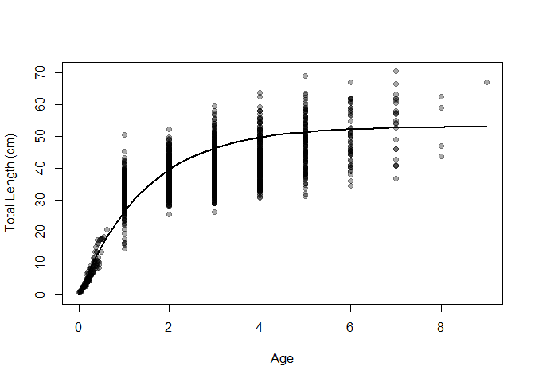
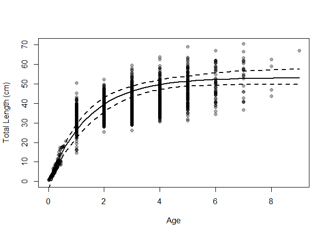
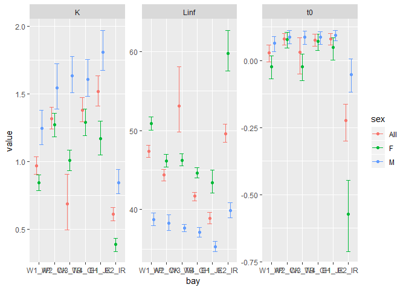
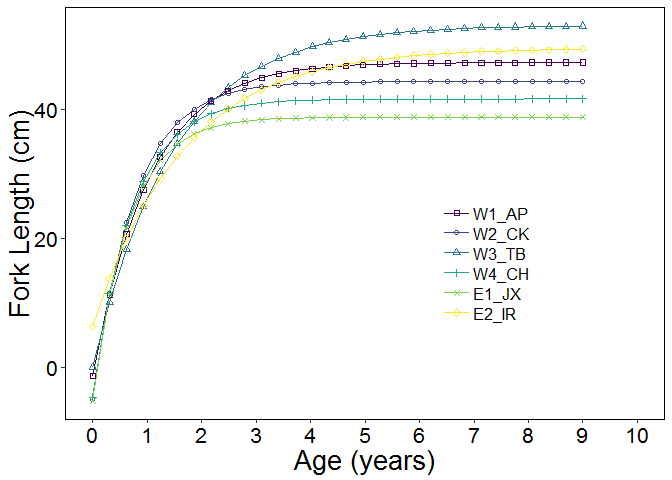

R Notebook: Growth\_curve\_analysis\_weighted.R
================

-   [*Main Objectives of this script*](#main-objectives-of-this-script)
-   [*Start Here*](#start-here)
-   [*1. Load data and do some wrangling*](#load-data-and-do-some-wrangling)
-   [*2.Statistical Fitting*](#statistical-fitting)
-   [*3.Visualize all predicted fits*](#visualize-all-predicted-fits)
-   [*4.Statistcal comparisons between groups.*](#statistcal-comparisons-between-groups.)
-   [*5.Plot comparative curves*](#plot-comparative-curves)

### *Main Objectives of this script*

1.  Imports otolith data.
2.  Determines VBGF parameters for each bay and bootstrapped 95% confidence intervals for each.
3.  Plots the comparative growth curves
4.  Compares nested growth models for Bay to Bay comparison to determine which growth parameters are significantly different between bays.

### *Start Here*

Load packages.

``` r
library(FSA)
library(magrittr)
library(dplyr)
library(nlstools)
library(tidyverse)
library(gridExtra)
library(grid)
library(lattice)
```

### *1. Load data and do some wrangling*

load the age 0 length data from the McMichael peters study \#\#\#\# change some variables and add some dummy variables so the dataframe will match to the Agelength\_Bay loaded next

``` r
#setwd("~/Desktop/PhD project/Projects/Seatrout/Data")
setwd("U:/PhD_projectfiles/Raw_Data/Age_Length_Data")

age0 <- read.csv("Age_length_mcmichael_peters.csv", header=TRUE) %>% mutate(tl=TL..mm./10, lcat2 =lencat(tl, w=1), bay=rep(NA, 149), date=rep(NA, 149)) %>% rename(final_age=Otolith.age..years.) 
```

    ## Warning: package 'bindrcpp' was built under R version 3.4.4

``` r
age0 <- subset(age0, select=-c(TL..mm.))
sex = sample(c("F", "M"),149,replace=TRUE, prob=c(0.5, 0.5))
age0$sex = sex

test <- read.csv("ALK_Bay_and_weight.csv", header=T)
Agelength_TB<- droplevels(subset(as.data.frame(read.csv("ALK_Bay_and_weight.csv", header=T)), bay=="TB" & tl>14 & final_age >0 & program=='FIM', select=c( bay, tl, final_age, date, sex))) %>% filter(!is.na(final_age)) %>% 
          mutate(tl=tl/10, lcat2 =lencat(tl, w=1)) %>%rbind(age0)
Agelength_TB$bay = "TB"
Agelength_TB <- subset(Agelength_TB, sex %in% c("M", "F"))
```

Now filter for the other areas

join all data together and make sure everything is leveled

``` r
all_raw <- rbind(Agelength_AP, Agelength_CH, Agelength_CK, Agelength_IR, Agelength_JX, Agelength_TB)

all_raw$bay <- as.factor(all_raw$bay)
all_raw$bay <- ordered(all_raw$bay, levels=c("AP", "CK", "TB", "CH", "JX", "IR"))
levels(all_raw$bay) <-  c("W1_AP", "W2_CK", "W3_TB", "W4_CH", "E1_JX", "E2_IR")
```

### *2.Statistical Fitting*

Fit Von B growth curves to each area and estimate parameters of curve.

Filter each data to fit to data with sexes combined or to just male and female data

``` r
# TB ####
t0=0
AL_TB <-  Agelength_TB %>% left_join(Agelength_TB %>% group_by(final_age) %>% summarize(n= n()), "final_age")


TB_M <- droplevels(Agelength_TB %>% filter(sex == "M")) %>% left_join(Agelength_TB %>% filter(sex == "M") %>% group_by(final_age) %>% summarize(n= n()), "final_age")
TB_F <- droplevels(Agelength_TB %>% filter(sex == "F")) %>% left_join(Agelength_TB %>% filter(sex == "F") %>% group_by(final_age) %>% summarize(n= n()), "final_age")

starting <- list(Linf=max(Agelength_TB$tl, na.rm=TRUE), K=0.3, t0=-3)

#use this as starting if you want to fix t0
#starting <- list(Linf=max(Agelength_TB$tl, na.rm=TRUE), K=0.3)

fitTB <- nls(tl~vbTyp(final_age, Linf, K, t0=t0), data=AL_TB, weights=1/n, start=starting)


coef(fitTB)
```

    ##        Linf           K          t0 
    ## 53.09204786  0.68441647  0.03160121

``` r
bootTB <- nlsBoot(fitTB)
```

    ## Warning in nlsBoot(fitTB): The fit did not converge 1 times during
    ## bootstrapping

``` r
confint(bootTB) #, plot=TRUE)
```

    ##          95% LCI     95% UCI
    ## Linf 49.95802831 57.30601637
    ## K     0.48639585  0.92928069
    ## t0   -0.04510728  0.08885962

Visualize the model fit - plot the best-fit VBGF with confidence intervals on top of the observed data uses a for loop to cycle through all ages

``` r
x <- seq(0,9, length.out=30) # ages for prediction
TB_pred <- vbTyp(x, Linf=coef(fitTB)[1],K= coef(fitTB)[2],t0=t0) #predicted lengths
xlmts <- range(c(x, Agelength_TB$final_age)) #set x limits
ylmts <- range(c(TB_pred, Agelength_TB$tl)) #set y limits
plot(tl~final_age, data=Agelength_TB, xlab="Age", ylab="Total Length (cm)", xlim=xlmts, ylim=ylmts, pch=19, col=rgb(0,0,0,1/3))
lines(TB_pred~x, lwd=2)
```



``` r
LCI <- UCI <- numeric(length(x))

for (i in 1:length(x))
{
  tmp <- apply(bootTB$coefboot, MARGIN =1, FUN=vbTyp, t=x[i])
  LCI[i] <- quantile(tmp, 0.025)
  UCI[i] <- quantile(tmp, 0.975)
}

x <- seq(0,9, length.out=30) # ages for prediction
TB_pred <- vbTyp(x, Linf=coef(fitTB)[1],K= coef(fitTB)[2],t0=t0) #predicted lengths
xlmts <- range(c(x, Agelength_TB$final_age)) #set x limits
ylmts <- range(c(TB_pred, Agelength_TB$tl)) #set y limits
plot(tl~final_age, data=Agelength_TB, xlab="Age", ylab="Total Length (cm)", xlim=xlmts, ylim=ylmts, pch=19, col=rgb(0,0,0,1/3))
lines(TB_pred~x, lwd=2)
lines(UCI ~ x, lwd=2, lty="dashed")
lines(LCI ~ x, lwd=2, lty="dashed")
```



Do for males.

``` r
#starting <- list(Linf=max(TB_M$tl, na.rm=TRUE), K=0.3, t0=-1)
fitTBM <- nls(tl~vbTyp(final_age, Linf, K, t0=t0), data=TB_M, start=starting, control=list(maxiter=500))
coef(fitTBM)
```

    ##        Linf           K          t0 
    ## 37.77952602  1.56648546  0.07535108

``` r
bootTBM <- nlsBoot(fitTBM)
confint(bootTBM) #, plot=TRUE)
```

    ##          95% LCI     95% UCI
    ## Linf 37.30978961 38.25533484
    ## K     1.45037724  1.69589744
    ## t0    0.04991602  0.09822581

``` r
x <- seq(0,9, length.out=30) # ages for prediction
TB_predM <- vbTyp(x, Linf=coef(fitTBM)[1],K= coef(fitTBM)[2],t0=t0) #predicted lengths
```

Do for females

``` r
#starting <- list(Linf=max(TB_F$tl, na.rm=TRUE), K=0.3, t0=-1)
fitTBF <- nls(tl~vbTyp(final_age, Linf, K, t0=t0), data=TB_F, start=starting, control=list(maxiter=500))
coef(fitTBF)
```

    ##        Linf           K          t0 
    ## 46.33547189  0.98483546 -0.03897035

``` r
bootTBF <- nlsBoot(fitTBF)
confint(bootTBF) #, plot=TRUE)
```

    ##          95% LCI     95% UCI
    ## Linf 45.59987243 47.12301172
    ## K     0.90611625  1.06855364
    ## t0   -0.09408713  0.01428825

``` r
x <- seq(0,9, length.out=30) # ages for prediction
TB_predF <- vbTyp(x, Linf=coef(fitTBF)[1],K= coef(fitTBF)[2],t0=t0) #predicted lengths
```

Now do for other estuaries.

### *3.Visualize all predicted fits*

``` r
# combine all predicted matrices into one
x <- seq(0,9, length.out=30)
t= data.frame(cbind(x,TB_pred)) %>% rename(pred=TB_pred) %>% mutate(bay=rep("TB",30))
a= data.frame(cbind(x,AP_pred)) %>% rename(pred=AP_pred) %>% mutate(bay=rep("AP",30))
ck= data.frame(cbind(x,CK_pred)) %>% rename(pred=CK_pred) %>% mutate(bay=rep("CK",30))
c= data.frame(cbind(x,CH_pred)) %>% rename(pred=CH_pred) %>% mutate(bay=rep("CH",30))
j= data.frame(cbind(x,JX_pred))%>% rename(pred=JX_pred) %>% mutate(bay=rep("JX",30))
i= data.frame(cbind(x,IR_pred)) %>% rename(pred=IR_pred) %>% mutate(bay=rep("IR",30))

pred_all <- rbind(t, a, ck, c, j,i)
```

``` r
library(grid)
library(ggplot2)

File <- ("U:/PhD_projectfiles/Figures/growth_curves_coloredversion.tiff")
#if (file.exists(File)) stop(File, " already exists")
dir.create(dirname(File), showWarnings = FALSE)

tiff(File, units="in", width=8, height=5, res=300)

ggplot(data= pred_all, aes(x=x, y=pred, group=bay))+  
  geom_line() + #aes(linetype=bay), size =.5)+ # make line types based on the different labels- this will be our workaround because in a few stps we will specify the first label (obserseved) be a blank line (therefore a scatter plot)
  geom_line(aes(color=bay), size=1.5)+
  #geom_point(aes(shape=bay), size=2) + #, color=bay))+ # groups the points together correctly and then gives them a unique shape them differently based on the line type 
  #scale_shape_manual(values=c(0,1,2, 3, 4, 5,6,7,8 ))+
  #scale_linetype_manual(values=c('solid', 'dashed', 'dotted'))+
  #scale_y_continuous(limits=c(-10,55), breaks= seq(-10,55,5))+
  scale_x_continuous(limits=c(0,10), breaks=seq(0,10,1))+
  xlab("Age (yrs)")+
  ylab("Total Length (cm)")+
  theme(panel.grid.minor=element_blank(), panel.grid.major=element_blank(),                                     
        panel.background=element_rect(fill='white', colour='black'),
        legend.key=element_blank(), legend.title=element_blank(),
        legend.background=element_rect(fill='white', size=.5),
        legend.position=c(.70,.38),
        legend.key.size= unit(3, "cm"),
        axis.title.y = element_text(colour="black", size=20), # changing font of y axis title
        axis.title.x = element_text(colour="black", size=20),
        axis.text.x=element_text(colour="black", size=16), #changing  colour and font of x axis text
        axis.text.y=element_text(colour="black", size=16), #changing colour and font of y axis
        #plot.title=element_text(size=14), # changing size of plot title)+
        legend.text=element_text( size=18),
        legend.key.height=unit(25,"point")) # changes vertical spacing of the legend text
#ggtitle("Comparative von Bertalanffy Growth Models")
dev.off()
```

    ## png 
    ##   2

Make cross bar plots for error

``` r
#CROSS BAR PLOTS FOR ERROR ####

coefs <- data.frame(rbind(coef(fitTB),coef(fitTBF),coef(fitTBM), 
                          coef(fitAP),coef(fitAPF),coef(fitAPM),
                          coef(fitCK),coef(fitCKF), coef(fitCKM),
                          coef(fitCH), coef(fitCHF), coef(fitCHM),
                          coef(fitIR), coef(fitIRF), coef(fitIRM),
                          coef(fitJX), coef(fitJXF), coef(fitJXM)))


coefs$bay <- rep(c("TB", "AP", "CK", "CH", "IR", "JX"), each=3) 
coefs$sex <- rep(c("All", "F", "M"), each = 1)

test <- coefs %>% gather(c(Linf, K, t0), key="params", value="value")
```

Get confidence intervals

``` r
confs <- data.frame(rbind(confint(bootTB),confint(bootTBF),confint(bootTBM),
confint(bootAP),confint(bootAPF),confint(bootAPM),
confint(bootCK),confint(bootCKF),confint(bootCKM),
confint(bootCH),confint(bootCHF),confint(bootCHM),
confint(bootIR),confint(bootIRF),confint(bootIRM),
confint(bootJX),confint(bootJXF),confint(bootJXM)))
```

    ## Warning in data.row.names(row.names, rowsi, i): some row.names duplicated:
    ## 4,5,6,7,8,9,10,11,12,13,14,15,16,17,18,19,20,21,22,23,24,25,26,27,28,29,30,31,32,33,34,35,36,37,38,39,40,41,42,43,44,45,46,47,48,49,50,51,52,53,54
    ## --> row.names NOT used

``` r
ggplot(uncertainty_matrix, aes(bay, value, color=sex))+ geom_point(position=position_dodge(0.5)) +
  geom_errorbar(aes(ymin= LCI, ymax=UCI), position=position_dodge(0.5))+
  facet_wrap(~params, scales = "free")
```

 \#\#\#\# plot mean size at age for raw data

``` r
# NOTE:::: TO run this the age0 dataframe should not be added in the beginning
all <- rbind(Agelength_AP, Agelength_CH, Agelength_CK, Agelength_IR, Agelength_JX, Agelength_TB)
all <- all%>% ungroup()


sum <- all %>% dplyr::group_by(bay, final_age) %>% dplyr::summarize(N=length(tl), meantl=mean(tl), sdtl=sd(tl), se= sdtl/sqrt(N))
names(sum)[1] <- "Area"

File <- ("U:/PhD_projectfiles/Figures/raw_data_with_fit_PLUS_confints.tiff")
#if (file.exists(File)) stop(File, " already exists")
dir.create(dirname(File), showWarnings = FALSE)

tiff(File, units="in", width=7, height=8, res=300)


# grid.arrange(ggplot(sum, aes(final_age, meantl, color=Area)) + 
#   geom_errorbar(aes(ymin=meantl-se, ymax=meantl+se), width=0.5, size=1) +
#   geom_point(aes(shape=Area), size=2.5)+
#   geom_line(aes(group=Area), size=0.75) +theme_bw()+
#   #xlab("Age (yrs)")+
#   ylab("Mean total length (cm)")+
#   scale_y_continuous(limits=c(0,80), breaks=seq(0,80, 10))+
#   scale_x_continuous(limits=c(0,10), breaks=seq(0,10, 1))+
#   theme(panel.grid.minor=element_blank(), panel.grid.major=element_blank(),
#         axis.title.y = element_text( colour="black", size=16), # changing font of y axis title
#         axis.title.x = element_blank(),
#         axis.text.x=element_text(colour="black", size=12), #changing  colour and font of x axis text
#         axis.text.y=element_text(colour="black", size=12),
#         legend.text=element_text( size=14),
#         legend.title=element_blank()),
  
grid.arrange(
  ggplot() + geom_point(data=all_raw, aes(final_age, tl, shape=sex, color=sex),position = position_dodge(0.5), alpha=0.3, size=2 )+
    geom_line(data=PRED, aes(x, pred, linetype=sex), size=1)+
    #geom_line(data=pred_allF, aes(x, pred), size=1, linetype="dashed")+
    #geom_line(data=pred_allM, aes(x, pred), size=1, linetype="dotted")+
    ylab("Total length (cm)") +
    xlab("Age (yrs)")+ 
    scale_color_manual(values=c("#F8766D", "#619CFF"))+
    scale_shape_manual(values=c(17,15))+
    scale_y_continuous(limits=c(-10,80), breaks=seq(-10,80, 10))+
    scale_x_continuous(limits=c(0, 10), breaks=seq(0, 10, 1))+
    theme(panel.grid.minor=element_blank(), 
          panel.grid.major=element_blank(), 
          panel.background=element_rect(colour="black", fill="white"),
          axis.title.x =element_text(colour="black", size=14),
          axis.text.x = element_text(colour="black"),
          strip.background = element_rect(color = "black", size = 1),
          strip.text.x=element_text(size=12),
          axis.title.y =element_text(colour="black", size=16),
          axis.text.y = element_text(colour="black"),
          legend.text=element_text( size=14),
          plot.title=element_text(size=14),
          legend.title=element_blank())+
    facet_wrap(~bay)+
    guides(color = guide_legend(override.aes = list(alpha=1))),
  ggplot(uncertainty_matrix, aes(bay, value, shape=sex, color=sex))+ 
    geom_point(position=position_dodge(0.5), size=2) +
    geom_errorbar(aes(ymin= LCI, ymax=UCI),size=0.6,position=position_dodge(0.5))+
    facet_wrap(~params, scales = "free")+
    xlab("Area")+
    ylab("")+
    scale_color_manual(values=c("#00BA38", "#F8766D", "#619CFF"))+
    theme(panel.grid.minor=element_line(color="grey"), 
          panel.grid.major=element_blank(), 
          panel.background=element_rect(colour="black", fill="white"),
          axis.title.x =element_text( colour="black", size=14),
          axis.text.x = element_text(colour="black", angle = 40, size=8),
          strip.background = element_rect(color = "black", size = 1),
          strip.text.x=element_text(size=12),
          axis.title.y =element_text(color="black"),
          axis.text.y = element_text(colour="black"),
          legend.text=element_text( size=14),
          plot.title=element_text(size=14),
          legend.title=element_blank()) +
    geom_vline(xintercept=seq(1.5, length(unique(uncertainty_matrix$bay))-0.5, 1), 
               lwd=1,linetype="solid", colour="grey"), nrow =2, heights=c(1.5,0.75))
```

    ## Warning: position_dodge requires non-overlapping x intervals

    ## Warning: position_dodge requires non-overlapping x intervals

    ## Warning: position_dodge requires non-overlapping x intervals

    ## Warning: position_dodge requires non-overlapping x intervals

    ## Warning: position_dodge requires non-overlapping x intervals

    ## Warning: position_dodge requires non-overlapping x intervals

    ## Warning: Removed 18 rows containing missing values (geom_point).

``` r
dev.off()
```

    ## png 
    ##   2

### *4.Statistcal comparisons between groups.*

Requires fitting multiple models to determine which parameters between each group is different. For simplicities sake, I will only compare 2 bays at a time. Can refer to ALK\_analysis.R for a list of bay to bay comparisons. Refer to page 236 in Ogle for the family of models that must be considered when examining the differences in VBGF among groups. The nested relationships among these models allows use of likelihoo ratio and extra sum of squares tests.

``` r
# Define the generic models to compare depending on whether you are comparing by sex or bay

# vbLKt <- tl~Linf[bay]*(1-exp(-K[bay]*(final_age-t0[bay])))
# vbLK <- tl~Linf[bay]*(1-exp(-K[bay]*(final_age-t0)))
# vbLt <- tl~Linf[bay]*(1-exp(-K*(final_age-t0[bay])))
# vbKt <- tl~Linf*(1-exp(-K[bay]*(final_age-t0[bay])))
# vbL <-  tl~Linf[bay]*(1-exp(-K*(final_age-t0)))
# vbK <-  tl~Linf*(1-exp(-K[bay]*(final_age-t0)))
# vbt <- tl~Linf*(1-exp(-K*(final_age-t0[bay])))
# vb0 <- tl~Linf*(1-exp(-K*(final_age-t0)))


vbLKt <- tl~Linf[sex]*(1-exp(-K[sex]*(final_age-t0[sex])))
vbLK <- tl~Linf[sex]*(1-exp(-K[sex]*(final_age-t0)))
vbLt <- tl~Linf[sex]*(1-exp(-K*(final_age-t0[sex])))
vbKt <- tl~Linf*(1-exp(-K[sex]*(final_age-t0[sex])))
vbL <-  tl~Linf[sex]*(1-exp(-K*(final_age-t0)))
vbK <-  tl~Linf*(1-exp(-K[sex]*(final_age-t0)))
vbt <- tl~Linf*(1-exp(-K*(final_age-t0[sex])))
vb0 <- tl~Linf*(1-exp(-K*(final_age-t0)))


#Define starting values for each model scenario

sv0 <- vbStarts(tl~final_age, data=Agelength_CK) #using the TB dataframe as a starter
```

    ## Warning: Starting value for Linf is very different from the observed maximum length, which suggests a model fitting problem.
    ## See a Walford or Chapman plot to examine the problem.  Consider
    ## either using the mean length for several of the largest fish
    ## (i.e., use 'oldAge' in 'methLinf=') or manually setting Linf
    ## to the maximum observed lengthin the starting value list.

    ## Warning: The suggested starting value for K is negative, which suggests a model fitting problem.
    ## See a Walford or Chapman Plot to examine the problem.
    ## Consider manually setting K=0.3 in the starting value list.

    ## Warning: Starting value for Linf is very different from the observed maximum length, which suggests a model fitting problem.
    ## See a Walford or Chapman plot to examine the problem.  Consider
    ## either using the mean length for several of the largest fish
    ## (i.e., use 'oldAge' in 'methLinf=') or manually setting Linf
    ## to the maximum observed lengthin the starting value list.

    ## Warning: The suggested starting value for K is negative, which suggests a model fitting problem.
    ## See a Walford or Chapman Plot to examine the problem.
    ## Consider manually setting K=0.3 in the starting value list.

``` r
sv0$Linf= 70
sv0$K = 0.3
sv0$t0 = -0.1
svLKt <- Map(rep,sv0,c(2,2,2))
svLK <- Map(rep,sv0,c(2,2,1))
svLt <- Map(rep,sv0,c(2,1,2))
svKt <- Map(rep,sv0,c(1,2,2))
svL <- Map(rep,sv0,c(2,1,1))
svt <- Map(rep,sv0,c(1,1,2))
svK <- Map(rep, sv0,c(1,2,1))
```

#### Define dataframes with bay-bay comparison

``` r
Agelength_TBCK<- rbind(Agelength_TB, Agelength_CK) 
  Agelength_TBCK$bay <- as.factor(Agelength_TBCK$bay)
```

Now do other area combinations

#### Define fits to model scenarios- first by sex for each bay

``` r
#filter missing sex
# library(minpack.lm)
  
tb_mf <- droplevels(subset(Agelength_TB, sex %in% c("M", "F")))
#Fit to [LKt] model then to the simplest model [vb0]

fitLKt <- nls(vbLKt, data=tb_mf, start=svLKt)
#residPlot(fitLKt, col=rgb(0,0,0,1/3))
fitLK <- nls(vbLK, data=tb_mf, start=svLK)
fitLt <- nls(vbLt, data=tb_mf, start=svLt)
fitKt <- nls(vbKt, data=tb_mf, start=svKt)
fitL <- nls(vbL, data=tb_mf, start=svL)
fitt <- nls(vbt, data=tb_mf, start=svt)
fitK <- nls(vbK, data=tb_mf, start=svK)
fit0 <- nls(vb0, data=tb_mf, start=sv0)

cbind(AIC(fitLKt,fitLK,fitLt,fitKt, fitL, fitK, fitt, fit0), BIC(fitLKt, fitLK, fitLt, fitKt, fitL, fitK, fitt, fit0))
```

    ##        df      AIC df      BIC
    ## fitLKt  7 12811.35  7 12850.63
    ## fitLK   6 12819.97  6 12853.64
    ## fitLt   6 12840.61  6 12874.29
    ## fitKt   6 13014.69  6 13048.37
    ## fitL    5 12841.24  5 12869.30
    ## fitK    5 13047.08  5 13075.14
    ## fitt    5 13171.59  5 13199.65
    ## fit0    4 13187.25  4 13209.70

``` r
# Likelihood ratio and extra for comparing the two models are calculated with lrt() and extraSS().
lrt(fit0, com=fitLKt, com.name="All pars differ", sim.name="No pars differ")
```

    ## Loading required namespace: lmtest

    ## Model 1: No pars differ
    ## Model A: All pars differ 
    ## 
    ##      DfO  logLikO  DfA  logLikA Df   logLik Chisq Pr(>Chisq)    
    ## 1vA 2020 -6589.63 2017 -6398.67  3  -190.95 381.9  < 2.2e-16 ***
    ## ---
    ## Signif. codes:  0 '***' 0.001 '**' 0.01 '*' 0.05 '.' 0.1 ' ' 1

``` r
extraSS(fit0, com=fitLKt, com.name="All pars diff", sim.names="No pars diff")
```

    ## Model 1: No pars diff
    ## Model A: All pars diff 
    ## 
    ##      DfO  RSSO  DfA  RSSA Df    SS      F    Pr(>F)    
    ## 1vA 2020 79951 2017 66197  3 13754 139.69 < 2.2e-16 ***
    ## ---
    ## Signif. codes:  0 '***' 0.001 '**' 0.01 '*' 0.05 '.' 0.1 ' ' 1

``` r
#Likelihood ratio and extra sums of square test both suggest a significant difference
# between the most complex and the simplest. So there is evidence that there is some
# difference in the parameters between TB and CK

#Compare the nested models

lrt(fitLK, fitLt, fitKt, com=fitLKt, com.name="All pars diff", sim.names=c("Linf, K diff", "Linf,t0 diff", "K, t0, diff"))
```

    ## Model 1: Linf, K diff
    ## Model 2: Linf,t0 diff
    ## Model 3: K, t0, diff
    ## Model A: All pars diff 
    ## 
    ##      DfO   logLikO  DfA   logLikA Df    logLik   Chisq Pr(>Chisq)    
    ## 1vA 2018 -6403.984 2017 -6398.674  1    -5.310  10.621   0.001118 ** 
    ## 2vA 2018 -6414.306 2017 -6398.674  1   -15.632  31.264  2.252e-08 ***
    ## 3vA 2018 -6501.346 2017 -6398.674  1  -102.672 205.343  < 2.2e-16 ***
    ## ---
    ## Signif. codes:  0 '***' 0.001 '**' 0.01 '*' 0.05 '.' 0.1 ' ' 1

``` r
# ***** Any nested model that is not statistically different from[L,K,t0] is considered "better" because it fits equally (statistically) well, but is more parsimonious.
#       If two models are better than [L, K, t0] then the one with the greatest LL is chosen to be the best of the nested models. 
```

Now do for the other areas

#### Define fits to model scenarios (one bay at a time) \_TBCK here

``` r
#Fit to [LKt] model then to the simplest model [vb0]
fitLKt <- nls(vbLKt, data=Agelength_TBCK, start=svLKt)
  #residPlot(fitLKt, col=rgb(0,0,0,1/3))
fitLK <- nls(vbLK, data=Agelength_TBCK, start=svLK)
fitLt <- nls(vbLt, data=Agelength_TBCK, start=svLt)
fitKt <- nls(vbKt, data=Agelength_TBCK, start=svKt)
fitL <- nls(vbL, data=Agelength_TBCK, start=svL)
fitt <- nls(vbt, data=Agelength_TBCK, start=svt)
fitK <- nls(vbK, data=Agelength_TBCK, start=svK)
fit0 <- nls(vb0, data=Agelength_TBCK, start=sv0)


############################################
#Likelihood ratio testing example with TBCK
###########################################


# Likelihood ratio and extra for comparing the two models are calculated with lrt() and extraSS().
lrt(fit0, com=fitLKt, com.name="All pars differ", sim.name="No pars differ")
extraSS(fit0, com=fitLKt, com.name="All pars diff", sim.names="No pars diff")

#Likelihood ratio and extra sums of square test both suggest a significant difference
# between the most complex and the simplest. So there is evidence that there is some
# difference in the parameters between TB and CK


#Compare the nested models

lrt(fitLK, fitLt, fitKt, com=fitLKt, com.name="All pars diff", sim.names=c("Linf, K diff", "Linf,t0 diff", "K, t0, diff"))

# ***** Any nested model that is not statistically different from[L,K,t0] is considered "better" because it fits equally (statistically) well, but is more parsimonious.
#       If two models are better than [L, K, t0] then the one with the greatest LL is chosen to be the best of the nested models. 


##############################################################
# Easier AIC/BIC example that could be used in place of the LRT
###############################################################
cbind(AIC(fitLKt,fitLK,fitLt,fitKt, fitL, fitK, fitt, fit0), BIC(fitLKt, fitLK, fitLt, fitKt, fitL, fitK, fitt, fit0))
#Lowest:
# #       df      AIC df      BIC
# fitLK   6 22568.78  6 22605.44
```

#### Now do it all over again with each Bay to bay comparison

### *5.Plot comparative curves*



This is an [R Markdown](http://rmarkdown.rstudio.com) Notebook. When you execute code within the notebook, the results appear beneath the code.

Try executing this chunk by clicking the *Run* button within the chunk or by placing your cursor inside it and pressing *Ctrl+Shift+Enter*.

Add a new chunk by clicking the *Insert Chunk* button on the toolbar or by pressing *Ctrl+Alt+I*.

When you save the notebook, an HTML file containing the code and output will be saved alongside it (click the *Preview* button or press *Ctrl+Shift+K* to preview the HTML file).
