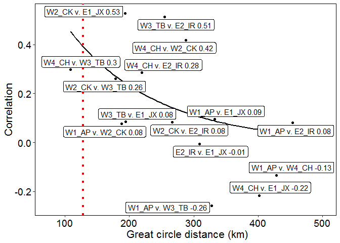

R Notebook:Medoid\_GC\_NLSfit\_plot.R
================

-   [*Main Objectives of this script*](#main-objectives-of-this-script)
-   [*Start Here*](#start-here)
-   [*1. Load data and do some wrangling*](#load-data-and-do-some-wrangling)
-   [*2.Medoid calculation*](#medoid-calculation)
-   [*3.Calculate great circle distance between pairs of areas*](#calculate-great-circle-distance-between-pairs-of-areas)
-   [*4.Combine mediods with rho values from spreadsheet*](#combine-mediods-with-rho-values-from-spreadsheet)
-   [*5. Fit non linear square model to estimate spatial decay*](#fit-non-linear-square-model-to-estimate-spatial-decay)
-   [*6. Visualize correlation by distance*](#visualize-correlation-by-distance)

### *Main Objectives of this script*

1.  Determining medoids of each estuary so they can be used as great circle (GC) distance references
2.  ESTIMATE SPATIAL DECAY WITH NLS MODEL for both recruitment indices and RESIDUALS
3.  Determines lats and longs for adult data as well.
4.  Produces a CSV file with all of the lats and longs

### *Start Here*

Load packages.

``` r
library(haven) #for loading SAS data
library(cluster) #for finding medoid
library(geosphere) # for calculating great circle distances between each medoid
library(ggplot2) #for plotting
library(nlstools) #for fitting nls models
library(tidyverse)
library(ggrepel)
```

### *1. Load data and do some wrangling*

``` r
setwd("U:/PhD_projectfiles/Raw_Data/Seatrout_FIM_Data/FIMData")
ap = subset(read_sas("ap_yoy_cn_c.sas7bdat"), month %in% c(6,7,8,9,10,11))
apl = read_sas("ap_yoy_cn_l.sas7bdat")

ck = subset(read_sas("ck_yoy_cn_c.sas7bdat"),  month %in% c(5,6,7,8,9,10,11)) 
ckl = read_sas("ck_yoy_cn_l.sas7bdat")

ch = subset(read_sas("ch_yoy_cn_c.sas7bdat"), month %in% c(4,5,6,7,8,9,10)) 
chl = read_sas("ch_yoy_cn_l.sas7bdat")

tb = subset(read_sas("tb_yoy_cn_c.sas7bdat"), month %in% c(4,5,6,7,8,9,10)) 
tbl = read_sas("tb_yoy_cn_l.sas7bdat")

ir = subset(read_sas("ir_yoy_cn_c.sas7bdat"), month %in% c(5,6,7,8,9,10,11)) 
irl = read_sas("ir_yoy_cn_l.sas7bdat")

jx = subset(read_sas("jx_yoy_cn_c.sas7bdat") , month %in% c(5,6,7,8,9,10,11))
jxl = read_sas("jx_yoy_cn_l.sas7bdat")


ap_all = ap
tb_all=tb
ch_all=ch
ck_all=ck
ir_all=ir
jx_all=jx
```

### *2.Medoid calculation*

``` r
AP_LL <- subset(ap_all, select=c("Longitude", "Latitude")) 
  APMed <- pam(AP_LL,1)$medoids
```

Now do for remaining areas.

### *3.Calculate great circle distance between pairs of areas*

``` r
AP_compars = rbind(distGeo(APMed, CHMed, a=6378137, f=1/298.257223563),
                        distGeo(APMed, CKMed, a=6378137, f=1/298.257223563),
                        distGeo(APMed, TBMed, a=6378137, f=1/298.257223563),
                        distGeo(APMed, IRMed, a=6378137, f=1/298.257223563),
                        distGeo(APMed, JXMed, a=6378137, f=1/298.257223563))
```

Now do for other combinations

#### join distances together

make sure they are in the correct order so that they can bind together with the csv imported below.

``` r
distances <- rbind(AP_compars, CH_compars, CK_compars, IR_compars, TB_compars)
rownames(distances) <- c("AP_CH", "AP_CK", "AP_TB", "AP_IR", "AP_JX", 
                         "CH_CK", "CH_TB", "CH_IR", "CH_JX",
                         "CK_TB", "CK_IR", "CK_JX",
                         "TB_IR", "TB_JX",
                         "IR_JX")
```

### *4.Combine mediods with rho values from spreadsheet*

``` r
rho_P_vector <- read.csv('U:/PhD_projectfiles/Exported_R_Datafiles/rho_P_vector.csv', header=T)


#combine rho and distances vectors and then turn distance into kilometers, name x and y for plotting convention below
t<-cbind(rho_P_vector, distances) %>% mutate(distancesKM=distances/1000) %>% arrange(distancesKM) %>% rename(y=rho, x=distancesKM)
```

    ## Warning: package 'bindrcpp' was built under R version 3.4.4

``` r
#export for later use
write.csv(t,'U:/PhD_projectfiles/Exported_R_Datafiles/rho_vs_distance.csv' )
```

### *5. Fit non linear square model to estimate spatial decay*

Two options:
1. Fix p0= 1, just exclude it from the equation
2. Estimate p0
Pyper et al. 2001, Peterman et al. 1998
P(d)= p0e(-d/v)- constrain p0 to 1
P(d)=p0e(-d/v) - estimate P0
v (e-folding scale) where e-folding scale tells distance

must find acceptable starting values (can play around with these in excel-rho\_vs\_distance\_param\_start\_estimation.csv)

``` r
p0 = 1
v = 100
#p0 constrained to 1, weighted by the total sample number which is shared between each comparison
m1 = nls(y ~exp(-(x/v)), start=list(v=v), data=t, weights=(N))
overview(m1)
```

    ## 
    ## ------
    ## Formula: y ~ exp(-(x/v))
    ## 
    ## Parameters:
    ##   Estimate Std. Error t value Pr(>|t|)    
    ## v   136.87      26.66   5.133 0.000152 ***
    ## ---
    ## Signif. codes:  0 '***' 0.001 '**' 0.01 '*' 0.05 '.' 0.1 ' ' 1
    ## 
    ## Residual standard error: 0.9259 on 14 degrees of freedom
    ## 
    ## Number of iterations to convergence: 3 
    ## Achieved convergence tolerance: 1.279e-06
    ## 
    ## ------
    ## Residual sum of squares: 0.627 
    ## 
    ## ------
    ## t-based confidence interval:
    ##      2.5%    97.5%
    ## 1 79.6782 194.0528
    ## 
    ## ------
    ## Correlation matrix:
    ##   v
    ## v 1

``` r
#estimated v 136.87(SE 26.66)
```

p0 estimated

``` r
p0=0.9
v=125
m2 = nls(y ~p0*exp(-(x/v)), start=list(p0=p0,v=v), data=t, weights=(N))
summary(m2)
```

    ## 
    ## Formula: y ~ p0 * exp(-(x/v))
    ## 
    ## Parameters:
    ##    Estimate Std. Error t value Pr(>|t|)
    ## p0   0.6978     0.5476   1.274    0.225
    ## v  178.4453   125.2971   1.424    0.178
    ## 
    ## Residual standard error: 0.949 on 13 degrees of freedom
    ## 
    ## Number of iterations to convergence: 19 
    ## Achieved convergence tolerance: 8.569e-06

``` r
yfitted <- predict(m2)
boot <- nlsBoot(m2, niter=2000) #bootstrapping 
bootCI <- boot$bootCI #gives confidence intervals and median values for p0 and v (e-folding scale) where e-folding scale tells distance 
```

evalute fit with anova and F test. if they are significantly different than F test will indicated significant p value

``` r
anova(m1, m2)
```

    ## Analysis of Variance Table
    ## 
    ## Model 1: y ~ exp(-(x/v))
    ## Model 2: y ~ p0 * exp(-(x/v))
    ##   Res.Df Res.Sum Sq Df  Sum Sq F value Pr(>F)
    ## 1     14     12.002                          
    ## 2     13     11.708  1 0.29399  0.3264 0.5775

### *6. Visualize correlation by distance*

Plot correlation by distance and add the fitted curve to the plot(here p0 is estimated. see below for explanation) <http://stackoverflow.com/questions/25030653/fitting-with-ggplot2-geom-smooth-and-nls> NOTE: within geom\_smooth it does not recognize variable names; they must be named x and y; weight must be in an aesthetic in ggplot

``` r
ggplot(data=t_mut, aes(x=x, y=y, label = label))+geom_point()+ 
  geom_smooth(method="nls",formula=y ~exp(-(x/v)), method.args=list(start=c(v=150)), aes(weight=N), se=FALSE, color="black", size=1)+                                           
  ylab("Correlation") +
  xlab(" Great circle distance (km)")+ 
  geom_vline(xintercept = 128.46, linetype="dotted", size=1.5, color="red")+
  #geom_text(aes(label= label), vjust=1.5, hjust=0.5, size=2, check_overlap=T)+
  #geom_text_repel(aes(label=label), size=4)+
  geom_label_repel(aes(label=label))+
  #geom_label( check_overlap=T)+
  #geom_label(size=2.5, hjust = 1.1)+
  scale_x_continuous(limits=c(75,500))+
  #scale_y_continuous(limits=c(-0.3, 0.5, 0.1))+
  theme(panel.grid.minor=element_blank(), panel.grid.major=element_blank(),  
        panel.background=element_rect(fill='white', colour='black'),                                                    
        axis.text.x=element_text(colour="black", size=14), #changing  colour of x axis
        axis.title.x=element_text(size=16),
        axis.title.y=element_text(size=16),
        axis.text.y=element_text(colour="black", size=14), #changing colour of y axis
        plot.title=element_text(size=14), # changing size of plot title)+
        legend.text=element_text(size=14))
```



    ## null device 
    ##           1
