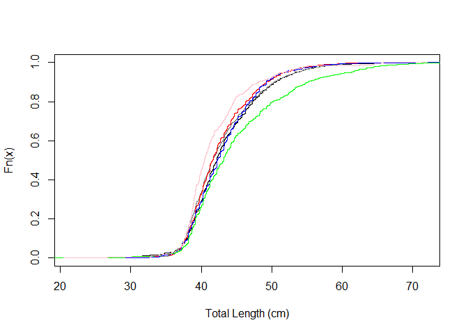
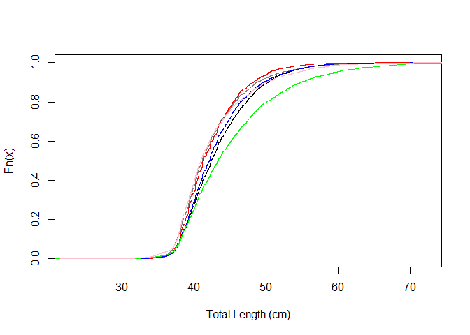
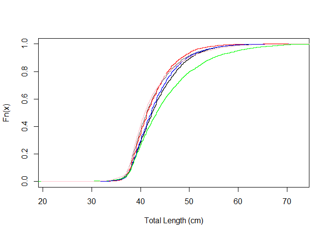
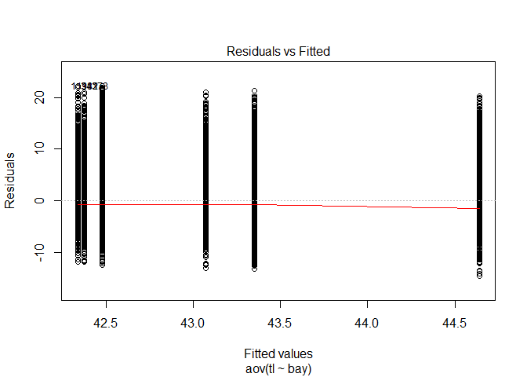
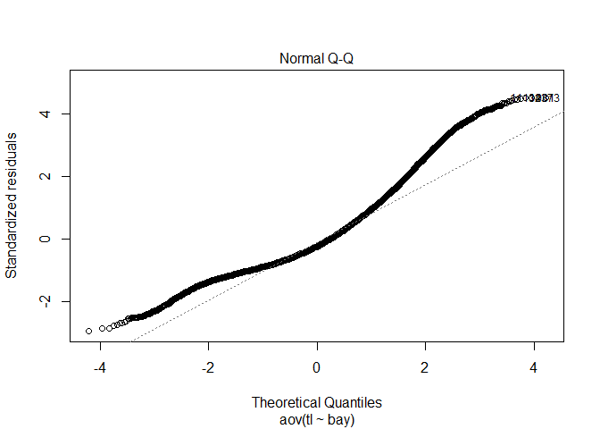
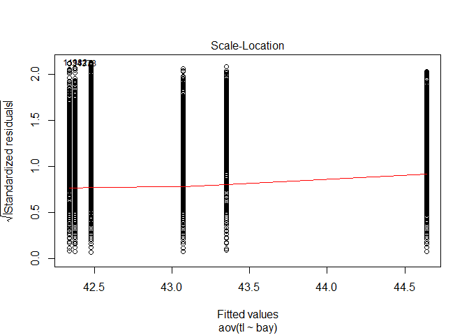
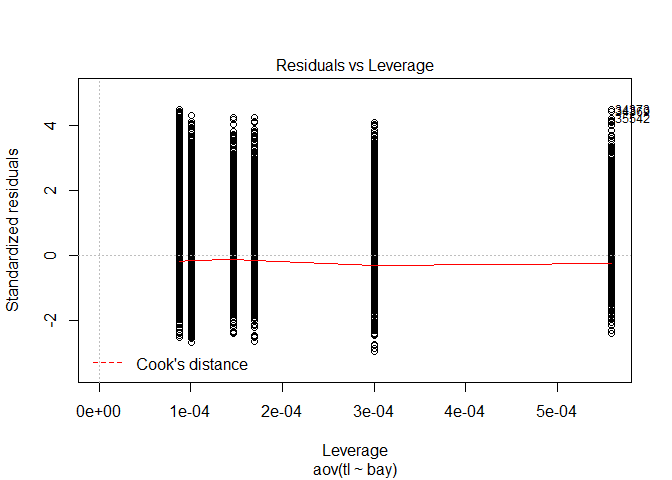

R Notebook: Recreational\_length\_frequency\_analysis
================

-   [*Main Objectives of this script*](#main-objectives-of-this-script)
-   [*Start Here*](#start-here)
-   [*1. Load data and do some wrangling*](#load-data-and-do-some-wrangling)
-   [*2. Plot ecdf (empirical cumulative distribution function) - used for K-S test*](#plot-ecdf-empirical-cumulative-distribution-function---used-for-k-s-test)
-   [*3.Statistical comparisons to test length distributions*](#statistical-comparisons-to-test-length-distributions)
-   [*4.Visualize with CROSSBAR PLOT for mean and standard error*](#visualize-with-crossbar-plot-for-mean-and-standard-error)

### *Main Objectives of this script*

1.  Imports mrfss and mrip length data.
2.  One way ANOVA to determine whether there is a significant difference in total length among estuaries
3.  Plots of ECDF
4.  Statistical comparison of bay-bay length frequencies.
    -   K-S test
    -   Chi-Square Test

### *Start Here*

Load packages.

``` r
library(FSA)
library(magrittr)
library(dplyr)
library(plotrix)
library(haven)
library(Matching)
library(dplyr)
library(ggplot2)
library(scales)
```

### *1. Load data and do some wrangling*

subset each estuary using the Country of Encounter codes From the definitions defined by FWRI FIPS county codes

load data select the counties that most closely align with the bays in question convert fork length to tl using the equation TLmm = 1.00467 \* FL + 0.04850 from the SAS mrfss leng\_freq chose data from 2000 on because of major regulatory changes

``` r
#setwd("~/Desktop/PhD project/Projects/Seatrout/Data")
setwd("U:/PhD_projectfiles/Raw_Data/Age_Length_Data")
mrfss <- read_sas("mrfss_lens_8115.sas7bdat")
mrip <- read_sas("mrip_lens_20042015.sas7bdat")
```

``` r
setwd("U:/PhD_projectfiles/Raw_Data/Age_Length_Data")
mrfss_AP <- subset(read_sas("mrfss_lens_8115.sas7bdat"), CNTY %in% c(5,33,37,45,65,77,91,113,123,129,131,133) & YEAR>=2000 & YEAR <= 2003) %>% mutate(tl = (1.00467*flmm+0.04850)/10) %>% filter(!is.na(tl)) %>% mutate(bay=rep("AP",2234)) 
```

    ## Warning: package 'bindrcpp' was built under R version 3.4.4

``` r
  mrfss_AP <- droplevels(subset(mrfss_AP, select=c(tl, bay)))
```

Now load other areas based on FIPS county designations

Load the Mrip data as above.

Now the other areas

combine data

``` r
AP <- rbind(mrfss_AP, mrip_AP)
TB <- rbind(mrfss_TB, mrip_TB)
CK <- rbind(mrfss_CK, mrip_CK)
CH <- rbind(mrfss_CH, mrip_CH)
JX <- rbind(mrfss_JX, mrip_JX)
IR <- rbind(mrfss_IR, mrip_IR)

All= rbind(AP, TB, CK, CH, JX, IR)
All$bay <- as.factor(All$bay)
All <- na.omit(All)
All$bay <- factor(All$bay, levels=c("AP", "CK", "TB", "CH", "JX", "IR"))

All_sum <- summarise(group_by(All, bay), N = length(tl), mean_tl = mean(tl), min_tl=min(tl), max_tl=max(tl), sd_tl= sd(tl), se_tl= sd_tl/(sqrt(length(tl))))
Rec_sum <- All_sum

N = nrow(AP) +nrow(TB) +nrow(CK) +nrow(CH) +nrow(JX) +nrow(IR)
```

### *2. Plot ecdf (empirical cumulative distribution function) - used for K-S test*

MRFSS  MRIP  ALL  test &lt;- ecdf(TB$tl)

### *3.Statistical comparisons to test length distributions*

#### First with K-S Test

used to determine whether ECDF are the same between two groups and can detect differences in location, dispersion and shape of the ditrubtions bootstrapped version of the K-S test that is insensitive to ties with noncontinuous data is implemented in ks.boot

``` r
ks<- c(ks.boot(mrfss_TB$tl, mrfss_CK$tl, nboots=1000)$p.value, ks.boot(mrfss_TB$tl, mrfss_CH$tl, nboots=5000)$p.value)
c <- ks.boot(mrfss_TB$tl, mrfss_TB$tl)
#if comparing more than two groups then each pair must be compared separately and the p value from each comparison must
# be adjusted for an increasing experimentwise error rate due to multiple comparisons. 
```

MRFSS

``` r
ks_ALL_mrfss <-c(ks.boot(mrfss_TB$tl, mrfss_CK$tl, nboots=1000)$ks.boot.pvalue, 
  ks.boot(mrfss_TB$tl, mrfss_CH$tl, nboots=1000)$ks.boot.pvalue,
  ks.boot(mrfss_TB$tl, mrfss_AP$tl, nboots=1000)$ks.boot.pvalue,
  ks.boot(mrfss_TB$tl, mrfss_JX$tl, nboots=1000)$ks.boot.pvalue,
  ks.boot(mrfss_TB$tl, mrfss_IR$tl, nboots=1000)$ks.boot.pvalue,
  ks.boot(mrfss_CK$tl, mrfss_CH$tl, nboots=1000)$ks.boot.pvalue,
  ks.boot(mrfss_CK$tl, mrfss_AP$tl, nboots=1000)$ks.boot.pvalue,
  ks.boot(mrfss_CK$tl, mrfss_JX$tl, nboots=1000)$ks.boot.pvalue,
  ks.boot(mrfss_CK$tl, mrfss_IR$tl, nboots=1000)$ks.boot.pvalue,
  ks.boot(mrfss_CH$tl, mrfss_AP$tl, nboots=1000)$ks.boot.pvalue,
  ks.boot(mrfss_CH$tl, mrfss_JX$tl, nboots=1000)$ks.boot.pvalue,
  ks.boot(mrfss_CH$tl, mrfss_IR$tl, nboots=1000)$ks.boot.pvalue,
  ks.boot(mrfss_AP$tl, mrfss_JX$tl, nboots=1000)$ks.boot.pvalue,
  ks.boot(mrfss_AP$tl, mrfss_IR$tl, nboots=1000)$ks.boot.pvalue,
  ks.boot(mrfss_JX$tl, mrfss_IR$tl, nboots=1000)$ks.boot.pvalue)

p.adjust(ks_ALL_mrfss) 
```

    ##  [1] 0.028 0.332 0.028 0.000 0.000 0.000 0.332 0.000 0.000 0.000 0.000
    ## [12] 0.000 0.000 0.000 0.000

MRIP

``` r
ks_ALL_mrip <-c(ks.boot(mrip_TB$tl, mrip_CK$tl, nboots=1000)$ks.boot.pvalue, 
                 ks.boot(mrip_TB$tl, mrip_CH$tl, nboots=1000)$ks.boot.pvalue,
                 ks.boot(mrip_TB$tl, mrip_AP$tl, nboots=1000)$ks.boot.pvalue,
                 ks.boot(mrip_TB$tl, mrip_JX$tl, nboots=1000)$ks.boot.pvalue,
                 ks.boot(mrip_TB$tl, mrip_IR$tl, nboots=1000)$ks.boot.pvalue,
                 ks.boot(mrip_CK$tl, mrip_CH$tl, nboots=1000)$ks.boot.pvalue,
                 ks.boot(mrip_CK$tl, mrip_AP$tl, nboots=1000)$ks.boot.pvalue,
                 ks.boot(mrip_CK$tl, mrip_JX$tl, nboots=1000)$ks.boot.pvalue,
                 ks.boot(mrip_CK$tl, mrip_IR$tl, nboots=1000)$ks.boot.pvalue,
                 ks.boot(mrip_CH$tl, mrip_AP$tl, nboots=1000)$ks.boot.pvalue,
                 ks.boot(mrip_CH$tl, mrip_JX$tl, nboots=1000)$ks.boot.pvalue,
                 ks.boot(mrip_CH$tl, mrip_IR$tl, nboots=1000)$ks.boot.pvalue,
                 ks.boot(mrip_AP$tl, mrip_JX$tl, nboots=1000)$ks.boot.pvalue,
                 ks.boot(mrip_AP$tl, mrip_IR$tl, nboots=1000)$ks.boot.pvalue,
                 ks.boot(mrip_JX$tl, mrip_IR$tl, nboots=1000)$ks.boot.pvalue)

p.adjust(ks_ALL_mrip)
```

    ##  [1] 0.000 0.000 0.000 0.000 0.000 0.000 0.002 0.000 0.000 0.000 0.000
    ## [12] 0.000 0.060 0.000 0.000

ALL

``` r
ks_ALL <-c(ks.boot(TB$tl, CK$tl, nboots=1000)$ks.boot.pvalue, 
                ks.boot(TB$tl, CH$tl, nboots=1000)$ks.boot.pvalue,
                ks.boot(TB$tl, AP$tl, nboots=1000)$ks.boot.pvalue,
                ks.boot(TB$tl, JX$tl, nboots=1000)$ks.boot.pvalue,
                ks.boot(TB$tl, IR$tl, nboots=1000)$ks.boot.pvalue,
                ks.boot(CK$tl, CH$tl, nboots=1000)$ks.boot.pvalue,
                ks.boot(CK$tl, AP$tl, nboots=1000)$ks.boot.pvalue,
                ks.boot(CK$tl, JX$tl, nboots=1000)$ks.boot.pvalue,
                ks.boot(CK$tl, IR$tl, nboots=1000)$ks.boot.pvalue,
                ks.boot(CH$tl, AP$tl, nboots=1000)$ks.boot.pvalue,
                ks.boot(CH$tl, JX$tl, nboots=1000)$ks.boot.pvalue,
                ks.boot(CH$tl, IR$tl, nboots=1000)$ks.boot.pvalue,
                ks.boot(AP$tl, JX$tl, nboots=1000)$ks.boot.pvalue,
                ks.boot(AP$tl, IR$tl, nboots=1000)$ks.boot.pvalue,
                ks.boot(JX$tl, IR$tl, nboots=1000)$ks.boot.pvalue)

p.adjust(ks_ALL)
```

    ##  [1] 0.000 0.000 0.000 0.000 0.000 0.000 0.000 0.000 0.000 0.000 0.000
    ## [12] 0.000 0.004 0.000 0.000

#### Chi-Square Test

used to test for differences in length frequencies among different groups (among, times, locations or gears)chi square will generally fail where the contingency table contains zeroes or very small frequencies so best to make the length categories to ensure appropriate sample size \# exclude some low and high values so that I can make more appropriate length intervals

length frequencies of the recreational catch will have changed by year based upon regulatory changes so that it is invalid to do yearly comparisons of length frequencies because they were affected by slot limit changes just compare by bays so combine the data and then make length frequencies current is 38 cm to 50 cm (slot of 15-20) started in 2000 but specified above already

MRFSS

``` r
mrfss_all <- subset(rbind(mrfss_AP, mrfss_TB, mrfss_CH, mrfss_CK, mrfss_JX, mrfss_IR), tl>=30 & tl<= 65) %>% mutate(lcat5=lencat(tl, w=5)) 
mrfss_all$bay <- as.factor(mrfss_all$bay)

(mrfss_lf <- xtabs(~bay+lcat5, data=mrfss_all))
```

    ##     lcat5
    ## bay   30  35  40  45  50  55  60
    ##   AP  11 745 816 408 168  62  14
    ##   CH  16 298 439 241  62  21   5
    ##   CK  17 393 498 211  77  23   4
    ##   IR  10 206 285 141  83  38  29
    ##   JX   5 127 107  30  15   1   3
    ##   TB  35 474 682 343 138  44   9

multiple comparisons are conducted by isolating pairs of groups, accumulating p-values for each pair and then adjusting the p values for multiple comparisons

``` r
ps_mrfss<- c(chisq.test(mrfss_lf[1:2,])$p.value,
chisq.test(mrfss_lf[1:3,])$p.value,
chisq.test(mrfss_lf[1:4,])$p.value,
chisq.test(mrfss_lf[1:5,])$p.value,
chisq.test(mrfss_lf[1:6,])$p.value,
chisq.test(mrfss_lf[2:3,])$p.value,
chisq.test(mrfss_lf[2:4,])$p.value,
chisq.test(mrfss_lf[2:5,])$p.value,
chisq.test(mrfss_lf[2:6,])$p.value,
chisq.test(mrfss_lf[3:4,])$p.value,
chisq.test(mrfss_lf[3:5,])$p.value,
chisq.test(mrfss_lf[3:6,])$p.value,
chisq.test(mrfss_lf[4:5,])$p.value,
chisq.test(mrfss_lf[4:6,])$p.value,
chisq.test(mrfss_lf[5:6,])$p.value)

p.adjust(ps_mrfss)
```

    ##  [1] 6.535873e-05 9.599433e-05 7.117142e-21 9.201242e-25 8.702769e-28
    ##  [6] 6.112883e-02 3.354968e-16 3.090052e-21 2.183414e-23 1.838131e-11
    ## [11] 8.301604e-16 2.670614e-20 5.725485e-09 7.029179e-16 2.646417e-07

MRIP

``` r
mrip_all <- subset(rbind(mrip_AP, mrip_TB, mrip_CH, mrip_CK, mrip_JX, mrip_IR), tl>=30 & tl<= 65) %>% mutate(lcat5=lencat(tl, w=5)) 
mrip_all$bay <- as.factor(mrip_all$bay)

(mrip_lf <- xtabs(~bay+lcat5, data=mrip_all))
```

    ##     lcat5
    ## bay    30   35   40   45   50   55   60
    ##   AP   85 3352 3653 1452  482  167   61
    ##   CH   28 1388 2047  915  311  108   26
    ##   CK   24 1902 2408  940  264   63   10
    ##   IR   27  640  868  537  268  132   64
    ##   JX   31  570  541  214   88   47   12
    ##   TB   70 2198 3355 1720  616  194   39

``` r
#multiple comparisons are conducted by isolating pairs of groups, accumulating p-values for each pair and then adjusting the p values for multiple comparisons
ps_mrip<- c(chisq.test(mrip_lf[1:2,])$p.value,
       chisq.test(mrip_lf[1:3,])$p.value,
       chisq.test(mrip_lf[1:4,])$p.value,
       chisq.test(mrip_lf[1:5,])$p.value,
       chisq.test(mrip_lf[1:6,])$p.value,
       chisq.test(mrip_lf[2:3,])$p.value,
       chisq.test(mrip_lf[2:4,])$p.value,
       chisq.test(mrip_lf[2:5,])$p.value,
       chisq.test(mrip_lf[2:6,])$p.value,
       chisq.test(mrip_lf[3:4,])$p.value,
       chisq.test(mrip_lf[3:5,])$p.value,
       chisq.test(mrip_lf[3:6,])$p.value,
       chisq.test(mrip_lf[4:5,])$p.value,
       chisq.test(mrip_lf[4:6,])$p.value,
       chisq.test(mrip_lf[5:6,])$p.value)

p.adjust(ps_mrip)
```

    ##  [1]  2.929149e-18  2.729570e-25 1.092937e-115 8.603680e-123 1.074210e-152
    ##  [6]  6.448927e-14  9.733838e-91 2.293920e-103 1.082635e-117  1.184847e-87
    ## [11]  6.552645e-96 1.942082e-116  4.186503e-25  5.290988e-58  5.720856e-23

ALL

``` r
ALL <- subset(rbind(AP, TB, CH, CK, JX, IR), tl>=30 & tl<= 65) %>% mutate(lcat5=lencat(tl, w=5)) 
ALL$bay <- as.factor(ALL$bay)

(ALL_lf <- xtabs(~bay+lcat5, data=ALL))
```

    ##     lcat5
    ## bay    30   35   40   45   50   55   60
    ##   AP   96 4097 4469 1860  650  229   75
    ##   CH   44 1686 2486 1156  373  129   31
    ##   CK   41 2295 2906 1151  341   86   14
    ##   IR   37  846 1153  678  351  170   93
    ##   JX   36  697  648  244  103   48   15
    ##   TB  105 2672 4037 2063  754  238   48

``` r
#multiple comparisons are conducted by isolating pairs of groups, accumulating p-values for each pair and then adjusting the p values for multiplecomparisons

ps_ALL<- c(chisq.test(ALL_lf[1:2,])$p.value, 
            chisq.test(ALL_lf[1:3,])$p.value, 
            chisq.test(ALL_lf[1:4,])$p.value, 
            chisq.test(ALL_lf[1:5,])$p.value, 
            chisq.test(ALL_lf[1:6,])$p.value, 
            chisq.test(ALL_lf[2:3,])$p.value, 
            chisq.test(ALL_lf[2:4,])$p.value, 
            chisq.test(ALL_lf[2:5,])$p.value, 
            chisq.test(ALL_lf[2:6,])$p.value, 
            chisq.test(ALL_lf[3:4,])$p.value, 
            chisq.test(ALL_lf[3:5,])$p.value, 
            chisq.test(ALL_lf[3:6,])$p.value, 
            chisq.test(ALL_lf[4:5,])$p.value, 
            chisq.test(ALL_lf[4:6,])$p.value, 
            chisq.test(ALL_lf[5:6,])$p.value) 

p.adjust(ps_ALL)
```

    ##  [1]  4.882066e-19  6.479406e-26 1.728449e-136 1.322000e-146 3.647914e-180
    ##  [6]  3.656291e-14 2.887823e-110 1.232441e-126 8.978277e-146 4.788343e-100
    ## [11] 1.675935e-112 5.951787e-141  2.345593e-34  9.149887e-77  2.706372e-28

#### ANOVA to test for differences in mean tl between bays

``` r
aov <- aov(tl ~ bay, data= ALL)
summary(aov)
```

    ##                Df Sum Sq Mean Sq F value Pr(>F)    
    ## bay             5  16692    3338   137.4 <2e-16 ***
    ## Residuals   39245 953668      24                   
    ## ---
    ## Signif. codes:  0 '***' 0.001 '**' 0.01 '*' 0.05 '.' 0.1 ' ' 1

``` r
plot(aov)
```



``` r
# Tukey test
TukeyHSD(aov)
```

    ##   Tukey multiple comparisons of means
    ##     95% family-wise confidence level
    ## 
    ## Fit: aov(formula = tl ~ bay, data = ALL)
    ## 
    ## $bay
    ##              diff        lwr        upr     p adj
    ## CH-AP  0.59518537  0.3702081  0.8201627 0.0000000
    ## CK-AP -0.10562153 -0.3202651  0.1090221 0.7257312
    ## IR-AP  2.16214872  1.8855761  2.4387213 0.0000000
    ## JX-AP -0.14112516 -0.4980278  0.2157775 0.8704026
    ## TB-AP  0.87193307  0.6793328  1.0645334 0.0000000
    ## CK-CH -0.70080690 -0.9503966 -0.4512172 0.0000000
    ## IR-CH  1.56696335  1.2624711  1.8714557 0.0000000
    ## JX-CH -0.73631053 -1.1152600 -0.3573611 0.0000005
    ## TB-CH  0.27674770  0.0458407  0.5076547 0.0083601
    ## IR-CK  2.26777026  1.9708315  2.5647091 0.0000000
    ## JX-CK -0.03550363 -0.4084108  0.3374036 0.9998024
    ## TB-CK  0.97755460  0.7567037  1.1984055 0.0000000
    ## JX-IR -2.30327388 -2.7149537 -1.8915940 0.0000000
    ## TB-IR -1.29021566 -1.5716329 -1.0087984 0.0000000
    ## TB-JX  1.01305823  0.6523883  1.3737281 0.0000000

### *4.Visualize with CROSSBAR PLOT for mean and standard error*

function for 95% CI

``` r
MinMeanSEM196Max <- function(x) {
  v <- c(mean(x) - (sd(x)/sqrt(length(x))*1.96), mean(x), mean(x) + (sd(x)/sqrt(length(x))*1.96))
  names(v) <- c("ymin", "y", "ymax")
  v
}
```

Make plot

``` r
File <- ("U:/PhD_projectfiles/Figures/rec_length_crossbar.tiff")
#if (file.exists(File)) stop(File, " already exists")
dir.create(dirname(File), showWarnings = FALSE)

tiff(File, units="in", width=5, height=5, res=300)
#scaleFUN <- function(x) sprintf("%.1f", x)
 ggplot(All, aes(bay, tl)) +
  stat_summary(fun.data=MinMeanSEM196Max, geom="crossbar", colour="black") + 
  scale_y_continuous(limits=c(40,48), breaks=seq(40,48, by=1), labels=seq(40,48, by=1))+
  xlab("Estuary")+
  ylab("Total length (cm) ")+
  theme(panel.grid.minor=element_blank(), panel.grid.major=element_blank(),                                     
        panel.background=element_rect(fill='white', colour='black'),
        axis.title.y = element_text(colour="black", size=18), # changing font of y axis title
        axis.title.x = element_text(colour="black", size=18),
        axis.text.x=element_text(colour="black", size=12), #changing  colour and font of x axis text
        axis.text.y=element_text(colour="black", size=12)) + 
   annotate("text", label="f", x = 1, y= 42.65) +
   annotate("text", label="f", x = 2, y= 42.55) +
   annotate("text", label="f", x = 5, y= 42.8) +
   annotate("text", label="g", x = 3, y= 43.55) +
   annotate("text", label="h", x = 4, y= 43.3) +
   annotate("text", label="i", x = 6, y= 45.4)
```

    ## Warning: Removed 18736 rows containing non-finite values (stat_summary).

``` r
   #changing colour and font of y axis

#plot.title=element_text(size=14), # changing size of plot title)

dev.off()
```

    ## png 
    ##   2
